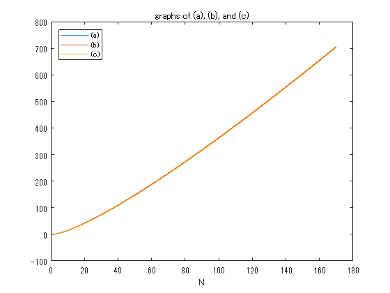
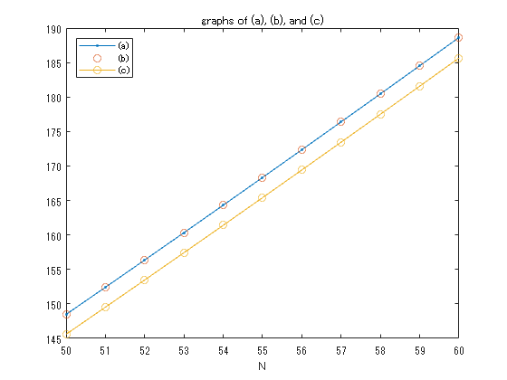
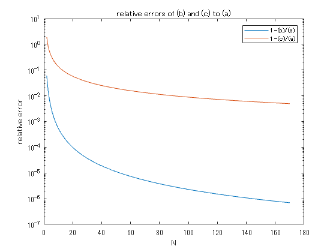
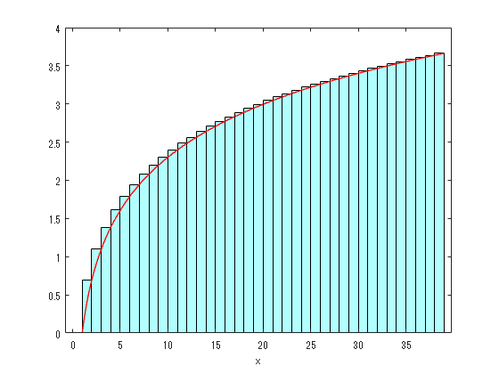

<a name="T_A1F1B072"></a>
# <span style="color:rgb(213,80,0)">スターリングの公式について</span>
<a name="beginToc"></a>
## 目次
[目的](#H_40106465)
 
[グラフを描いて確認する](#H_4CCB0F06)
 
[近似式(1), (2)との相対誤差をグラフで表す](#H_0A0CFD2B)
 
[近似式(2)の証明](#H_CBB190D1)
 
[演習](#H_4157C71D)
 
[参考文献](#H_3D4DC009)
 
<a name="endToc"></a>
<a name="H_40106465"></a>
# 目的

**階乗を指数関数によって近似的に評価**するために、統計力学では以下の Stirling の公式がよく用いられる


 $N\gg 1$ のとき、


&nbsp;&nbsp;&nbsp;&nbsp; (1) $\ln N!\approx N\ln N-N+\frac{1}{2}\ln \left(2\pi N\right)$ 


または、より粗い近似として、


&nbsp;&nbsp;&nbsp;&nbsp; (2) $\ln N!\approx N\ln N-N$ 


<samp>- ここでは、 Stirlingの公式を視覚的に理解する</samp>


<samp>-</samp> <samp>また、\$N\$が大きくなるにつれて、近似の精度がどのように変化するかを把握する</samp> 

<a name="H_4CCB0F06"></a>
# グラフを描いて確認する

Q.1

-  (a) $\ln N!$ 
-  (b) $N\ln N-N+\frac{1}{2}\ln \left(2\pi N\right)$ 
-  (c) $N\ln N-N$  

を $N$ の関数としてグラフで表せ。


→ ３つの曲線がほぼ一致しているように見える。

```matlab
format long
n0 = 1;
n1 = 170;
x = linspace(1,n1,n1);
y1 = log(factorial(x));
y2 = x .* log(x) - x + 0.5 * log(2*pi*x);
y3 = x .* log(x) - x;

plot(x,y1)
hold on 
plot(x,y2)
plot(x,y3)
legend('(a)','(b)','(c)', "Location",'northwest');
title('graphs of (a), (b), and (c)')
xlabel('N');
hold off
```

<center></center>


```matlab
format
```

Q2. Q1. において、 $N$ の範囲を例えば、 $50\le N\le 60$ に限定してグラフを描け。


→ (c)の誤差が顕著になる。(a)と(b)は一致しているように見える。

```matlab
plot(x,y1, '.-')
hold on 
plot(x,y2,'o')
plot(x,y3,'-o')
legend('(a)','(b)','(c)', "Location",'northwest');
title('graphs of (a), (b), and (c)')
xlabel('N');
xlim([50 60]);
hold off
```

<center></center>

<a name="H_0A0CFD2B"></a>
# 近似式(1), (2)との相対誤差をグラフで表す

厳密な式を $f(x)$ 、近似式を $g(x)$ とすれば、相対誤差 $r$ は次式のように与えられる。

 $$ r=\left|\frac{f(x)-g(x)}{f(x)}\right| $$ 

Q3. Q1の(a)と(b)との相対誤差、(a)と(c)との相対誤差を求め、グラフで表せ。

```matlab
semilogy(x,1-y2./y1)
hold on 
semilogy(x,1-y3./y1)
legend('1-(b)/(a)','1-(c)/(a)', "Location",'northeast');
title('relative errors of (b) and (c) to (a)')
xlabel('N');
ylabel('relative error');
hold off
```

<center></center>

<a name="H_CBB190D1"></a>
# 近似式(2)の証明

近似式(2)については、 $\ln x$ の積分と和に着目することによって近似的に証明できる。

 $$ \ln \;N=\sum_{\textrm{ｊ＝１}}^N \ln \;j\;\approx \int_1^N \ln \;x\;\textrm{dx}={\left\lbrack x\;\ln \;x-x\right\rbrack }_1^N =N\;\ln \;N-N+1\approx N\;\ln \;N-N $$ 

この証明をグラフで表すとこのようになる。


（スライドバーによって $x_1$ の値を変えることができる。）

```matlab

x1 =39;
xl1 = linspace(1,x1,x1);
yl1 = log(xl1);
bar(xl1-0.5, yl1, 1, "cyan", 'FaceAlpha',.3)
hold on
xlabel("x")
fplot(@(x)log(x), [1, x1], 'LineWidth',1,"Color",'r')
hold off
```

<center></center>

<a name="H_4157C71D"></a>
# 演習

Q4. $N=10$ および $N=1000$ のそれぞれの場合において、 Q1 の(a)と(b)の相対誤差、ならびに、(a)と(c)の相対誤差を求めよ。

<a name="H_3D4DC009"></a>
# 参考文献
