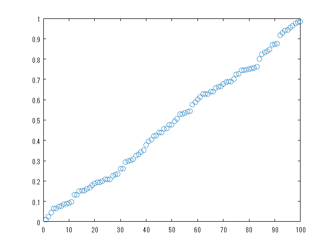
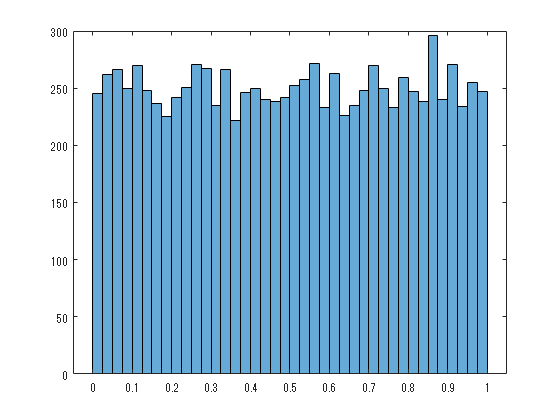
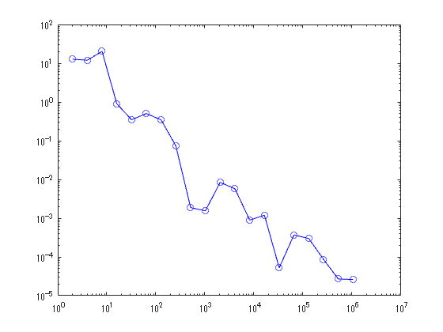
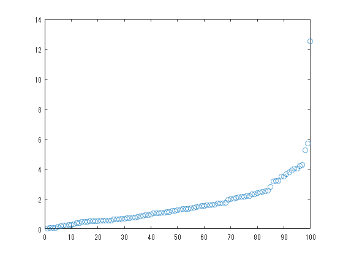
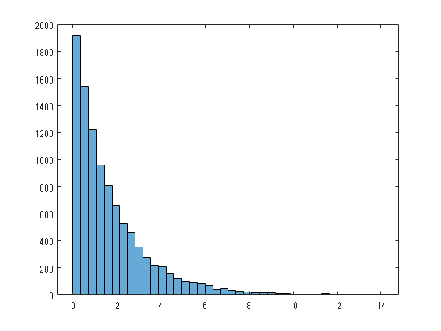
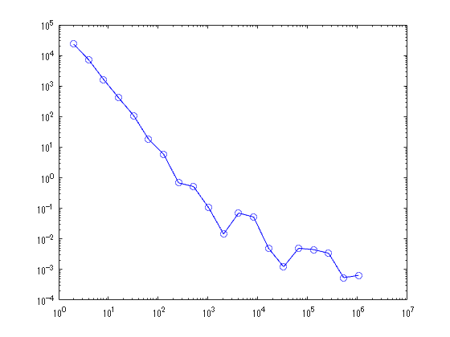

<a name="T_DDA7D2F0"></a>
# <span style="color:rgb(213,80,0)">離散に対する近似的な連続表現</span>
<a name="beginToc"></a>
## 目次
[一様分布の場合](#H_E3E84D15)
 
[指数分布の場合](#H_43511909)
 
[Bose分布の場合（BEC）](#H_9F648B9C)
 
<a name="endToc"></a>
<a name="H_E3E84D15"></a>
# 一様分布の場合
```matlab
% 準位による表現
plot(sort(rand([100 1])), 'o')
```

<center></center>


```matlab
rd1 = rand([10000 1]);
histogram(rd1, 40);
```

<center></center>


```matlab

format long g
disp(sum(rd1))
```

```TextOutput
          5000.79508603148
```

```matlab
hb = 1:20;
h = histogram(rd1, 'Visible', 'off');
a = 0;
hold on
for n = hb
    h.NumBins = 2^n;
    s = sum(h.Values .* (h.BinEdges(1:end-1)+h.BinWidth/2));
    a(n) = abs(s-sum(rd1));
end

plot(2.^hb, a, 'bo-')
set(gca, 'YScale', 'log');
set(gca, 'XScale', 'log');
hold off
```

<center></center>

<a name="H_43511909"></a>
# 指数分布の場合
```matlab
% 準位による表現
mu = 1.7;
pd2 = makedist("Exponential", mu);
plot(sort(random(pd2, [100 1])), 'o')
```

<center></center>


```matlab

rd2 = random(pd2,[10000 1]);

histogram(rd2, 40);
```

<center></center>


```matlab

format long g
disp(sum(rd2))
```

```TextOutput
          17146.7162943933
```

```matlab
hb = 1:20;
h = histogram(rd2, 'Visible', 'off');
a = 0;
hold on
for n = hb
    h.NumBins = 2^n;
    s = sum(h.Values .* (h.BinEdges(1:end-1)+h.BinWidth/2));
    a(n) = abs(s-sum(rd2));
end

plot(2.^hb, a, 'bo-')
set(gca, 'YScale', 'log');
set(gca, 'XScale', 'log');
hold off
```

<center></center>


<a name="H_9F648B9C"></a>
# Bose分布の場合（BEC）
```matlab
% 準位による表現
mu = 1.7;
pd2 = makedist("Exponential", mu);
plot(sort(random(pd2, [100 1])), 'o')
```

```matlab

rd2 = random(pd2,[10000 1]);

histogram(rd2, 40);

format long g
disp(sum(rd2))
hb = 1:20;
h = histogram(rd2, 'Visible', 'off');
a = 0;
hold on
for n = hb
    h.NumBins = 2^n;
    s = sum(h.Values .* (h.BinEdges(1:end-1)+h.BinWidth/2));
    a(n) = abs(s-sum(rd2));
end

plot(2.^hb, a, 'bo-')
set(gca, 'YScale', 'log');
set(gca, 'XScale', 'log');
hold off
```
