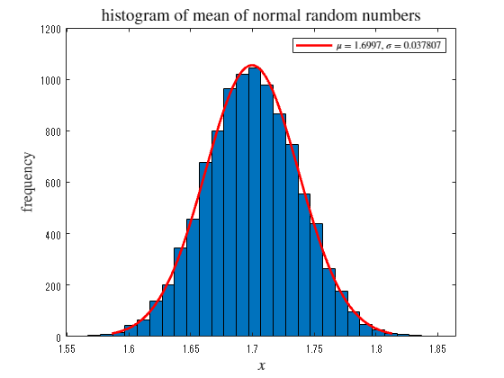

<a name="T_1DC7F588"></a>
# <span style="color:rgb(213,80,0)">中心極限定理の確認</span>
<a name="beginToc"></a>
## 目次
[1．一様分布の場合](#H_1A20678A)
 
&emsp;[分布オブジェクトの生成](#H_6458F814)
 
&emsp;[乱数の生成と正規分布によるフィッティング](#H_CCE4F93B)
 
[2．指数分布の場合](#H_6DB8AA61)
 
&emsp;[分布オブジェクトの生成](#H_C7240049)
 
&emsp;[乱数の生成と正規分布によるフィッティング](#H_DC33C18D)
 
<a name="endToc"></a>
<a name="H_7F8D78C1"></a>
<a name="H_1A20678A"></a>
# 1．一様分布の場合
<a name="H_6458F814"></a>
## 分布オブジェクトの生成

例として、平均 1.7 の指数分布オブジェクトを作成する。

```matlab
pd1 = makedist("Uniform", "lower",0, "upper",2);
```
<a name="H_4375E1A4"></a>
<a name="H_CCE4F93B"></a>
## 乱数の生成と正規分布によるフィッティング
<a name="H_DD406E82"></a>

乱数を生成し、ヒストグラムを描画する

```matlab
rd1 = random(pd1,[10000 2000]);
histogram(rd1(1,:))
title('histogram of uniform random numbers', Interpreter='latex', FontSize=15)
```

<center></center>


```matlab

rd1m = mean(rd1(1:10000, :), 2);
fc1 = fitdist(rd1m,"normal");
hc1 = histfit(rd1m, 30,"normal");
hc12 = hc1(2);
set(hc12, DisplayName=" !!!EQ_1!!! "+string(fc1.mu)+",  !!!EQ_2!!! "+string(fc1.std))
title('histogram of mean of normal random numbers', Interpreter='latex', FontSize=14)
xlabel(" !!!EQ_3!!! ", Interpreter="latex", FontSize=13)
ylabel("frequency", Interpreter="latex", FontSize=13)
legend(hc12, Interpreter="latex")
```

<center></center>

<a name="H_6DB8AA61"></a>
# 2．指数分布の場合
<a name="H_C7240049"></a>
## 分布オブジェクトの生成

例として、平均 1.7 の指数分布オブジェクトを作成する。

```matlab
pd2 = makedist("Exponential", mu=1.7);
```
<a name="H_F8854DA8"></a>
<a name="H_DC33C18D"></a>
## 乱数の生成と正規分布によるフィッティング
<a name="H_DD406E82"></a>

乱数を生成し、ヒストグラムを描画する

```matlab
rd2 = random(pd2,[10000 2000]);
h2 = histfit(rd2(1,:), 20, "exponential");
f2 = fitdist(rd2(1,:)',"exponential");
h22 = h2(2);
set(h22, DisplayName=" $\mu =$ "+string(f2.mu))
title('histogram of exponential random numbers', Interpreter='latex', FontSize=15)
xlabel(" $x$ ", Interpreter="latex", FontSize=13)
ylabel("frequency", Interpreter="latex", FontSize=13)
legend(h22, Interpreter="latex")
```

<center></center>


```matlab

rd2m = mean(rd2(1:10000, :), 2);
fc2 = fitdist(rd2m,"normal");
hc2 = histfit(rd2m, 30,"normal");
hc22 = hc2(2);
set(hc22, DisplayName=" !!!EQ_1!!! "+string(fc2.mu)+",  !!!EQ_2!!! "+string(fc2.std))
title('histogram of mean of normal random numbers', Interpreter='latex', FontSize=14)
xlabel(" !!!EQ_3!!! ", Interpreter="latex", FontSize=13)
ylabel("frequency", Interpreter="latex", FontSize=13)
legend(hc22, Interpreter="latex")
```

<center></center>

