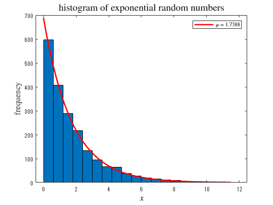

<a name="T_1DC7F588"></a>
# <span style="color:rgb(213,80,0)">中心極限定理の確認</span>
<a name="beginToc"></a>
## 目次
[1．一様分布の場合](#H_1A20678A)
 
&emsp;[分布オブジェクトの生成](#H_6458F814)
 
&emsp;[分布の描画](#H_78792AA8)
 
&emsp;[乱数の生成](#H_CCE4F93B)
 
[2．指数分布の場合](#H_6DB8AA61)
 
&emsp;[分布オブジェクトの生成](#H_C7240049)
 
&emsp;[分布の描画](#H_BA1E579F)
 
&emsp;[乱数の生成](#H_DC33C18D)
 
<a name="endToc"></a>
<a name="H_7F8D78C1"></a>
<a name="H_1A20678A"></a>
# 1．一様分布の場合
<a name="H_6458F814"></a>
## 分布オブジェクトの生成

例として、平均 1.7 の指数分布オブジェクトを作成する。

```matlab
pd2 = makedist("Exponential", mu=1.7);
```
<a name="H_78792AA8"></a>
## 分布の描画
<a name="H_DD406E82"></a>

 $0$ から $+10$ の範囲で確率密度関数と累積分布を描く

```matlab
x = 0:0.01:10;
plot(x, pdf(pd2, x))
hold on
    pd2_m = mean(pd2)
```

```TextOutput
pd2_m = 1.7000
```

```matlab
    pd2_s = std(pd2)
```

```TextOutput
pd2_s = 1.7000
```

```matlab
    xline(pd2_m, 'r--')
    xline(pd2_m + pd2_s, 'g--')
    xline(pd2_m - pd2_s, 'g--')
hold off
title('pdf of exponential distribution', Interpreter='latex', FontSize=15)
xlabel(" !!!EQ_3!!! ", Interpreter="latex", FontSize=13)
ylabel(" !!!EQ_4!!! ", Interpreter="latex", FontSize=13)
```

<center></center>


```matlab

plot(x, cdf(pd2, x))
title('cdf of exponential distribution', Interpreter='latex', FontSize=15)
xlabel(" !!!EQ_3!!! ", Interpreter="latex", FontSize=13)
ylabel(" !!!EQ_6!!! ", Interpreter="latex", FontSize=13)
```

<center></center>


<a name="H_CCE4F93B"></a>
## 乱数の生成
<a name="H_DD406E82"></a>

乱数を生成し、ヒストグラムを描画する

```matlab
rd2 = random(pd2,[1000 1000])
```

```TextOutput
rd2 = 1000x1000    
    2.5593    0.2297    0.6207    3.2100    3.0268    3.2093    0.4013    1.2231    0.2283    0.3917    0.9627    3.7966    2.3876    0.6310    1.8270    1.1282    0.8585    4.6123    4.9440    0.2772    3.3829    3.6161    0.2699    0.9999    2.6848    1.5700    0.8922    4.7233    1.9075    0.9324    1.3360    3.5826    0.2571    1.1346    1.6563    0.8037    0.3573    0.2499    3.9103    1.3527    5.1843    3.4572    0.8870    2.6453    3.0883    1.3020    2.2638    3.9159    1.5441    1.1738
    6.1607    0.7042    1.4374    0.1027    0.3004    0.5131    0.1502    1.5241    0.4029    0.4866    0.9983    0.0495    1.7750    0.6532    1.8208    0.2684    0.1280    1.4394    0.2816    1.3938    1.2134    1.7723    1.1773    2.6754    0.2414    0.7912    0.9102    1.1911    0.7792    0.0726    2.1575    0.2224    1.5597    0.4607    1.1633    0.1210    2.4665    2.4689    1.1638    0.3955    0.2745    2.5270    0.2375    0.6556    1.0528    3.3786    0.8770    5.4747    1.4383    1.5841
    0.8144    2.2504    3.1491    0.0861    2.0434    0.6693    1.8518    0.0235    1.0124    0.7594    1.6625    0.2718    0.2186    0.5538    0.7779    3.3903    4.0019    0.9900    1.5249    3.6731    1.7439    1.0796    0.1200    1.2318    0.1498    0.0795    3.5539    0.7489    0.1635    1.3014    0.3863    0.6759    1.1820    1.0931    1.0855    2.6381    0.1789    0.7136    0.4032    0.3752    0.7772    0.3744    0.1167    0.2476    5.3474    0.2480    0.9768    0.6654    1.4734    0.6181
    0.8136    0.2551    0.5209    0.6276    0.9451    5.9243    0.1190    0.2273    1.1859    2.1743    1.4818    1.9929    0.2236    1.0002    4.3989    0.4071    2.6758    0.5586    0.3569    4.6281    0.1431    0.2070    1.4563    1.4211    2.2727    0.0564    2.7811    0.0300    0.4285    2.8984    0.5522    0.8978    2.1209    5.1020    1.9723    2.3055    1.0435    0.4012    1.6430    0.0832    4.6941    0.2353    0.9734    0.7575    1.4526    1.3422    0.3555    1.8166    0.1346    0.5032
    2.0442    1.3010    0.4715    0.7702    0.3576    0.2731    0.3227    2.7041    1.6745    0.4800    0.2512    1.1224    2.0668    0.3922    1.0591    0.5731    1.1723    0.6115    0.2105    0.9629    1.7927    1.6232    0.9513    1.4039   11.1834    4.1435    2.8937    0.2740    0.2497    3.4737    1.1073    1.3115    2.9455    0.0282    1.2129    1.3506    3.3679    2.2005    3.1171    4.0866    1.7119    2.3380    2.0136    0.0324    0.2024    1.8588    1.8141    1.2958    6.2256    1.7061
    0.4756    0.4929    2.2948    0.3238    2.7061    3.3048    0.7081    0.1359    0.0587    1.1874    0.9918    2.2620    1.1532    0.1546    1.0603    3.0582    0.9460    2.6278    0.0585    1.4123    0.0711    1.1532    0.7874    0.3249    1.1728    2.4218    2.1694    0.1768    0.3031    0.4365    0.9505    2.5804    0.6634    0.6312    1.4759    3.3759    0.5864    0.5270    1.4998    0.8459    0.9947    1.8206    0.2620    7.1736    1.6365    3.5456    1.4170    0.3750    5.3601    0.2183
1.4859    2.3707    0.0419    0.1796    1.4416    0.1883    0.6424    1.2721    0.1185    2.1501    1.0443    1.7346    1.6889    0.1219    0.2259    2.9225    4.3207    0.3374    0.3297    4.2861    3.5842    1.0579    2.9492    1.0646    2.0835    1.3112    0.1827    0.1000    0.9338    0.1681    0.0044    1.1038    2.4359    0.6682    0.7633    1.4810    1.9546    1.0997    4.3692    0.5619    0.3656    0.7740    1.3329    0.5479    0.9056    1.0962    2.8333    2.2826    1.3614    1.4249
    0.4255    2.3893    0.8104    1.9717    1.8043    2.4389    3.5834    4.4026    0.6592    3.6641    0.5895    0.0407    1.0977    4.2205    4.5608    1.4333    2.2104    0.7683    0.6009    3.5013    0.5468    0.2193    0.7325    0.8742    0.8462    2.2375    6.1896    4.5769    0.2162    5.4142    0.0117    0.6554    1.7532    0.3389    1.6791    0.9904    3.1671    0.3545    0.5377    0.7196    0.4032    1.5820    0.5457    1.8941    0.7614    1.0931    3.6894    2.9730    0.4222    7.8788
1.4043    1.4883    1.9877    0.7990    0.9185    2.8078    2.8203    0.1610    0.7169    2.7228    2.0543    2.0714    7.1173    2.5797    1.6540    0.7088    6.1360    2.5270    0.4123    1.4191    0.6023    1.9114    0.7058    2.5157    0.4700    0.3046    0.0615    0.8177    2.8684    1.3757    0.4104    2.5952    0.6735    1.2642    1.6367    0.9118    1.3861    1.0292    0.2544    3.5013    5.0383    0.4606    4.6855    0.2004    0.0098    4.2012    0.4949    1.8109    0.9511    0.2686
    2.1336    2.2216    1.3907    0.3184    1.3282    0.2897    3.3076    2.9612    2.9497    0.6728    2.4723    0.3637    0.5353    0.0988    0.3181    0.2521    1.0041    0.0142    1.2699    1.3277    1.0400    0.0818    0.6729    0.1943    0.2593    4.4221    1.3973    0.2765    1.7804    0.2200    1.3958    5.4503    3.2355    1.5860    0.0846    1.1394    5.1169    1.7033    0.7606    0.8002    0.1288    1.1508    1.2995    1.3602    0.2534    1.8527    0.4955    0.3194    3.3830    1.0263
```

```matlab
histogram(rd2(1,:))
```

<center></center>


```matlab
histogram(mean(rd2(1:20, :), 2))
```

<center></center>


<a name="H_6DB8AA61"></a>
# 2．指数分布の場合
<a name="H_C7240049"></a>
## 分布オブジェクトの生成

例として、平均 1.7 の指数分布オブジェクトを作成する。

```matlab
pd2 = makedist("Exponential", mu=1.7);
```
<a name="H_BA1E579F"></a>
## 分布の描画
<a name="H_DD406E82"></a>

 $0$ から $+10$ の範囲で確率密度関数と累積分布を描く

```matlab
x = 0:0.01:10;
plot(x, pdf(pd2, x))
hold on
    pd2_m = mean(pd2)
    pd2_s = std(pd2)
    xline(pd2_m, 'r--')
    xline(pd2_m + pd2_s, 'g--')
    xline(pd2_m - pd2_s, 'g--')
hold off
title('pdf of exponential distribution', Interpreter='latex', FontSize=15)
xlabel(" $x$ ", Interpreter="latex", FontSize=13)
ylabel(" $p(x)$ ", Interpreter="latex", FontSize=13)

plot(x, cdf(pd2, x))
title('cdf of exponential distribution', Interpreter='latex', FontSize=15)
xlabel(" $x$ ", Interpreter="latex", FontSize=13)
ylabel(" $Q(x)$ ", Interpreter="latex", FontSize=13)

```
<a name="H_DC33C18D"></a>
## 乱数の生成
<a name="H_DD406E82"></a>

乱数を生成し、ヒストグラムを描画する

```matlab
rd2 = random(pd2,[1000 1000])
histogram(rd2(1,:))
histogram(mean(rd2(1:20, :), 2))

```
