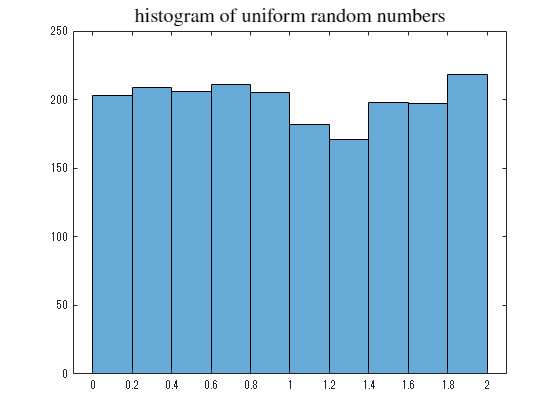
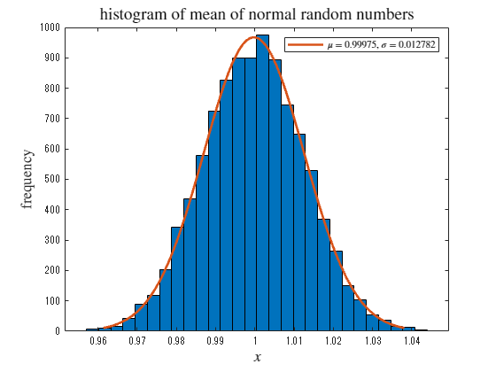
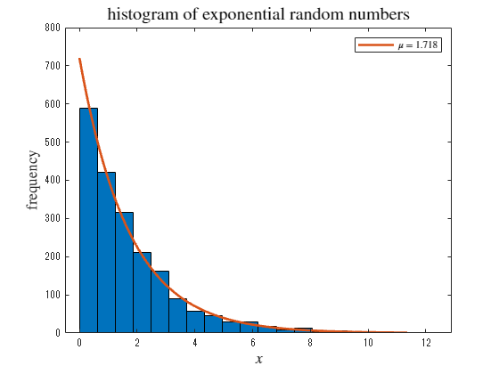
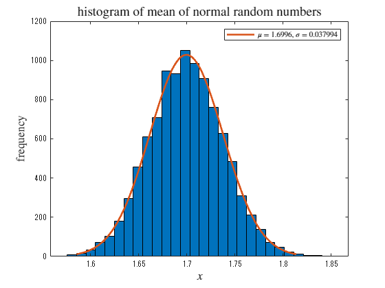

# Confirmation of central limit theorem 
<a name="beginToc"></a>

## Table of Contents
[ ](#-)
 
[1. Uniform distribution ](#1.-uniform-distribution-)
 
&emsp;[Creating a distribution object ](#creating-a-distribution-object-)
 
&emsp;[ ](#-)
 
&emsp;[Generating random numbers and fitting using normal distribution ](#generating-random-numbers-and-fitting-using-normal-distribution-)
 
[2. Exponential distribution ](#2.-exponential-distribution-)
 
&emsp;[Creating a distribution object ](#creating-a-distribution-object-)
 
&emsp;[ ](#-)
 
&emsp;[Generating random numbers and fitting using normal distribution ](#generating-random-numbers-and-fitting-using-normal-distribution-)
 
<a name="endToc"></a>

#  
# 1. Uniform distribution 
## Creating a distribution object 

As an example, create an exponential distribution object with a mean of 1.7. 

```matlab
pd1 = makedist("Uniform", "lower",0, "upper",2); 
```

##  
## Generating random numbers and fitting using normal distribution 

Generating random numbers and drawing a histogram 

```matlab
rd1 = random(pd1,[10000 2000]);
histogram(rd1(1,:))
title('histogram of uniform random numbers', Interpreter='latex', FontSize=15)
```



```matlab

rd1m = mean(rd1(1:10000, :), 2);
fc1 = fitdist(rd1m,"normal");
hc1 = histfit(rd1m, 30,"normal");
hc12 = hc1(2);
set(hc12, DisplayName=" !!!EQ_1!!! "+string(fc1.mu)+",  !!!EQ_2!!! "+string(fc1.std))
title('histogram of mean of normal random numbers', Interpreter='latex', FontSize=14)
xlabel(" !!!EQ_3!!! ", Interpreter="latex", FontSize=13)
ylabel("frequency", Interpreter="latex", FontSize=13)
legend(hc12, Interpreter="latex") 
```



# 2. Exponential distribution 
## Creating a distribution object 

As an example, create an exponential distribution object with a mean of 1.7. 

```matlab
pd2 = makedist("Exponential", mu=1.7); 
```

##  
## Generating random numbers and fitting using normal distribution 

Generating random numbers and drawing a histogram 

```matlab
rd2 = random(pd2,[10000 2000]);
h2 = histfit(rd2(1,:), 20, "exponential");
f2 = fitdist(rd2(1,:)',"exponential");
h22 = h2(2);
set(h22, DisplayName=" $\mu =$ "+string(f2.mu))
title('histogram of exponential random numbers', Interpreter='latex', FontSize=15)
xlabel(" $x$ ", Interpreter="latex", FontSize=13)
ylabel("frequency", Interpreter="latex", FontSize=13)
legend(h22, Interpreter="latex")
```



```matlab

rd2m = mean(rd2(1:10000, :), 2);
fc2 = fitdist(rd2m,"normal");
hc2 = histfit(rd2m, 30,"normal");
hc22 = hc2(2);
set(hc22, DisplayName=" !!!EQ_1!!! "+string(fc2.mu)+",  !!!EQ_2!!! "+string(fc2.std))
title('histogram of mean of normal random numbers', Interpreter='latex', FontSize=14)
xlabel(" !!!EQ_3!!! ", Interpreter="latex", FontSize=13)
ylabel("frequency", Interpreter="latex", FontSize=13)
legend(hc22, Interpreter="latex")
```


