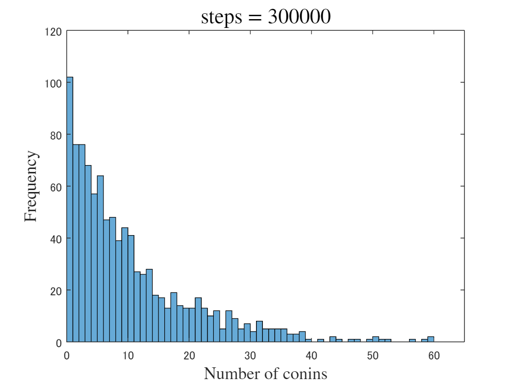

<a name="T_827D14D5"></a>
# <span style="color:rgb(213,80,0)">コイン交換によるカノニカル分布の生成</span>
<a name="beginToc"></a>
## 目次
[コイン交換モデル](#H_2D1171D3)
 
[初期条件の設定と表示](#H_E38F5CED)
 
[コイン交換を実際に行う](#H_32B72611)
 
[指数分布によるフィッティング](#H_5E22F317)
 
<a name="endToc"></a>
```matlab
clear all;
clf;
```
<a name="H_2D1171D3"></a>
# コイン交換モデル

<samp>カノニカル分布を理解するために、コインの分配モデルを用いた系の定常状態に着目しよう。まず、</samp> $M$ <samp>人が</samp> $N$ <samp>個のコインをやりとりする状況を想定する。ここでのコイン交換ルールは、</samp> $M$ <samp>人の中からランダムに2人を選び、コインを持つ者から持たない者へコインを一つ渡すというものである。このプロセスを繰り返すことによって、特定の人が持つコインの枚数の分布がどのように形成されるかを考える。</samp>


 <samp>このコイン分配モデルは、物理的にはエネルギー量子の交換と解釈することができる。つまり、系全体を</samp> $M$ <samp>個の部分系に分け、各部分系がコイン（エネルギー量子）を所持していると考えるわけである。いま、全体系のエネルギーを</samp> $A$ <samp>、エネルギーの最小単位を</samp> $\varepsilon$ <samp>とし、全体系に含まれる単位エネルギーの総数を</samp> $N$ <samp>とする</samp> $(N=A/\varepsilon )$ <samp>。</samp>


 <samp>このコイン分配モデルで、ある部分系（特定の人）が所持するコイン（エネルギー量子）の枚数分布を問題としよう。これは、</samp> $N$ <samp>個のエネルギー量子をランダムに交換した際に、一つの部分系に分配される単位エネルギーの数</samp> $(E/\varepsilon =\eta )$ <samp>の確率分布</samp> $p(\eta )$ <samp>を求める問題に相当する。そしてこの問題は、「系」と「環境」との間でエネルギー交換が行われる際に、「系」のエネルギーが</samp> $E$ <samp>となる確率</samp> $p(E)$ <samp>を求める問いとみることもできる。</samp>


<samp>実際にこのコイン分配のルールを適用すると、コイン交換（エネルギー量子の交換）がランダムに行われるため、所持するコインの枚数が少ない状態が出現しやすくなり、最終的なコイン分布（エネルギー分布）は指数分布となります。これはミクロな状態が同じ確率で出現するという等重率の原理に基づいて理解できる。</samp>

<a name="H_E38F5CED"></a>
# 初期条件の設定と表示
```matlab
N = 10000; %コイン数
M = 1000; %人数

% initial condition
% 
xc = N/M*ones([1 M]);
histogram(xc)
xlim([0 65])

title("Initial condition", Interpreter="latex", FontSize=16)
xlabel('Number of conins', Interpreter='latex', FontSize=13)
ylabel('Frequency', Interpreter='latex', FontSize=13)
```

<center></center>


```matlab

%exportgraphics(gca, 'Coin_exchange_000000.png')

```
<a name="H_32B72611"></a>
# コイン交換を実際に行う

分布の変化を動画で表示する

```matlab
% maximum step
tm = 300001;
for j = 1:1:tm
    ps_chk = 0;
    while ps_chk == 0
        ps = randi([1 M],[1 2]);
        if (ps(1) ~= ps(2)) & (xc(ps(1)) > 0)
            ps_chk = 1;
        end
    end

    xc(ps(1)) = xc(ps(1)) - 1;
    xc(ps(2)) = xc(ps(2)) + 1;

    if ((j<00)&(rem(j, 10) == 0))||((j>=00)&(rem(j, 500) == 0))
        edges = [0:1:60];
        histogram(xc, edges)
    %     xlabel("velocity")
    %     ylabel("frequency")
        title("steps = "+string(j), Interpreter="latex", FontSize=16)
        xlabel('Number of conins', Interpreter='latex', FontSize=13)
        ylabel('Frequency', Interpreter='latex', FontSize=13)
        %ylim([0 1.1*M])
        xlim([0 65])
        drawnow
    end
    % if ((j==3000)||(j==30000)||(j==300000))
    %    exportgraphics(gca, 'Coin_exchange_'+string(j)+'.png')
    % end
end
```

<center></center>

<a name="H_5E22F317"></a>
# 指数分布によるフィッティング

線形目盛と片対数目盛での描画

```matlab

edges2 = [0:2:60];
[hm1, edges2] = histcounts(xc, edges2);
hm1v = hm1;
hm1x = edges2(1:end-1)+0.5*(edges2(2)-edges2(1));

%% 近似: '新規近似 1'。
[xData, yData] = prepareCurveData( hm1x, hm1v );

% 近似タイプとオプションを設定します。
ft = fittype( 'exp1' );
opts = fitoptions( 'Method', 'NonlinearLeastSquares' );
opts.Display = 'Off';
opts.StartPoint = [93.1500294644759 -0.0928478954905877];

% モデルをデータに近似します。
[fitresult, gof] = fit( xData, yData, ft, opts )
```

```TextOutput
fitresult = 
     一般モデル Exp1:
     fitresult(x) = a*exp(b*x)
     係数 (95% の信頼限界):
       a =       195.1  (189.3, 200.9)
       b =    -0.09848  (-0.1026, -0.09432)
gof = 
           sse: 280.6564
       rsquare: 0.9956
           dfe: 28
    adjrsquare: 0.9954
          rmse: 3.1660
```

```matlab

% データの近似をプロットします。
figure( 'Name', '新規近似 1' );
h = plot( fitresult, xData, yData, 'bo' );
legend( h, 'data', 'fitting', 'Location', 'NorthEast', 'Interpreter', 'none' );
% ラベル Axes
title("steps = 3000000", Interpreter="latex", FontSize=16)
xlabel('Number of conins', Interpreter='latex', FontSize=13)
ylabel('Frequency', Interpreter='latex', FontSize=13)

grid on
```

<center></center>


```matlab
%exportgraphics(gca, 'Coin_exchange_3000000_fit.png')
```

```matlab
semilogy(hm1x, hm1, 'bo')
hold on
    semilogy(xData, fitresult(xData), 'r-')
    xlabel( 'coins', 'Interpreter', 'none' );
    ylabel( 'frequency', 'Interpreter', 'none' );
    legend( 'data', 'fitting', 'Location', 'NorthEast', 'Interpreter', 'none' );
    grid on
    
    title("steps = 3000000", Interpreter="latex", FontSize=16)
    xlabel('Number of conins', Interpreter='latex', FontSize=13)
    ylabel('Frequency', Interpreter='latex', FontSize=13)
    
hold off
```

<center></center>


```matlab
%exportgraphics(gca, 'Coin_exchange_3000000_fit_sl.png')

```
