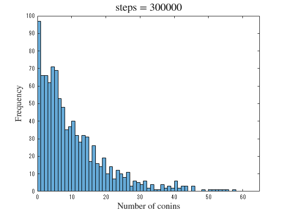

# Generation of Canonical Distribution by Coin Exchange
<a name="beginToc"></a>

## Table of Contents
[Coin exchange model](#coin-exchange-model)
 
[Setting initial conditions and plotting](#setting-initial-conditions-and-plotting)
 
[Execute coin exchange](#execute-coin-exchange)
 
[Fitting by exponential distribution](#fitting-by-exponential-distribution)
 
<a name="endToc"></a>

```matlab
clear all;
clf;
```

# Coin exchange model

To understand the canonical distribution, let us focus on the steady state of the system using the coin distribution model. First, assume a situation in which $M$ people $N$ coins. The coin exchange rule here is that two persons are chosen at random from among the $M$ persons, and one coin is passed from the person with the coin to the person without the coin. By repeating this process, we consider how the distribution of the number of coins held by a particular person is formed.


This coin distribution model can be physically interpreted as an exchange of energy quanta. In other words, the entire system is divided into $M$ subsystems, and each subsystem is considered to possess a coin (energy quantum). Let $A$ be the energy of the entire system, $\varepsilon$ , the smallest unit of energy, and $N$ , the total number of energy units in the entire system. $(N=A/\varepsilon )$ 


In this coin distribution model, let us consider the distribution of number of coins (enegery quanta) held by a certain subsystem (a specific person). This cprresponds to the problem of finding the probability distribution, $p(\eta )$ , of the number of unit energy $(E/\varepsilon =\eta )$ distributed to one subsystem when $N$ , energy quanta are exchanged at random. And this problem can also be viewed as a question to find the probability $p(E)$ that the energy of the "system" is $E$ when energy is exchanged between the "system" and the "environment". 


When this rule of coin distribution is actually applied, the coin exchange (exchange of energy quanta) is performed randomly, so that states with fewer coins in their posession are more likely to emerge, and the final coin distribution (energy distribution) becomes an expotential distribution. This can be understood based on the principle of equal weightedness, which states that microscopic states have the same probability of appering. 


# Setting initial conditions and plotting
```matlab
N = 10000; % total number of coins
M = 1000; % number of persons

% initial condition
% 
xc = N/M*ones([1 M]);
histogram(xc)
xlim([0 65])

title("Initial condition", Interpreter="latex", FontSize=16)
xlabel('Number of conins', Interpreter='latex', FontSize=13)
ylabel('Frequency', Interpreter='latex', FontSize=13)
```


```matlab

%exportgraphics(gca, 'Coin_exchange_000000.png')
```

# Execute coin exchange

Animation that shows the change in distribution

```matlab
% maximum step
tm = 300001;
for j = 1:1:tm
    ps_chk = 0;
    while ps_chk == 0
        ps = randi([1 M],[1 2]);
        if (ps(1) ~= ps(2)) & (xc(ps(1)) > 0)
            ps_chk = 1;
        end
    end

    xc(ps(1)) = xc(ps(1)) - 1;
    xc(ps(2)) = xc(ps(2)) + 1;

    if ((j<00)&(rem(j, 10) == 0))||((j>=00)&(rem(j, 500) == 0))
        edges = [0:1:60];
        histogram(xc, edges)
    %     xlabel("velocity")
    %     ylabel("frequency")
        title("steps = "+string(j), Interpreter="latex", FontSize=16)
        xlabel('Number of conins', Interpreter='latex', FontSize=13)
        ylabel('Frequency', Interpreter='latex', FontSize=13)
        %ylim([0 1.1*M])
        xlim([0 65])
        drawnow
    end
    % if ((j==3000)||(j==30000)||(j==300000))
    %    exportgraphics(gca, 'Coin_exchange_'+string(j)+'.png')
    % end
end
```



# Fitting by exponential distribution

Plotting with linear and single logarithmic scale


```matlab

edges2 = [0:2:60];
[hm1, edges2] = histcounts(xc, edges2);
hm1v = hm1;
hm1x = edges2(1:end-1)+0.5*(edges2(2)-edges2(1));

%% 近似: '新規近似 1'。
[xData, yData] = prepareCurveData( hm1x, hm1v );

% 近似タイプとオプションを設定します。
ft = fittype( 'exp1' );
opts = fitoptions( 'Method', 'NonlinearLeastSquares' );
opts.Display = 'Off';
opts.StartPoint = [93.1500294644759 -0.0928478954905877];

% モデルをデータに近似します。
[fitresult, gof] = fit( xData, yData, ft, opts )
```

```matlabTextOutput
fitresult = 
     一般モデル Exp1:
     fitresult(x) = a*exp(b*x)
     係数 (95% の信頼限界):
       a =       183.4  (173.1, 193.7)
       b =    -0.09002  (-0.09715, -0.08288)
gof = フィールドをもつ struct:
           sse: 9.620721469056624e+02
       rsquare: 0.984119583658830
           dfe: 28
    adjrsquare: 0.983552425932360
          rmse: 5.861716432270081

```

```matlab

% データの近似をプロットします。
figure( 'Name', '新規近似 1' );
h = plot( fitresult, xData, yData, 'bo' );
legend( h, 'data', 'fitting', 'Location', 'NorthEast', 'Interpreter', 'none' );
% ラベル Axes
title("steps = 3000000", Interpreter="latex", FontSize=16)
xlabel('Number of conins', Interpreter='latex', FontSize=13)
ylabel('Frequency', Interpreter='latex', FontSize=13)

grid on
```


```matlab
%exportgraphics(gca, 'Coin_exchange_3000000_fit.png')
```

```matlab
semilogy(hm1x, hm1, 'bo')
hold on
    semilogy(xData, fitresult(xData), 'r-')
    xlabel( 'coins', 'Interpreter', 'none' );
    ylabel( 'frequency', 'Interpreter', 'none' );
    legend( 'data', 'fitting', 'Location', 'NorthEast', 'Interpreter', 'none' );
    grid on
    
    title("steps = 3000000", Interpreter="latex", FontSize=16)
    xlabel('Number of conins', Interpreter='latex', FontSize=13)
    ylabel('Frequency', Interpreter='latex', FontSize=13)
    
hold off
```


```matlab
%exportgraphics(gca, 'Coin_exchange_3000000_fit_sl.png')

```
