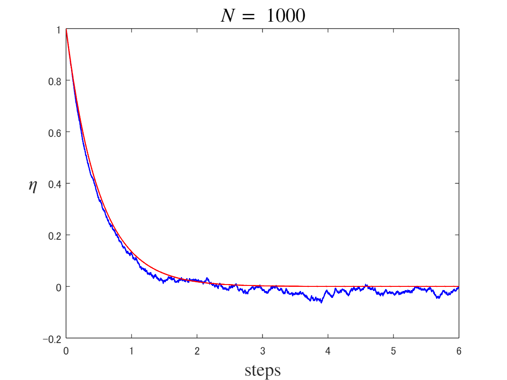
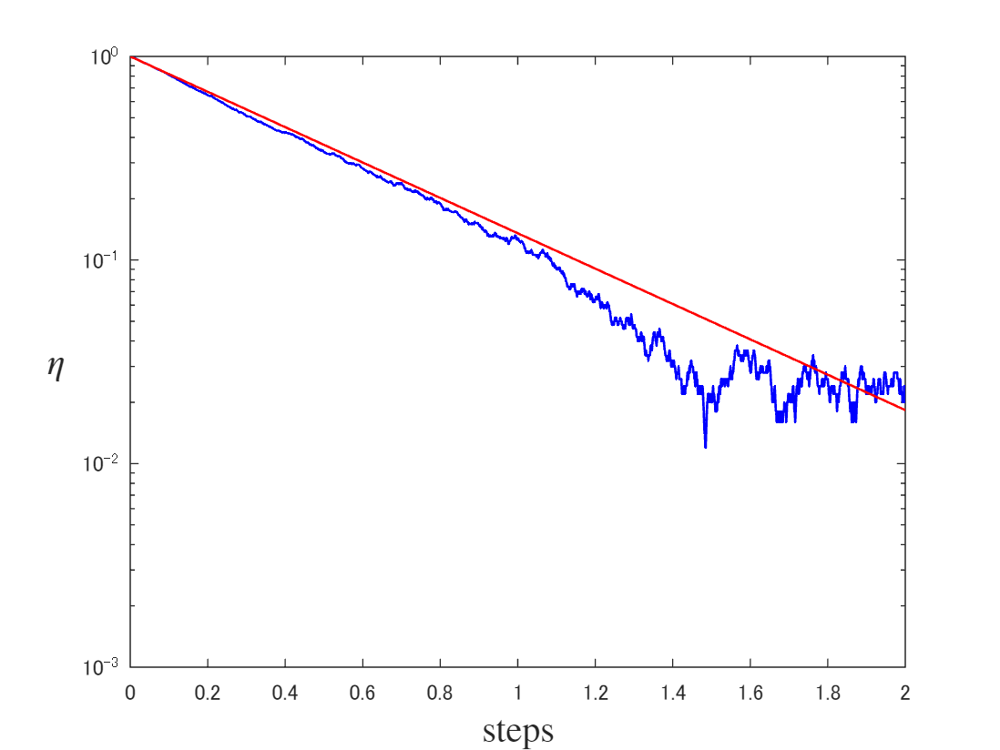
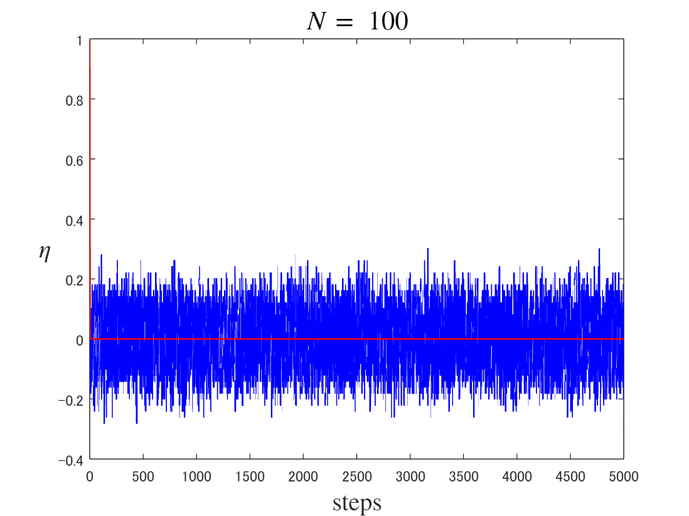
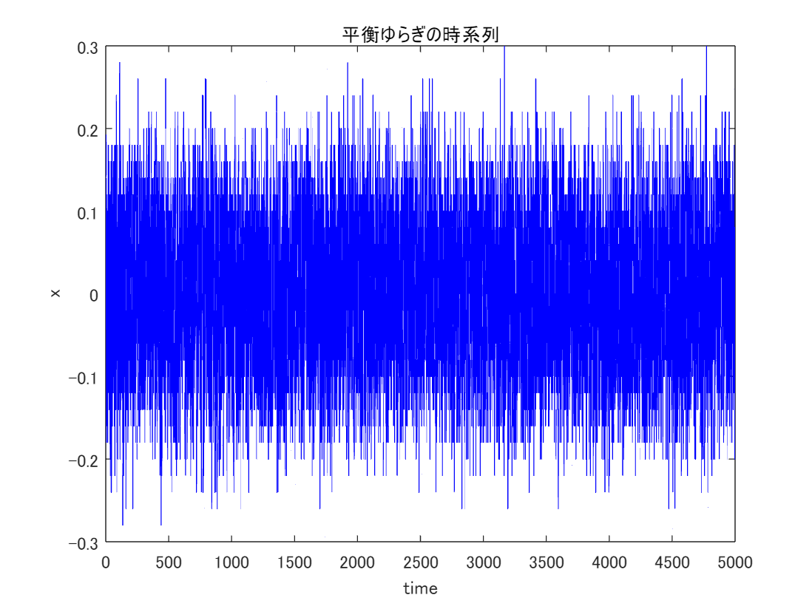
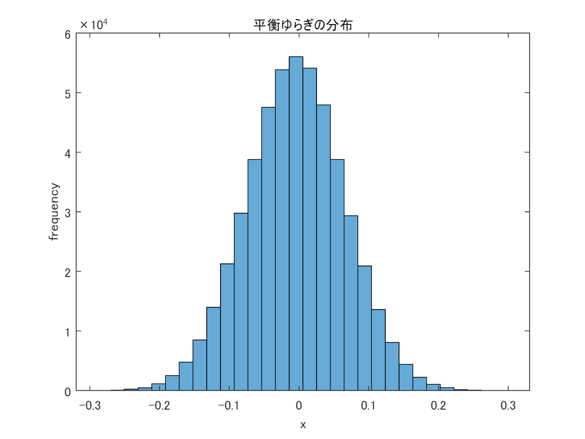
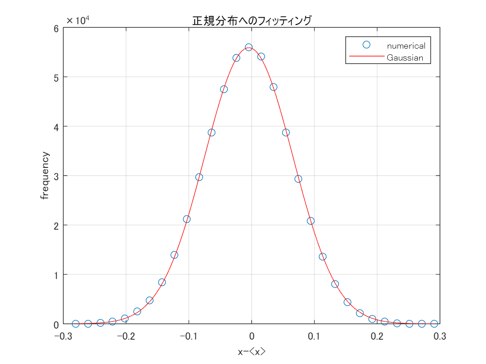
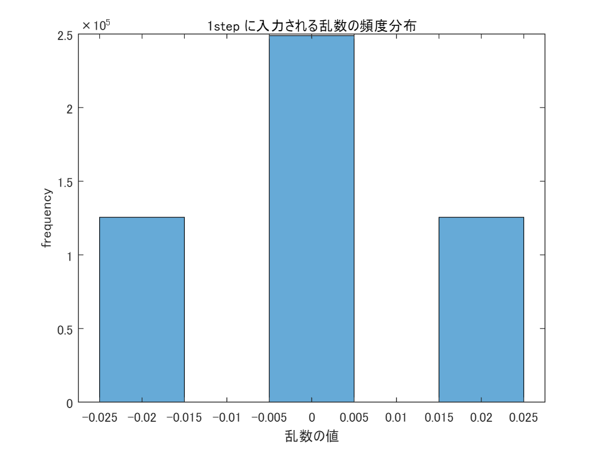

<a name="T_0D665AD3"></a>
# <span style="color:rgb(213,80,0)">Coin exchange model for relaxation process</span>
<a name="beginToc"></a>
## 目次
[非平衡から平衡への緩和：平均的挙動との比較](#H_F572270B)
 
[平衡状態：平均的挙動とゆらぎを分離する](#H_47506E7B)
 
&emsp;[平衡状態のゆらぎ（平衡ゆらぎ）](#H_92EA3CFA)
 
&emsp;[平衡ゆらぎの分布：ガウス分布によるフィッティング](#H_E1441DA0)
 
&emsp;[１ステップあたりの $\eta$ の変化量](#H_8EB6EA49)
 
[コイン交換を行い、描画する関数](#H_7E616628)
 
<a name="endToc"></a>
<a name="H_A3858203"></a>
```matlab
clear all; clf;
```
<a name="H_F572270B"></a>
# 非平衡から平衡への緩和：平均的挙動との比較

コイン交換モデルでは、緩和過程を平均挙動とゆらぎに分離して理解することが期待される。


そこでまずは平均挙動に着目する．このような平衡状態への緩和過程において、 $\eta_{{\mathrm{A}}}$ 時間とともに平均的には指数関数的に緩和する。実際、 $\eta_{{\mathrm{A}}}$ の時系列は指数関数（赤い線）を用いて良くフィットできる．

```matlab
T = 6; %時間
N = 1000; %コイン数

[tm, sm1] = coin_exchange(T, N);
```

<center></center>


```matlab

semilogy(tm, sm1, 'b-', "LineWidth", 1)
hold on
    semilogy(tm, exp(-2*tm), '-r', "LineWidth", 1)
hold off
xlabel('steps', Interpreter='latex', FontSize=15)
ylabel(' !!!EQ_3!!! ', Interpreter='latex', FontSize=15, Rotation=0)
xlim([0 2])
ylim([1e-3 Inf])
```

<center></center>


<a name="H_47506E7B"></a>
# 平衡状態：平均的挙動とゆらぎを分離する
<a name="H_92EA3CFA"></a>
## 平衡状態のゆらぎ（平衡ゆらぎ）

次にゆらぎに着目する．


 $\eta_{{\mathrm{A}}}$ の時系列から平均的な指数緩和を差し引けば，ゆらぎの時系列を取り出すことができる．グラフに示すように，このゆらぎについての頻度分布は正規分布となっている．また1試行における得点変化の頻度分布のグラフについて，1試行ごとの得点変化は

-  青いコインを渡して青いコインを受け取る場合　 $\pm 0$ 
-  青いコインを渡して赤いコインを受け取る場合　 $-2$ 
-  赤いコインを渡して青いコインを受け取る場合　 $+2$ 
-  赤いコインを渡して赤いコインを受け取る場合　 $\pm 0$ 

であり，それぞれが等確率で起こる．

```matlab
T = 5000; %時間
N = 100; %コイン数
[tm, sm1] = coin_exchange(T, N);
```

<center></center>


```matlab

dv = sm1-exp(-2*tm);
plot(tm(20:end), dv(20:end), '-b', "LineWidth", 0.5);
xlabel('time')
ylabel('x')
title('平衡ゆらぎの時系列')
```

<center></center>


```matlab

h1 = histogram(dv(100:end),30);
xlabel('x')
ylabel('frequency')
title('平衡ゆらぎの分布')
```

<center></center>


```matlab

h1x = h1.BinEdges+0.5*h1.BinWidth;
h1x = h1x(1:end-1);
h1y = h1.Values;
```
<a name="H_E1441DA0"></a>
## 平衡ゆらぎの分布：ガウス分布によるフィッティング
```matlab
%% 近似:
[xData, yData] = prepareCurveData( h1x, h1y );

% 近似タイプとオプションを設定します。
ft = fittype( 'gauss1' );
opts = fitoptions( 'Method', 'NonlinearLeastSquares' );
opts.Display = 'Off';
opts.Lower = [-Inf -Inf 0];
opts.StartPoint = [22655 -0.0187 0.0486660050980374];

% モデルをデータに近似します。
[fitresult, gof] = fit( xData, yData, ft, opts );

% データの近似をプロットします。
figure( 'Name', '正規分布へのフィッティング' );
h = plot( fitresult, xData, yData, 'o' );
legend( h, 'numerical', 'Gaussian', 'Location', 'NorthEast', 'Interpreter', 'none' );
% ラベル Axes
xlabel( 'x-<x>', 'Interpreter', 'none' );
ylabel( 'frequency', 'Interpreter', 'none' );
title('正規分布へのフィッティング')
grid on
```

<center></center>


<a name="H_8EB6EA49"></a>
## １ステップあたりの $\eta$ の変化量
```matlab

histogram(diff(sm1-exp(-2*tm)),[-0.025:0.01:0.025])
xlabel('乱数の値')
ylabel('frequency')
title('1step に入力される乱数の頻度分布')
```

<center></center>


<a name="H_7E616628"></a>
# コイン交換を行い、描画する関数
```matlab
function [tm, sm1] = coin_exchange(T, N)
Tn = T*N;
s01 =  N;
s02 = -N;

x1 = 0:1:Tn;

tm  = x1/N;
sm1 = 0*x1;
sm2 = 0*x1;

sm1(1) = s01/N;
sm2(1) = s02/N;

for j = 2:1:Tn+1
    if rand < (s01/N + 1)*0.5 
        ch1 = 1;
    else
        ch1 = -1;
    end
    if rand < (s02/N + 1)*0.5 
        ch2 = 1;
    else
        ch2 = -1;
    end
    s01 = s01 - ch1 + ch2;
    s02 = s02 + ch1 - ch2;

    sm1(j) = s01/N;
    sm2(j) = s02/N;
end
plot(tm, sm1, 'b-', "LineWidth", 1)
hold on
plot(tm, exp(-2*tm), '-r', "LineWidth", 1)
xlabel('steps', Interpreter='latex', FontSize=15)
ylabel(' $\eta$ ', Interpreter='latex', FontSize=15, Rotation=0)
title([' $N =$ ', num2str(N)], Interpreter="latex", FontSize=16)
hold off
end
```
