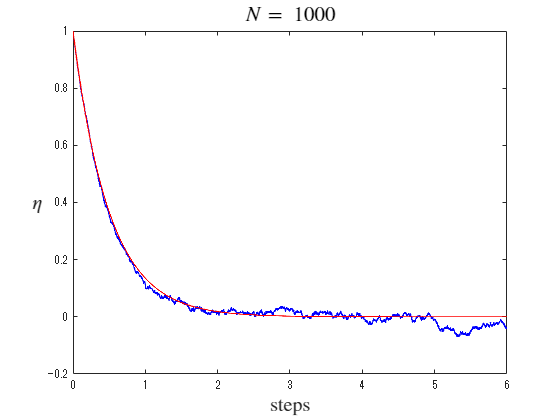
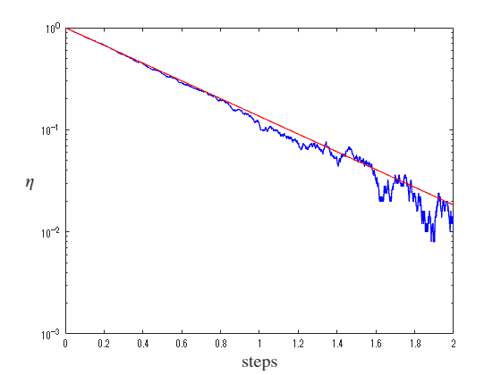
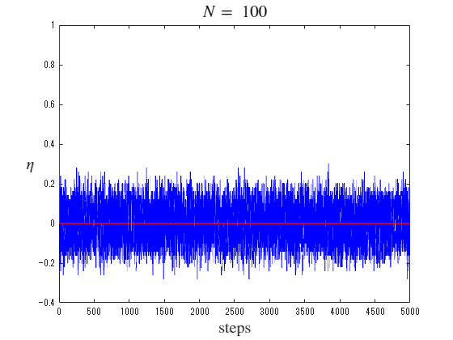
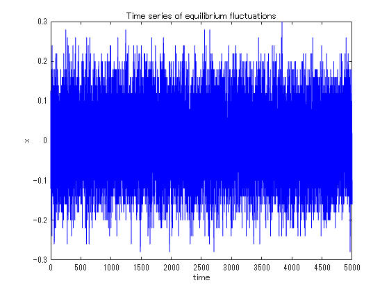
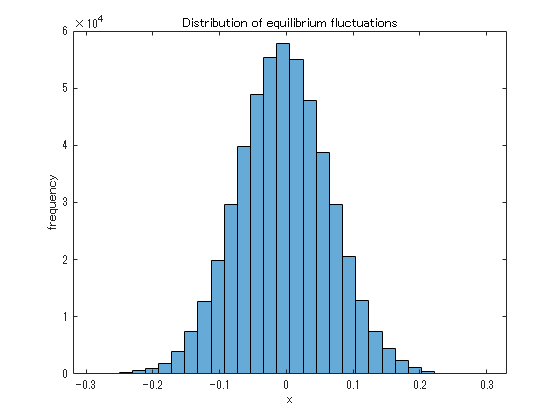
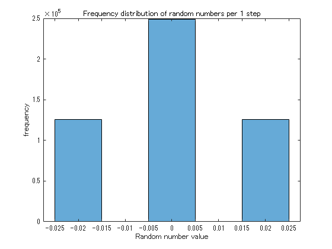

# Coin exchange model for relaxation process 
<a name="beginToc"></a>

## Table of Contents
[Relaxation from non\-equilibrium to equilibrium: comparison with average behavior ](#relaxation-from-non\-equilibrium-to-equilibrium:-comparison-with-average-behavior-)
 
[Equilibrium state: Separate average behavior and fluctuations ](#equilibrium-state:-separate-average-behavior-and-fluctuations-)
 
&emsp;[Fluctuations in equilibrium state (equilibrium fluctuations) ](#fluctuations-in-equilibrium-state-(equilibrium-fluctuations)-)
 
&emsp;[Distribution of equilibrium fluctuation: Fitting by Gaussian distribution ](#distribution-of-equilibrium-fluctuation:-fitting-by-gaussian-distribution-)
 
&emsp;[Change amount of $\eta$ per 1 step ](#change-amount-of--!!!eq_3!!!--per-1-step-)
 
[Function to exchange coins and draw ](#function-to-exchange-coins-and-draw-)
 
<a name="endToc"></a>

```matlab
clear all; clf; 
```

# Relaxation from non\-equilibrium to equilibrium: comparison with average behavior 

 


Coin exchange model is expected to understand the relaxation process by separating it into average behavior and fluctuation. 


The first thing to do is to focus on the average behavior. In the process of relaxation to such an equilibrium state, $\eta_{{\mathrm{A}}}$ on average relaxes exponentially over time. In fact, the $\eta_{{\mathrm{A}}}$ time series can be well fitted using an exponential function (red line). 

```matlab
T = 6; %time
N = 1000; %number of coins

[tm, sm1] = coin_exchange(T, N);
```



```matlab

semilogy(tm, sm1, 'b-', "LineWidth", 1)
hold on
    semilogy(tm, exp(-2*tm), '-r', "LineWidth", 1)
hold off
xlabel('steps', Interpreter='latex', FontSize=15)
ylabel(' !!!EQ_3!!! ', Interpreter='latex', FontSize=15, Rotation=0)
xlim([0 2])
ylim([1e-3 Inf])
```



# Equilibrium state: Separate average behavior and fluctuations 
## Fluctuations in equilibrium state (equilibrium fluctuations) 

 


Next, we will focus on fluctuations. By subtracting the average exponential relaxation from the $\eta_{{\mathrm{A}}}$ time series, we can extract the fluctuation time series. As shown in the graph, the frequency distribution of this fluctuation is a normal distribution. Also, regarding the graph of the frequency distribution of score changes in one trial, the score change in each trial is 

-  When giving a blue coin and receiving a blue coin $\pm 0$ 
-  When giving a blue coin and receiving a red coin $-2$ 
-  When giving a red coin If you give a blue coin and receive a red coin, $+2$ 
-  If you give a red coin and receive a red coin, $\pm 0$ 

, and each happens with equal probability. 

```matlab
T = 5000; %time
N = 100; %number of coins
[tm, sm1] = coin_exchange(T, N);
```



```matlab

dv = sm1-exp(-2*tm);
plot(tm(20:end), dv(20:end), '-b', "LineWidth", 0.5);
xlabel('time')
ylabel('x')
title('Time series of equilibrium fluctuations')
```



```matlab

h1 = histogram(dv(100:end),30);
xlabel('x')
ylabel('frequency')
title('Distribution of equilibrium fluctuations')
```



```matlab

h1x = h1.BinEdges+0.5*h1.BinWidth;
h1x = h1x(1:end-1);
h1y = h1.Values; 
```

## Distribution of equilibrium fluctuation: Fitting by Gaussian distribution 
```matlab
%% approximation:
[xData, yData] = prepareCurveData( h1x, h1y );

% Set the fit type and options.
ft = fittype( 'gauss1' );
opts = fitoptions( 'Method', 'NonlinearLeastSquares' );
opts.Display = 'Off';
opts.Lower = [-Inf -Inf 0];
opts.StartPoint = [22655 -0.0187 0.0486660050980374];

% Fit the model to the data.
[fitresult, gof] = fit( xData, yData, ft, opts );

% Plot a fit to the data.
figure( 'Name', 'fitting to normal distrubiton' );
h = plot( fitresult, xData, yData, 'o' );
legend( h, 'numerical', 'Gaussian', 'Location', 'NorthEast', 'Interpreter', 'none' );
% Label Axes
xlabel( 'x-<x>', 'Interpreter', 'none' );
ylabel( 'frequency', 'Interpreter', 'none' );
title('fitting to normal distrubiton')
grid on
```


```matlab
 
```

## Change amount of $\eta$ per 1 step 
```matlab

histogram(diff(sm1-exp(-2*tm)),[-0.025:0.01:0.025])
xlabel('Random number value')
ylabel('frequency')
title('Frequency distribution of random numbers per 1 step')
```



```matlab
 
```

# Function to exchange coins and draw 
```matlab
function [tm, sm1] = coin_exchange(T, N)
Tn = T*N;
s01 =  N;
s02 = -N;

x1 = 0:1:Tn;

tm  = x1/N;
sm1 = 0*x1;
sm2 = 0*x1;

sm1(1) = s01/N;
sm2(1) = s02/N;

for j = 2:1:Tn+1
    if rand < (s01/N + 1)*0.5 
        ch1 = 1;
    else
        ch1 = -1;
    end
    if rand < (s02/N + 1)*0.5 
        ch2 = 1;
    else
        ch2 = -1;
    end
    s01 = s01 - ch1 + ch2;
    s02 = s02 + ch1 - ch2;

    sm1(j) = s01/N;
    sm2(j) = s02/N;
end
plot(tm, sm1, 'b-', "LineWidth", 1)
hold on
plot(tm, exp(-2*tm), '-r', "LineWidth", 1)
xlabel('steps', Interpreter='latex', FontSize=15)
ylabel(' $\eta$ ', Interpreter='latex', FontSize=15, Rotation=0)
title([' $N =$ ', num2str(N)], Interpreter="latex", FontSize=16)
hold off
end
```
