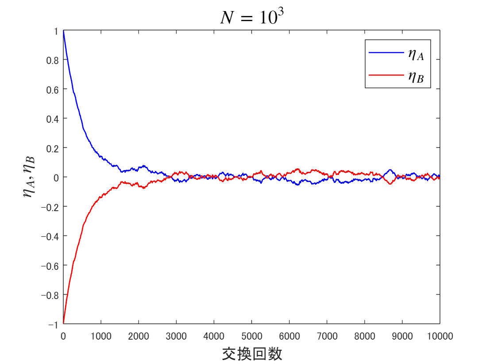
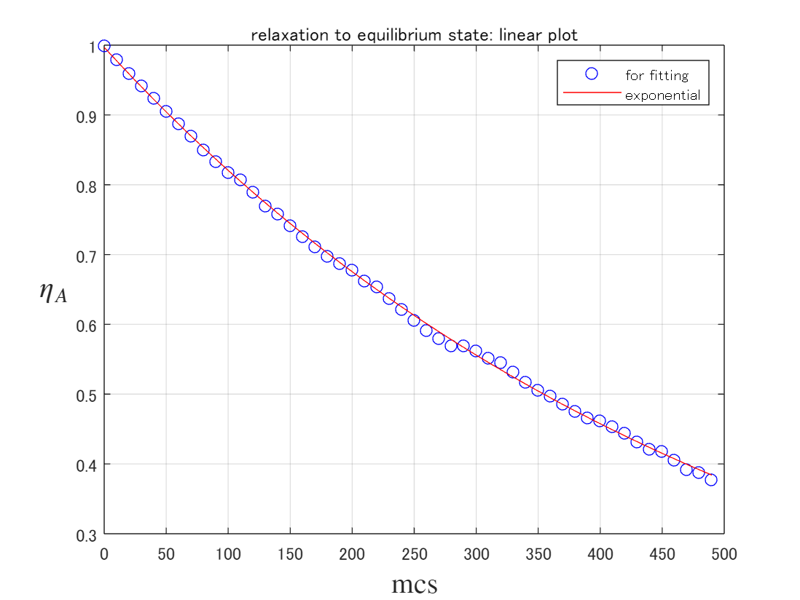
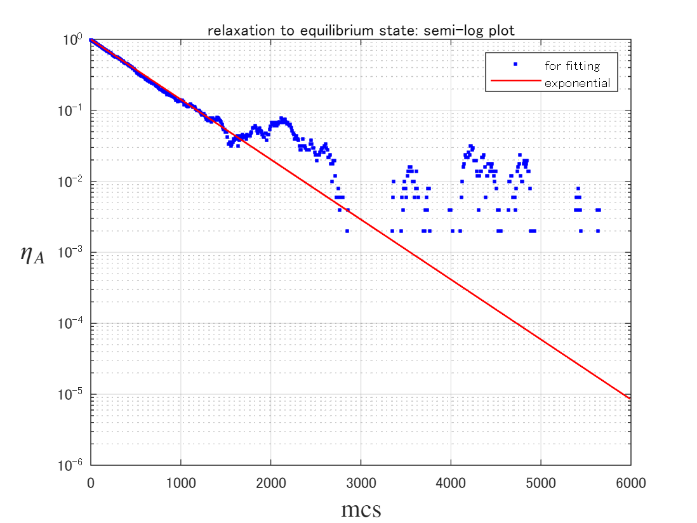
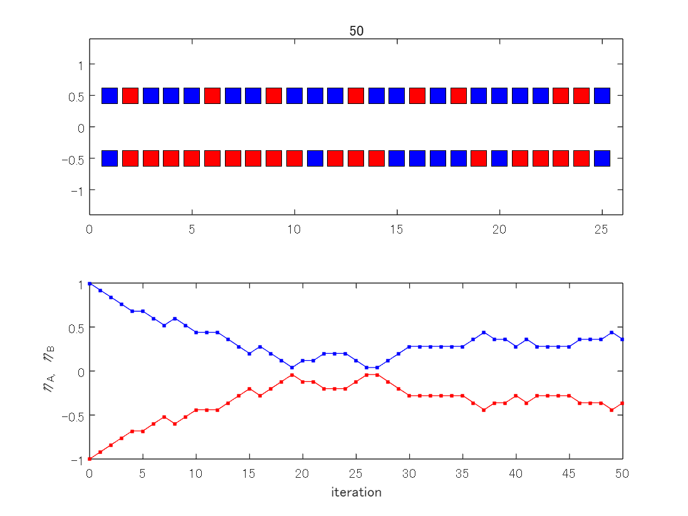

<a name="T_0D665AD3"></a>
# <span style="color:rgb(213,80,0)">Coin exchange model for relaxation process</span>
<a name="beginToc"></a>
## 目次
[コイン交換モデル：概要](#H_1BCF7E67)
 
[ $\eta_{{\mathrm{A}}} ,\eta_{{\mathrm{B}}}$ 時系列の表示](#H_A33F0E76)
 
[指数関数によるフィッティング](#H_AB95E22F)
 
&emsp;[片対数グラフでの表示](#H_E7944F3B)
 
[付録](#H_82EA5D90)
 
&emsp;[コイン交換モデルのアニメーション](#H_9C12E0C0)
 
<a name="endToc"></a>
<a name="H_1BCF7E67"></a>
# コイン交換モデル：概要

ここでは2つの系A，Bが熱エネルギーの交換によって平衡状態に緩和する過程を，コイン交換モデルで表現する．このモデルではAとBの2人がコインを交換することを考える．はじめAは青いコインを $N$ 枚，Bは赤いコインを $N$ 枚持っているものとし，青と赤のコインにはそれぞれ，エネルギーに見立てた得点 $+1,-1$ が割り当てられているものとする．その後，Aの持っているコインとBの持っているコインを1枚ずつ無作為に選んで交換するという操作を繰り返す．数値シミュレーションの結果から読み取れるように，ある程度時間が経つと (試行を繰り返すと)，A，B各々の合計得点 $E_{{\mathrm{A}}} ,E_{{\mathrm{B}}}$ (を規格化した値 $\eta_{{\mathrm{A}}} =E_{{\mathrm{A}}} /N,\eta_{{\mathrm{B}}} =E_{{\mathrm{B}}} /N$ ) はゼロに緩和する．これは A (またはB) の持つ赤と青のコインが同数となる状態に対応する．しかしながら $\eta_{{\mathrm{A}}} ,\eta_{{\mathrm{B}}}$ が平均値ゼロの周りにゆらいでいる様子も見て取れる．( $N$ を大きくすると，このゆらぎは目立たなくなる．)ここから緩和過程を平均挙動とゆらぎに分離して理解することが動機付けられる．


そこでまずは平均挙動に着目する．


このような平衡状態への緩和過程では，(平均的には) 合計得点 $E_{{\mathrm{A}}}$ は (したがって $\eta_{{\mathrm{A}}}$ は) 時間とともに指数関数的に緩和することが理論的に知られている．


確かに $\eta_{{\mathrm{A}}}$ の時系列は指数関数を用いて良くフィットできる．

```matlab
clear all; clf;
```
<a name="H_A33F0E76"></a>
# $\eta_{{\mathrm{A}}} ,\eta_{{\mathrm{B}}}$ 時系列の表示

 $N$ を変えたときの時系列に着目する

<a name="H_A3858203"></a>
```matlab
%時系列のみ表示する
%
expN = 3;
expT = expN + 1;
T = 10^expT; %試行回数（モンテカルロステップ）
N = 10^expN; %コイン数

s01 =  N;
s02 = -N;

x1 = 1:N;

tm  = [0];
sm1 = [s01/N];
sm2 = [s02/N];

%subplot(1, 1, 1);

for j = 1:T
    if rand < (s01/N + 1)*0.5 
        ch1 = 1;
    else
        ch1 = -1;
    end
    if rand < (s02/N + 1)*0.5 
        ch2 = 1;
    else
        ch2 = -1;
    end
    s01 = s01 - ch1 + ch2;
    s02 = s02 + ch1 - ch2;

    if rem(j, 10^(expN-2)) == 0
        tm  = [tm  j];
        sm1 = [sm1 s01/N];
        sm2 = [sm2 s02/N];
    end
end

plot(tm, sm1, '-b', "LineWidth", 1., DisplayName=" !!!EQ_13!!! ")
hold on 
plot(tm, sm2, '-r', "LineWidth", 1., DisplayName=" !!!EQ_14!!! ")

tit = " !!!EQ_15!!! ";
title(tit, Interpreter="latex", FontSize=16)
xlabel('交換回数', FontSize=13)
ylabel(' !!!EQ_16!!! ', Interpreter='latex', FontSize=15)
legend(Interpreter="latex", FontSize=14)
hold off
```

<center></center>


```matlab

%exportgraphics(gca, "coin_exchange.png")
```
<a name="H_AB95E22F"></a>
# 指数関数によるフィッティング

 $\eta_A$ の結果を指数関数でフィッティングする

```matlab
%% 近似: '新規近似 1'。
[xData, yData] = prepareCurveData( tm(1:50), sm1(1:50));

% 近似タイプとオプションを設定します。
ft = fittype( 'exp1' );
opts = fitoptions( 'Method', 'NonlinearLeastSquares' );
opts.Display = 'Off';
opts.StartPoint = [1 0];
%opts.Exclude = excludedPoints;

% モデルをデータに近似します。
[fitresult, gof] = fit( xData, yData, ft, opts )
```

```TextOutput
fitresult = 
     一般モデル Exp1:
     fitresult(x) = a*exp(b*x)
     係数 (95% の信頼限界):
       a =      0.9969  (0.9938, 0.9999)
       b =   -0.001947  (-0.001961, -0.001932)
gof = 
           sse: 9.3054e-04
       rsquare: 0.9994
           dfe: 48
    adjrsquare: 0.9994
          rmse: 0.0044
```

```matlab

% データの近似をプロットします。
figure( 'Name', '新規近似 1' );
h = plot( fitresult, xData, yData, 'bo');
legend( h, 'for fitting', 'exponential', 'Location', 'NorthEast', 'Interpreter', 'none' );
% ラベル Axes
xlabel( 'mcs', Interpreter='latex', FontSize=15 );
ylabel( ' !!!EQ_13!!! ', Interpreter='latex', Rotation=0, FontSize=15);
title('relaxation to equilibrium state: linear plot')
grid on
```

<center></center>


<a name="H_E7944F3B"></a>
## 片対数グラフでの表示

平衡状態への緩和過程では， $\eta_{{\mathrm{A}}}$ は時間とともに指数関数的に緩和することが理論的に知られている．実際、 $\eta_{{\mathrm{A}}}$ の時系列を片対数グラフとして表示すると，初期の緩和過程におけるデータは直線状となっていることが見て取れる．これは $\eta_{{\mathrm{A}}}$ が指数緩和していることを意味する．

```matlab
xn = 600;
semilogy(tm(1:xn), sm1(1:xn), 'b.', DisplayName='for fitting' );
hold on
semilogy(tm(1:xn), fitresult(tm(1:xn)), 'r-', LineWidth=1, DisplayName='exponential');
hold off
xlabel( 'mcs', Interpreter='latex', FontSize=15 );
ylabel( ' $\eta_A$ ', Interpreter='latex', Rotation=0, FontSize=15);
title('relaxation to equilibrium state: semi-log plot')
legend()
grid on
```

<center></center>


```TextOutput
警告: 負のデータは無視されました
```
<a name="H_82EA5D90"></a>
# 付録
<a name="H_9C12E0C0"></a>
## コイン交換モデルのアニメーション
<a name="H_A3858203"></a>
```matlab
clear all; clf;

%random walk 
T = 50; %試行回数
N = 25; %コイン数

s1 =  ones(2, N);
s1(2,:) = -s1(2,:);

x1 = 1:N;
ms = fix(300/N);

%subplot(m,n,p)

subplot(2, 1, 1);
plot(x1, 0.5 * s1(1,:), 'ks', "MarkerSize", ms, "MarkerFaceColor",'b')
hold on 
plot(x1, 0.5 * s1(2,:), 'ks', "MarkerSize", ms, "MarkerFaceColor",'r')
xlim([-0 N+1])
ylim([-1.4 1.4])
title(0);

tm  = [0];
sm1 = [sum(s1(1, :))/N];
sm2 = [sum(s1(2, :))/N];

for j = 1:T
    r1 = fix(rand * N) + 1;
    r2 = fix(rand * N) + 1;
    t1 = s1(1, r1);
    %t2 = s1(2, r2);
    s1(1, r1) = s1(2, r2);
    s1(2, r2) = t1;
    
    subplot(2, 1, 1);
    plot([r1 r2], 0.5*[1 -1], 'k-') 
    pause(0.1)
    plot([r1 r2], 0.5*[1 -1], 'w-') 
    for k = 1:N
        if s1(1, k) > 0
            plot([k], 0.5, 'ks', "MarkerSize", ms, "MarkerFaceColor",'b')
        else
            plot([k], 0.5, 'ks', "MarkerSize", ms, "MarkerFaceColor",'r')
        end
        
        if s1(2, k) > 0
            plot([k], -0.5, 'ks', "MarkerSize", ms, "MarkerFaceColor",'b')
        else
            plot([k], -0.5, 'ks', "MarkerSize", ms, "MarkerFaceColor",'r')
        end
    end
    %pause(1);
    title(j);
    
    subplot(2, 1, 2);
    tm  = [tm  j];
    sm1 = [sm1 sum(s1(1, :))/N];
    sm2 = [sm2 sum(s1(2, :))/N];
    plot(tm, sm1, '.-b')
    hold on
        plot(tm, sm2, '.-r')
    hold off
    xlabel('iteration')
    ylabel('\eta_A, \eta_B')

    drawnow
end
hold off
```

<center></center>


