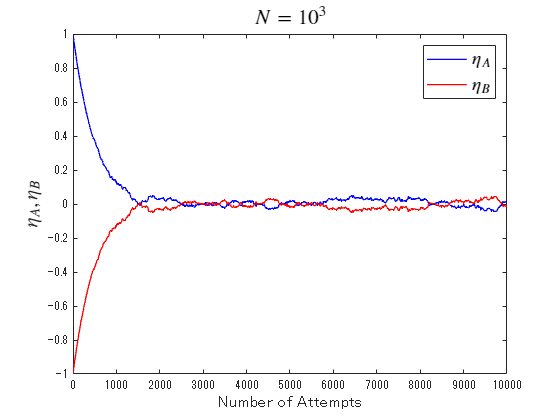
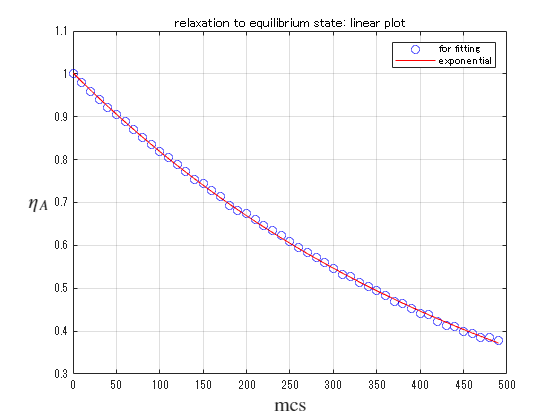
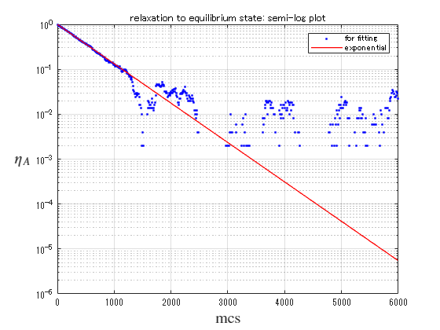
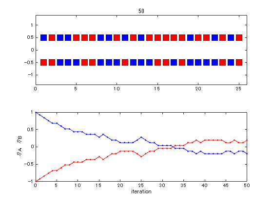

# Coin exchange model for relaxation process 
<a name="beginToc"></a>

## Table of Contents
[Coin exchange model: Overview ](#coin-exchange-model:-overview-)
 
[ $\eta_{{\mathrm{A}}} ,\eta_{{\mathrm{B}}}$ Time series display ](#-!!!eq_6!!!--time-series-display-)
 
[ Fitting by exponential function](#-fitting-by-exponential-function)
 
&emsp;[Display in semi\-logarithmic graph ](#display-in-semi\-logarithmic-graph-)
 
[Appendix ](#appendix-)
 
&emsp;[Animation of Coin exchange model](#animation-of-coin-exchange-model)
 
<a name="endToc"></a>

# Coin exchange model: Overview 

 


Here, we use a coin exchange model to express the process in which two systems A and B relax to an equilibrium state by exchanging thermal energy. In this model, consider two people, A and B, exchanging coins. Initially, it is assumed that A has $N$ blue coins and B has $N$ red coins, and each blue and red coin is assigned a score $+1,-1$ that is compared to energy. Then, repeat the operation of randomly selecting one coin owned by A (blue or red) and one coin owned by B and exchanging them.  As can be seen from the numerical simulation results, after a certain amount of time (after repeated trials), the total score $E_{{\mathrm{A}}} ,E_{{\mathrm{B}}}$ (normalized value $\eta_{{\mathrm{A}}} =E_{{\mathrm{A}}} /N,\eta_{{\mathrm{B}}} =E_{{\mathrm{B}}} /N$ ) of each of A and B eases to zero. This corresponds to the situation where A (or B) has the same number of red and blue coins. However, it can also be seen that $\eta_{{\mathrm{A}}} ,\eta_{{\mathrm{B}}}$ fluctuates around the mean value of zero. (If $N$ is increased, this fluctuation becomes less noticeable.) This motivates us to understand the relaxation process by separating it into average behavior and fluctuation. 


Therefore, we first focus on the average behavior. 


It is theoretically known that in such a relaxation process to an equilibrium state, (on average) the total score $E_{{\mathrm{A}}}$ (and therefore $\eta_{{\mathrm{A}}}$ ) will relax exponentially over time. 


Certainly, the $\eta_{{\mathrm{A}}}$ time series can be well fitted using an exponential function. 

```matlab
clear all; clf;
```

# $\eta_{{\mathrm{A}}} ,\eta_{{\mathrm{B}}}$ Time series display 

The time series when changing $N$ 


```matlab
%Display only time series
%
expN = 3;
expT = expN + 1;
T = 10^expT; %Number of trials (Monte Carlo step)
N = 10^expN; %number of coins

s01 =  N;
s02 = -N;

x1 = 1:N;

tm  = [0];
sm1 = [s01/N];
sm2 = [s02/N];

%subplot(1, 1, 1);

for j = 1:T
    if rand < (s01/N + 1)*0.5 
        ch1 = 1;
    else
        ch1 = -1;
    end
    if rand < (s02/N + 1)*0.5 
        ch2 = 1;
    else
        ch2 = -1;
    end
    s01 = s01 - ch1 + ch2;
    s02 = s02 + ch1 - ch2;

    if rem(j, 10^(expN-2)) == 0
        tm  = [tm  j];
        sm1 = [sm1 s01/N];
        sm2 = [sm2 s02/N];
    end
end

plot(tm, sm1, '-b', "LineWidth", 1., DisplayName=" !!!EQ_13!!! ")
hold on 
plot(tm, sm2, '-r', "LineWidth", 1., DisplayName=" !!!EQ_14!!! ")

tit = " !!!EQ_15!!! ";
title(tit, Interpreter="latex", FontSize=16)
xlabel('Number of Attempts', FontSize=13)
ylabel(' !!!EQ_16!!! ', Interpreter='latex', FontSize=15)
legend(Interpreter="latex", FontSize=14)
hold off
```



```matlab

%exportgraphics(gca, "coin_exchange.png")
```

#  Fitting by exponential function

 $\eta_A$ results fitting with an exponential function 

```matlab
%% Fit: 'New Fit 1'.
[xData, yData] = prepareCurveData( tm(1:50), sm1(1:50));

% Set the fit type and options.
ft = fittype( 'exp1' );
opts = fitoptions( 'Method', 'NonlinearLeastSquares' );
opts.Display = 'Off';
opts.StartPoint = [1 0];
%opts.Exclude = excludedPoints;

% Fit the model to the data.
[fitresult, gof] = fit( xData, yData, ft, opts )
```

```matlabTextOutput
fitresult = 
     一般モデル Exp1:
     fitresult(x) = a*exp(b*x)
     係数 (95% の信頼限界):
       a =       1.002  (1, 1.004)
       b =    -0.00202  (-0.002031, -0.00201)
gof = フィールドをもつ struct:
           sse: 4.933731662702592e-04
       rsquare: 0.999709897746347
           dfe: 48
    adjrsquare: 0.999703853949396
          rmse: 0.003206026766986

```

```matlab

% Plot a fit to the data.
figure( 'Name', '新規近似 1' );
h = plot( fitresult, xData, yData, 'bo');
legend( h, 'for fitting', 'exponential', 'Location', 'NorthEast', 'Interpreter', 'none' );
% Label Axes
xlabel( 'mcs', Interpreter='latex', FontSize=15 );
ylabel( ' !!!EQ_13!!! ', Interpreter='latex', Rotation=0, FontSize=15);
title('relaxation to equilibrium state: linear plot')
grid on
```




## Display in semi\-logarithmic graph 

In the relaxation process to the equilibrium state, it is known that the total score $E_{{\mathrm{A}}}$ relaxes exponentially with time. Therefore, when the time series of $\eta_{{\mathrm{A}}}$ is displayed as a semi\-log graph, it can be seen that the data in the initial relaxation process is linear. This certainly means that $\eta_{{\mathrm{A}}}$ is exponentially relaxed. 

```matlab
xn = 600;
semilogy(tm(1:xn), sm1(1:xn), 'b.', DisplayName='for fitting' );
hold on
semilogy(tm(1:xn), fitresult(tm(1:xn)), 'r-', LineWidth=1, DisplayName='exponential');
hold off
xlabel( 'mcs', Interpreter='latex', FontSize=15 );
ylabel( ' $\eta_A$ ', Interpreter='latex', Rotation=0, FontSize=15);
title('relaxation to equilibrium state: semi-log plot')
legend()
grid on 
```



```matlabTextOutput
警告: 負のデータは無視されました
```

# Appendix 
## Animation of Coin exchange model

```matlab
clear all; clf;

%random walk
T = 50; %number of attempts
N = 25; %number of coins

s1 =  ones(2, N);
s1(2,:) = -s1(2,:);

x1 = 1:N;
ms = fix(300/N);

%subplot(m,n,p)

subplot(2, 1, 1);
plot(x1, 0.5 * s1(1,:), 'ks', "MarkerSize", ms, "MarkerFaceColor",'b')
hold on 
plot(x1, 0.5 * s1(2,:), 'ks', "MarkerSize", ms, "MarkerFaceColor",'r')
xlim([-0 N+1])
ylim([-1.4 1.4])
title(0);

tm  = [0];
sm1 = [sum(s1(1, :))/N];
sm2 = [sum(s1(2, :))/N];

for j = 1:T
    r1 = fix(rand * N) + 1;
    r2 = fix(rand * N) + 1;
    t1 = s1(1, r1);
    %t2 = s1(2, r2);
    s1(1, r1) = s1(2, r2);
    s1(2, r2) = t1;
    
    subplot(2, 1, 1);
    plot([r1 r2], 0.5*[1 -1], 'k-') 
    pause(0.1)
    plot([r1 r2], 0.5*[1 -1], 'w-') 
    for k = 1:N
        if s1(1, k) > 0
            plot([k], 0.5, 'ks', "MarkerSize", ms, "MarkerFaceColor",'b')
        else
            plot([k], 0.5, 'ks', "MarkerSize", ms, "MarkerFaceColor",'r')
        end
        
        if s1(2, k) > 0
            plot([k], -0.5, 'ks', "MarkerSize", ms, "MarkerFaceColor",'b')
        else
            plot([k], -0.5, 'ks', "MarkerSize", ms, "MarkerFaceColor",'r')
        end
    end
    %pause(1);
    title(j);
    
    subplot(2, 1, 2);
    tm  = [tm  j];
    sm1 = [sm1 sum(s1(1, :))/N];
    sm2 = [sm2 sum(s1(2, :))/N];
    plot(tm, sm1, '.-b')
    hold on
        plot(tm, sm2, '.-r')
    hold off
    xlabel('iteration')
    ylabel('\eta_A, \eta_B')

    drawnow
end
hold off
```




