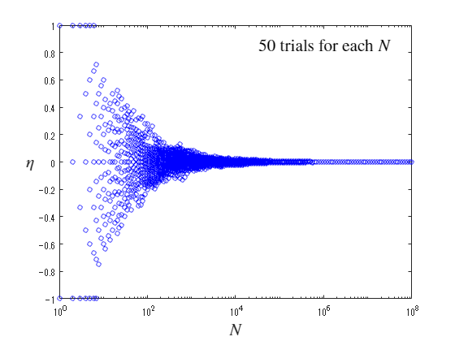
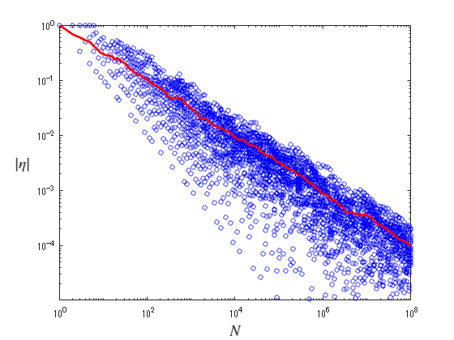
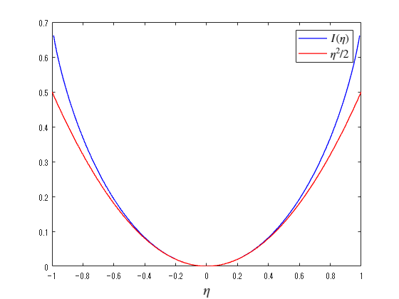
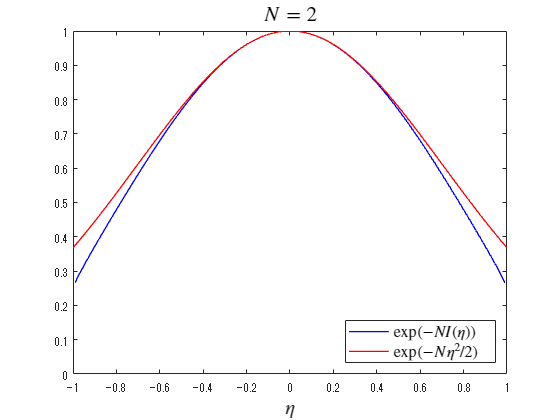
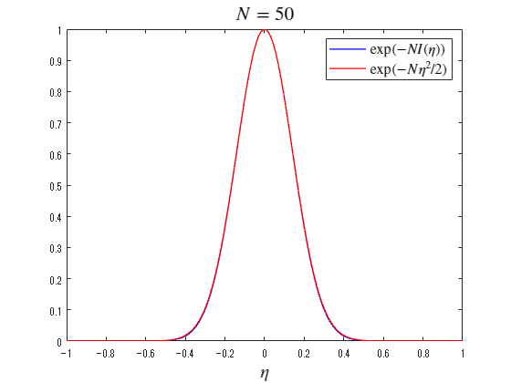

<a name="T_827D14D5"></a>
# <span style="color:rgb(213,80,0)">コイン投げ</span>
<a name="beginToc"></a>
## 目次
[コイン投げ](#T_827D14D5)
 
&emsp;[初期設定](#H_CDB8EDE6)
 
&emsp;[コイン投げの実施](#H_567B8145)
 
&emsp;[データ読み込みとグラフ描画](#H_25157F0B)
 
&emsp;[標準偏差の $N$ 依存性](#H_095B2BF3)
 
[近似を視覚的に理解する](#H_4FEC8881)
 
<a name="endToc"></a>

表と裏の出る確率がそれぞれ $1/2$ のコインを $N$ 枚用意する．


各コインの表面には得点 $+1$ が，裏面には得点 $-1$ が割り当てられている．


 $N$ 枚のコインを投げた合計得点 $E$ に対して， $\eta =E/N$ はコイン1枚あたりの平均得点と解釈できる．


 $\eta$ の期待値はゼロである．


ここではコインの枚数 $N$ を変化させたときの各コインの平均値 $\eta$ を，数値シミュレーションによって調べる．

<a name="H_567B8145"></a>
# コイン投げ
<a name="H_CDB8EDE6"></a>
## 初期設定

コインの枚数 $N$ のリスト T を作成する．

```matlab
T = 1:1:9;
for j = 1:1:7
    x = uint64(logspace(j, j+1, 20));
    T = horzcat(T, x(1:end-1));
end
T = horzcat(T, x(end));
AA = [];
```
<a name="H_28ECB4AF"></a>
## コイン投げの実施

各コインの枚数 $N$ に関してコイン投げを $R$ 回繰り返し，各試行での $\eta$ の値を取得する．

```matlab
format long
R = 50;
for j =1:1:R
    A = zeros(size(T));
    maxT = T(end);
    tm = 1;
    cn = 0;
    sm = 0;
    avr = 0;
    chk_t = 1;
    while tm <= maxT
        cn = cn + 1.0;
        xi = 2*randi(2)-3;
        sm = sm + xi;
        if(tm == T(chk_t))
            A(chk_t) = sm / cn;
            chk_t = chk_t + 1;
        end
        tm = tm + 1;
    end
    AA = vertcat(AA, A);
end

```
<a name="H_25157F0B"></a>
## データ読み込みとグラフ描画

コインの枚数 $N$ が充分大きくなると，試行ごとの $\eta$ のばらつきがほとんどなくなり，平均値 $\eta$ は確率的にいって，ほぼ確実に期待値ゼロに一致することが読み取れる．

```matlab
x1 = double(T);
m1 = std(AA);

semilogx(T, AA, 'ob', MarkerSize=4)
xl = xlabel(' $N$ ', Interpreter='latex');
xl.FontSize=16;
yl = ylabel(' $\eta$ ', Rotation=0, Interpreter='latex');
yl.FontSize=16;
text(3e4, 0.85, '50 trials for each $N$ ', Interpreter='latex', FontSize=16)

%exportgraphics(gca, "Coin_Toss_eta.png")
```

<center></center>

<a name="H_095B2BF3"></a>
## 標準偏差の $N$ 依存性

実際， $|\eta |$ の標準偏差 $\Delta \eta$ を $N$ に対して両対数グラフに表示すると，標準偏差は $\Delta \eta =N^{-0.5}$ （図の赤い線）に従って減少する様子が見て取れる．


なお $|\eta |$ の値は $1/N$ を最小単位として離散化されているので， $|\eta |=N^{-1}$ よりも小さなデータは現れない．

```matlab
loglog(T, AA, 'ob', MarkerSize=4)
hold on
    loglog(x1, m1, '-r', LineWidth=2)
hold off
xl = xlabel(' $N$ ', Interpreter='latex');
xl.FontSize=14;
yl = ylabel(' $|\eta|$ ', Rotation=0, Interpreter='latex');
yl.FontSize=14;
ylim([1e-5 1])
```

<center></center>


```matlab


```
<a name="H_4FEC8881"></a>
# 近似を視覚的に理解する

 $I(\eta )=\frac{1}{2}\left\lbrace (1+\eta )\ln (1+\eta )+(1-\eta )\ln (1-\eta )\right\rbrace$ と $I(\eta )$ の近似 $\frac{1}{2}\eta^2$ との比較を行う。

```matlab
eta = -1:0.01:1;

Ieta = 0.5*((1+eta).*log(1+eta)+(1-eta).*log(1-eta));

plot(eta, Ieta, 'b-', LineWidth=1, DisplayName=" $I(\eta)$ ")
hold on
    plot(eta, 0.5*eta.^2, 'r-', LineWidth=1, DisplayName=" $\eta^{2}/2$ ")
hold off
xlabel(" $\eta$ ", Interpreter="latex", FontSize=15)
%ylabel(" $I(\eta)$ [blue], $\eta^{2}/2$ [red]", Interpreter="latex", FontSize=14)
legend(Interpreter="latex", FontSize=12)
```

<center></center>


 $\exp (-NI(\eta ))$ と $\exp \left(-\frac{N}{2}\eta^2 \right)$ の比較を行う。


 $N=2$ の場合

```matlab
eta = -1:0.01:1;

Ieta = 0.5*((1+eta).*log(1+eta)+(1-eta).*log(1-eta));

N = 2;

plot(eta, exp(-N*Ieta), 'b-', LineWidth=1, DisplayName=" $\exp(-NI(\eta))$ ")
hold on
    plot(eta, exp(-N*0.5*eta.^2), 'r-', LineWidth=1, DisplayName=" $\exp(-N\eta^{2}/2)$ ")
hold off
xlabel(" $\eta$ ", Interpreter="latex", FontSize=15)
%ylabel(" $\exp(-NI)$ [blue], $\exp(-N\eta^{2}/2)$ [red]", Interpreter="latex", FontSize=14)
legend(Interpreter="latex", FontSize=12, Location="southeast")
ylim([0 1])
title(" $N=2$ ", Interpreter="latex", FontSize=16)
```

<center></center>


 $N=50$ の場合

```matlab
eta = -1:0.01:1;

Ieta = 0.5*((1+eta).*log(1+eta)+(1-eta).*log(1-eta));

N = 50;

plot(eta, exp(-N*Ieta), 'b-', LineWidth=1, DisplayName=" $\exp(-NI(\eta))$ ")
hold on
    plot(eta, exp(-N*0.5*eta.^2), 'r-', LineWidth=1, DisplayName=" $\exp(-N\eta^{2}/2)$ ")
hold off
xlabel(" $\eta$ ", Interpreter="latex", FontSize=15)
%ylabel(" $\exp(-NI)$ [blue], $\exp(-N\eta^{2}/2)$ [red]", Interpreter="latex", FontSize=14)
legend(Interpreter="latex", FontSize=12, Location="northeast")
ylim([0 1])
title(" $N=50$ ", Interpreter="latex", FontSize=16)
```

<center></center>


