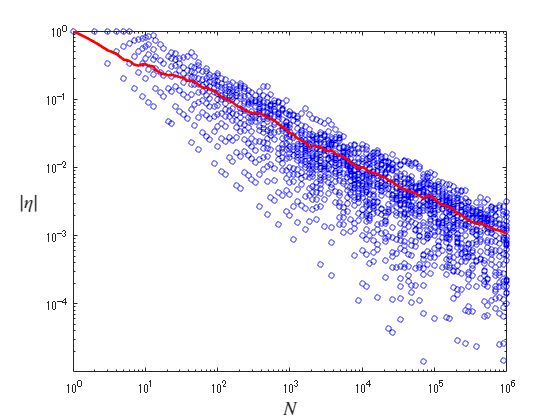

# Coin toss 
<a name="beginToc"></a>

## Table of Contents
[coin toss ](#coin-toss-)
 
&emsp;[initial setting ](#initial-setting-)
 
&emsp;[Conducting coin tosses](#conducting-coin-tosses)
 
&emsp;[Data loading and plotting ](#data-loading-and-plotting-)
 
&emsp;[N dependence of standard deviation](#n-dependence-of-standard-deviation)
 
[Understanding approximiation visually ](#understanding-approximiation-visually-)
 
<a name="endToc"></a>

Prepare $N$ coins with probability of getting heads and tails of $1/2$ respectively. 


The front side of each coin is assigned a score $+1$ , and the back side is assigned a score $-1$ . $\eta =E/N$ can be interpreted as the average score per coin, compared to the total score $E$ for tossing $N$ coins. The expected value of $\eta$ is zero. 


Here, we investigate the average value $\eta$ of each coin when the number of coins $N$ is varied by numerical simulation. 

# coin toss 
## initial setting 

Create a list T of the number of coins $N$ . 

```matlab
T = 1:1:9;
for j = 1:1:5
    x = uint64(logspace(j, j+1, 20));
    T = horzcat(T, x(1:end-1));
end
T = horzcat(T, x(end));
AA = []; 
```

## Conducting coin tosses

Repeat the coin toss $R$ times for each coin $N$ and obtain the value of $\eta$ in each trial. 

```matlab
format long
R = 50;
for j =1:1:R
    A = zeros(size(T));
    maxT = T(end);
    tm = 1;
    cn = 0;
    sm = 0;
    avr = 0;
    chk_t = 1;
    while tm <= maxT
        cn = cn + 1.0;
        xi = 2*randi(2)-3;
        sm = sm + xi;
        if(tm == T(chk_t))
            A(chk_t) = sm / cn;
            chk_t = chk_t + 1;
        end
        tm = tm + 1;
    end
    AA = vertcat(AA, A);
end
 
```

## Data loading and plotting 

When the number of coins $N$ becomes large enough, the variation of $\eta$ from trial to trial is almost eliminated. and the average value $\eta$ is almost certainly equal to the expected value of zero from a probabilistic point of view.

```matlab
x1 = double(T);
m1 = std(AA);

semilogx(T, AA, 'ob', MarkerSize=4)
xl = xlabel(' $N$ ', Interpreter='latex');
xl.FontSize=16;
yl = ylabel(' $\eta$ ', Rotation=0, Interpreter='latex');
yl.FontSize=16;
text(3e3, 0.85, '50 trials for each $N$ ', Interpreter='latex', FontSize=16)
```


```matlab

%exportgraphics(gca, "Coin_Toss_eta.png")
```

## N dependence of standard deviation

In fact, when the standard deviation of $|\eta |$ , $\Delta \eta$ , is plotted against $N$ on a log\-log graph, you can see that the standard deviation decreases according to $\Delta \eta =N^{-0.5}$ (red line in the figure) ．．


Note that the value of $|\eta |$ is discretized using $1/N$ as the minimum unit, so data smaller than $|\eta |=N^{-1}$ will not appear. 

```matlab
loglog(T, AA, 'ob', MarkerSize=4)
hold on
    loglog(x1, m1, '-r', LineWidth=2)
hold off
xl = xlabel(' $N$ ', Interpreter='latex');
xl.FontSize=14;
yl = ylabel(' $|\eta|$ ', Rotation=0, Interpreter='latex');
yl.FontSize=14;
ylim([1e-5 1])
```



```matlab


```

# Understanding approximiation visually 

Compare $I(\eta )=\frac{1}{2}\left\lbrace (1+\eta )\ln (1+\eta )+(1-\eta )\ln (1-\eta )\right\rbrace$ with approximation of $I(\eta )$ , $\frac{1}{2}\eta^2$ .

```matlab
eta = -1:0.01:1;

Ieta = 0.5*((1+eta).*log(1+eta)+(1-eta).*log(1-eta));

plot(eta, Ieta, 'b-', LineWidth=1, DisplayName=" $I(\eta)$ ")
hold on
    plot(eta, 0.5*eta.^2, 'r-', LineWidth=1, DisplayName=" $\eta^{2}/2$ ")
hold off
xlabel(" $\eta$ ", Interpreter="latex", FontSize=15)
%ylabel(" $I(\eta)$ [blue], $\eta^{2}/2$ [red]", Interpreter="latex", FontSize=14)
legend(Interpreter="latex", FontSize=12)
```


Compare between $\exp (-NI(\eta ))$ and $\exp \left(-\frac{N}{2}\eta^2 \right)$ . 


In case of $N=2$ 

```matlab
eta = -1:0.01:1;

Ieta = 0.5*((1+eta).*log(1+eta)+(1-eta).*log(1-eta));

N = 2;

plot(eta, exp(-N*Ieta), 'b-', LineWidth=1, DisplayName=" $\exp(-NI(\eta))$ ")
hold on
    plot(eta, exp(-N*0.5*eta.^2), 'r-', LineWidth=1, DisplayName=" $\exp(-N\eta^{2}/2)$ ")
hold off
xlabel(" $\eta$ ", Interpreter="latex", FontSize=15)
%ylabel(" $\exp(-NI)$ [blue], $\exp(-N\eta^{2}/2)$ [red]", Interpreter="latex", FontSize=14)
legend(Interpreter="latex", FontSize=12, Location="southeast")
ylim([0 1])
title(" $N=2$ ", Interpreter="latex", FontSize=16)
```


In case of $N=50$ 

```matlab
eta = -1:0.01:1;

Ieta = 0.5*((1+eta).*log(1+eta)+(1-eta).*log(1-eta));

N = 50;

plot(eta, exp(-N*Ieta), 'b-', LineWidth=1, DisplayName=" $\exp(-NI(\eta))$ ")
hold on
    plot(eta, exp(-N*0.5*eta.^2), 'r-', LineWidth=1, DisplayName=" $\exp(-N\eta^{2}/2)$ ")
hold off
xlabel(" $\eta$ ", Interpreter="latex", FontSize=15)
%ylabel(" $\exp(-NI)$ [blue], $\exp(-N\eta^{2}/2)$ [red]", Interpreter="latex", FontSize=14)
legend(Interpreter="latex", FontSize=12, Location="northeast")
ylim([0 1])
title(" $N=50$ ", Interpreter="latex", FontSize=16)
```


