<a name="T_827D14D5"></a>
# <span style="color:rgb(213,80,0)">詳細つりあいによる平衡状態の再現</span>
<a name="beginToc"></a>
## 目次
[１次元理想気体の平衡状態](#H_2D1171D3)
 
&emsp;[問題設定](#H_F557905B)
 
&emsp;[目的](#H_DA491F32)
 
&emsp;[初期条件の設定](#H_1EC491C5)
 
&emsp;[ガウス分布によるフィッティング（メトロポリス法）](#H_8815ED7D)
 
&emsp;[エネルギーの時間変化について：平衡状態への緩和（メトロポリス法）](#H_A7A4783D)
 
&emsp;[平衡状態におけるエネルギーの揺らぎ（メトロポリス法）](#H_81E7495E)
 
&emsp;&emsp;[平衡状態のサンプリング](#H_A18342DB)
 
&emsp;&emsp;[平衡状態におけるエネルギー分布](#H_BAAB064B)
 
&emsp;[ガウス分布によるフィッティング（熱浴法）](#H_276695E9)
 
&emsp;[エネルギーについて、平衡状態への緩和（熱浴法）＋メトロポリス法との比較](#H_9781EDB3)
 
&emsp;[平衡状態におけるエネルギーの揺らぎ（熱浴法）](#H_29390B9A)
 
&emsp;&emsp;[平衡状態のサンプリング](#H_2858C44A)
 
&emsp;&emsp;[平衡状態におけるエネルギー分布](#H_77CF1E85)
 
<a name="endToc"></a>
```matlab
clear all;
clf;
```
<a name="H_2D1171D3"></a>
# １次元理想気体の平衡状態
<a name="H_F557905B"></a>
## 問題設定

温度 $T$ の熱浴に接している、 $N$ 個の粒子から成る1次元理想気体系を考える。


粒子の質量はすべて等しく $m$ とする。


初期条件として、全ての粒子に初速 $v_0$ を与えることとする。


 $j(=1,\cdots ,N)$ 番目の粒子の速度を $v_j$ と書くと、系の全エネルギー $E$ は ${E=\sum_{j=1}^N \frac{1}{2}mv_j^2 }$ と表される。

<a name="H_DA491F32"></a>
## 目的

メトロポリス法および熱浴法によって平衡状態へと緩和していく様子を確認する。


なお、以下の数値シミュレーションでは、

 $$ N=10000,~~m=1,~~T=3,~~v_0 =10, $$ 

および trial state への速度の最大変化量を $\delta v=1$ と数値を設定している。


（また、ボルツマン定数は $k_B =1$ としている。）

<a name="H_1EC491C5"></a>
## 初期条件の設定
```matlab
N = 10000; % 粒子数
v0 = 10; % 初期速度
dlt = 1;

% for metropolis
vm = v0 * ones(1, N); 
vm2 = vm.*vm;
em0 = sum(0.5*vm2);

% for heat bath
vh = v0 * ones(1, N); 
vh2 = vh.*vh;
eh0 = sum(0.5*vh2);

% temperature
T = 3;
beta = 1/T;

% maximum montecarlo step
tm = 200;

% time evolution of energy 
% for metropolis
em1 = zeros(1,tm+1);
em2 = zeros(1,tm+1);
em1(1) = em0;
em2(1) = em0*em0;

% for heat bath
eh1 = zeros(1,tm+1);
eh2 = zeros(1,tm+1);
eh1(1) = eh0;
eh2(1) = eh0*eh0;

% distribution of the initial state
histogram(vm)
xlabel("velocity")
ylabel("frequency")
title("the initial distribution of velocity at mcs = 0")
ylim([0 1.1*N])
xlim([-5 11])
```

<center>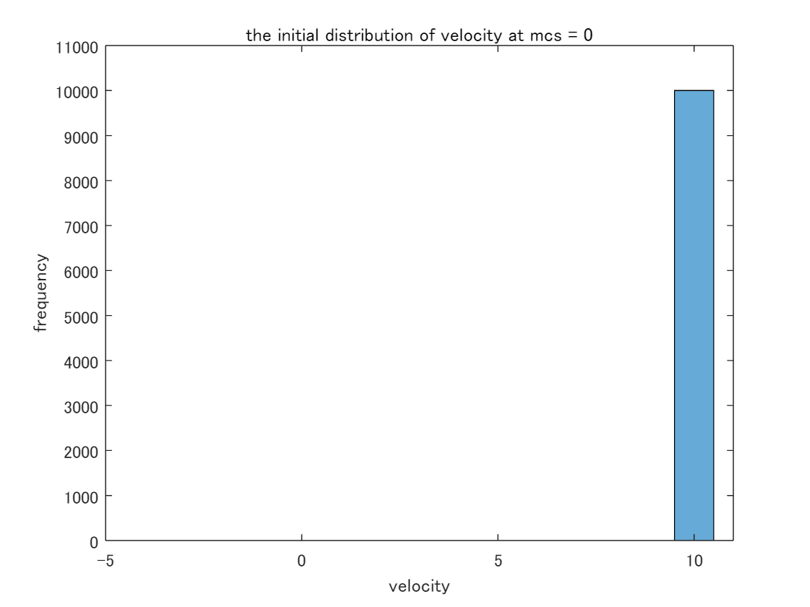</center>

<a name="H_5A30BF10"></a>
# **メトロポリス法**
```matlab
for j = 1:1:tm
    for k = 1:1:N
        pcl = randi(N);
        vmt = vm(pcl) + 2*(rand(1)-0.5)*dlt;
        dme = 0.5*(vmt*vmt - vm(pcl)*vm(pcl));
        imchk = 0;
        if dme > 0
            if exp(-beta*dme) < rand(1)
                imchk = 1;
            end
        end
        if imchk == 0
            vm(pcl) = vmt;
        end
    end

    em1(j+1) = sum(0.5*vm.*vm);
    em2(j+1) = em1(j+1)*em1(j+1);

    edges = [-10:0.2:10];
    histogram(vm, edges)
    xlabel("velocity")
    ylabel("frequency")
    title("metropolis method : mcs = "+string(j))
    ylim([0 0.1*N])
    xlim([-10 10])
    drawnow
end
```

<center>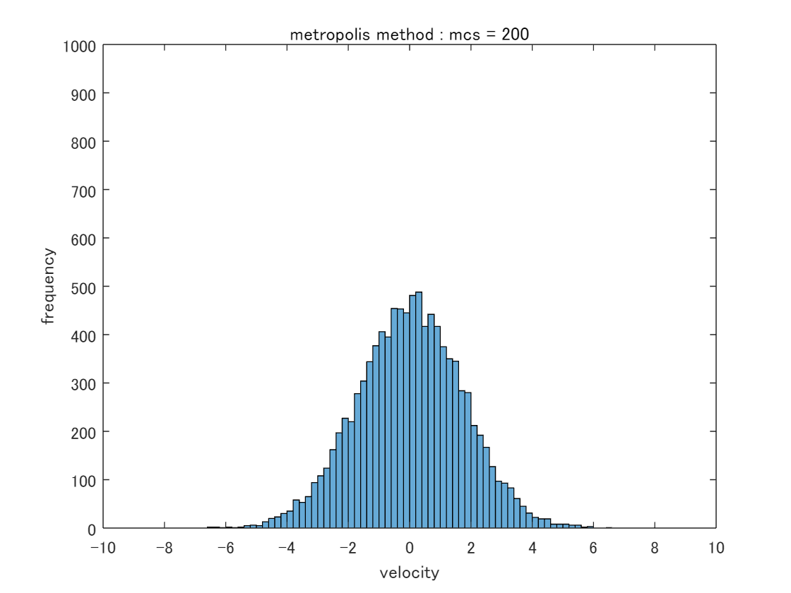</center>

<a name="H_8815ED7D"></a>
## ガウス分布によるフィッティング（メトロポリス法）

メトロポリス法に基づく状態遷移では、速度分布は初期条件を反映したデルタ関数的な分布から、状態遷移を繰り返すことによって、釣り鐘型の分布に移行している。


平衡状態における速度分布はMaxwell分布になることが期待されるので、得られた平衡状態の分布をガウス分布によってフィッティングすることを試みる。

```matlab
[hm1, edges] = histcounts(vm, 20);
hm1v = hm1;
hm1x = edges(1:end-1)+0.5*(edges(2)-edges(1));

%% 近似: '新規近似 1'。
[xData, yData] = prepareCurveData( hm1x, hm1v );

% 近似タイプとオプションを設定します。
ft = fittype( 'gauss1' );
opts = fitoptions( 'Method', 'NonlinearLeastSquares' );
opts.Display = 'Off';
opts.Lower = [-Inf -Inf 0];
opts.StartPoint = [1549 0.0449999999999995 1.2734707355075];

% モデルをデータに近似します。
[fitresult, gof] = fit( xData, yData, ft, opts )
```

```TextOutput
fitresult = 
     一般モデル Gauss1:
     fitresult(x) =  a1*exp(-((x-b1)/c1)^2)
     係数 (95% の信頼限界):
       a1 =        1523  (1500, 1546)
       b1 =     0.04361  (0.01346, 0.07375)
       c1 =       2.443  (2.4, 2.486)
gof = 
           sse: 6.2534e+03
       rsquare: 0.9989
           dfe: 17
    adjrsquare: 0.9988
          rmse: 19.1794
```

```matlab

% データの近似をプロットします。
figure( 'Name', 'fitting' );
h = plot( fitresult, xData, yData, 'o' );
legend( h, 'Metropolis', 'fitting', 'Location', 'NorthEast', 'Interpreter', 'none' );
% ラベル Axes
xlabel( 'velocity', 'Interpreter', 'none' );
ylabel( 'frequency', 'Interpreter', 'none' );
grid on
```

<center>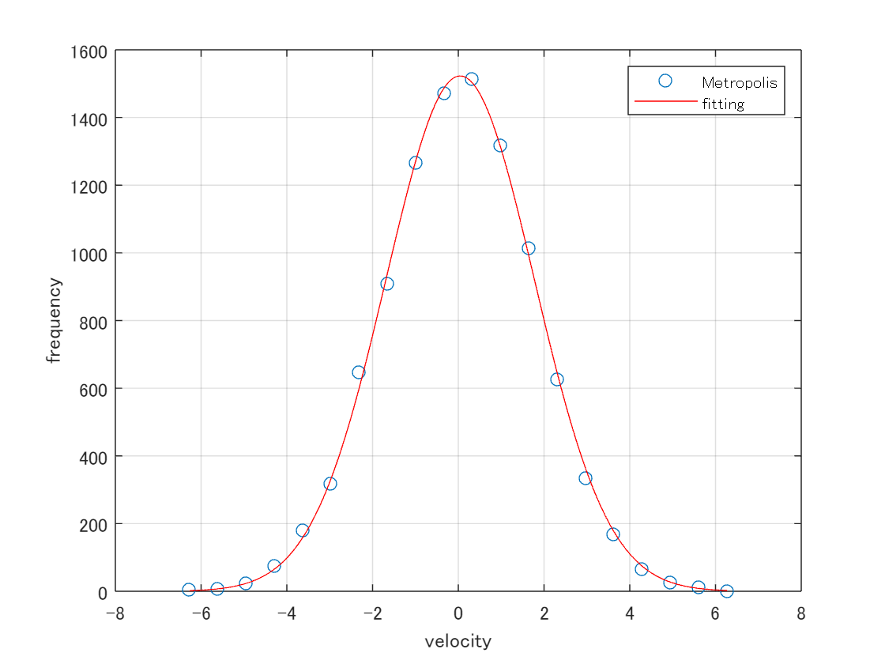</center>

<a name="H_A7A4783D"></a>
## エネルギーの時間変化について：平衡状態への緩和（メトロポリス法）

メトロポリス法によって系は平衡状態に緩和するが、その緩和過程における系の全エネルギーの時間変化をグラフで表す。


このとき系のエネルギー変化は、系に接している熱浴 (環境) との間で熱としてエネルギーのやりとりをしているものと解釈できる。

```matlab
plot([0:1:tm],em1, '-m', LineWidth=2, DisplayName='Metropolis')
title('Metroplois method')
xlabel('mcs')
ylabel('enegy')
legend()
```

<center>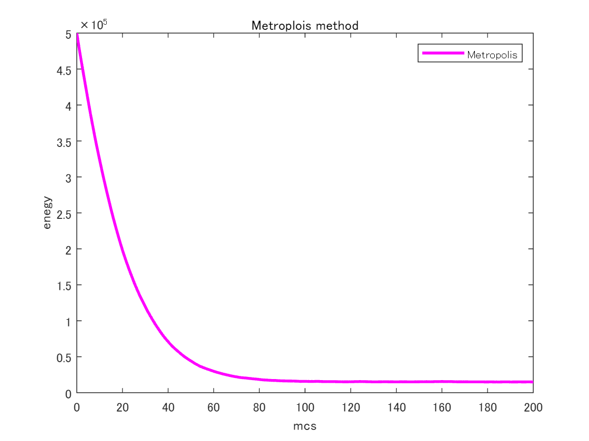</center>

<a name="H_81E7495E"></a>
## 平衡状態におけるエネルギーの揺らぎ（メトロポリス法）
<a name="H_A18342DB"></a>
### 平衡状態のサンプリング

平衡状態に緩和した後の状態をサンプリングして、平衡状態における状態の揺らぎを分布で表すことを試みる。

```matlab
tmq = 10000;
eqm1 = zeros(1, tmq);
for j = 1:1:tmq
    for k = 1:1:N
        pcl = randi(N);
        vmt = vm(pcl) + 2*(rand(1)-0.5)*dlt;
        dme = 0.5*(vmt*vmt - vm(pcl)*vm(pcl));
        imchk = 0;
        if dme > 0
            if exp(-beta*dme) < rand(1)
                imchk = 1;
            end
        end
        if imchk == 0
            vm(pcl) = vmt;
        end
    end
    eqm1(j) = sum(0.5*vm.*vm);
end
plot(eqm1)
xlabel('mcs')
ylabel('total energy')
title('flucuation of the total energy in equilibrium state')
```

<center>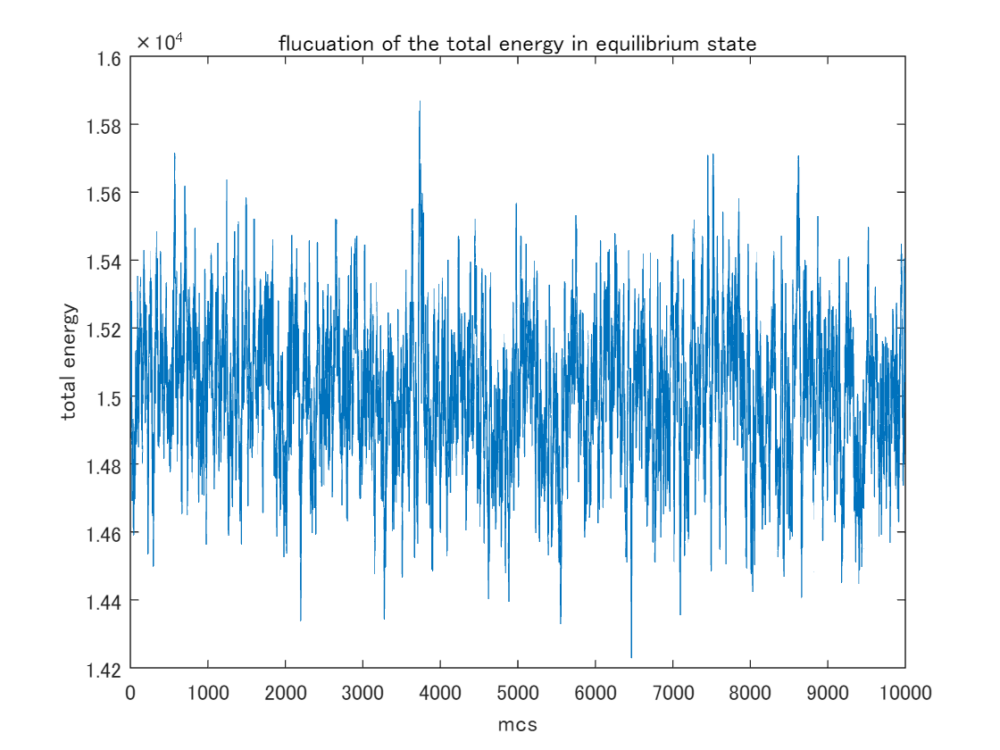</center>

<a name="H_BAAB064B"></a>
### 平衡状態におけるエネルギー分布

系が平衡状態に達してからのエネルギーの揺らぎに注目すると、エネルギーの頻度分布もまたガウス分布で良くフィッティングできることを確認する。


定性的には系のエネルギーが高いほど状態数は増えるのに対し、エネルギーが高い状態ほど出現確率は減少するため [*]、それらを掛け合わせて得られるエネルギーの頻度分布は単峰のグラフになることが理解できる。


[*] あるいは環境に割り当てられるエネルギーが減り、環境の取り得る状態数が減少する。

```matlab
[heqmv, edges] = histcounts(eqm1, 20);
heqmx = edges(1:end-1)+0.5*(edges(2)-edges(1));
%% 近似: '新規近似 1'。
[xData, yData] = prepareCurveData( heqmx, heqmv );

% 近似タイプとオプションを設定します。
ft = fittype( 'gauss1' );
opts = fitoptions( 'Method', 'NonlinearLeastSquares' );
opts.Display = 'Off';
opts.Lower = [-Inf -Inf 0];
opts.StartPoint = [1506 14979.5 155.895955293752];

% モデルをデータに近似します。
[fitresult, gof] = fit( xData, yData, ft, opts )
```

```TextOutput
fitresult = 
     一般モデル Gauss1:
     fitresult(x) =  a1*exp(-((x-b1)/c1)^2)
     係数 (95% の信頼限界):
       a1 =        1625  (1575, 1675)
       b1 =   1.501e+04  (1.501e+04, 1.502e+04)
       c1 =         299  (288.4, 309.5)
gof = 
           sse: 2.7544e+04
       rsquare: 0.9958
           dfe: 17
    adjrsquare: 0.9953
          rmse: 40.2525
```

```matlab

% データの近似をプロットします。
figure( 'Name', '新規近似 1' );
h = plot( fitresult, xData, yData, 'o' );
legend( h, 'metropolis', 'fitting', 'Location', 'NorthEast', 'Interpreter', 'none' );
% ラベル Axes
xlabel( 'energy', 'Interpreter', 'none' );
ylabel( 'frequency', 'Interpreter', 'none' );
grid on
```

<center>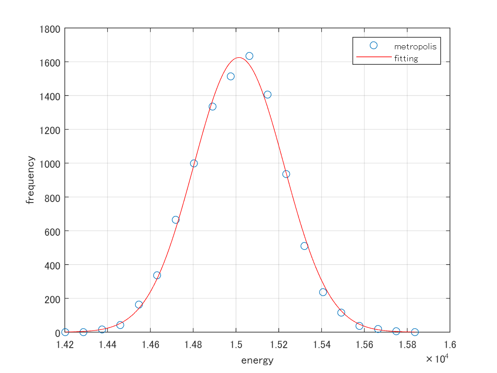</center>

<a name="H_03383CC1"></a>
# **熱浴法**
```matlab
for j = 1:1:tm
    for k = 1:1:N
        pcl = randi(N);
        vht = vh(pcl) + 2*(rand(1)-0.5)*dlt;
        dhe = 0.5*(vht*vht - vh(pcl)*vh(pcl));
        ihchk = 0;
        if 1/(1+exp(beta*dhe)) < rand(1)
            ihchk = 1;
        end
        if ihchk == 0
            vh(pcl) = vht;
        end
    end

    eh1(j+1) = sum(0.5*vh.*vh);
    eh2(j+1) = eh1(j+1)*eh1(j+1);    
    edges = [-10:0.2:10];
    histogram(vh, edges)
    xlabel("velocity")
    ylabel("frequency")
    title("heatbath method : mcs = "+string(j))
    ylim([0 0.1*N])
    xlim([-10 10])
    drawnow
end
```

<center>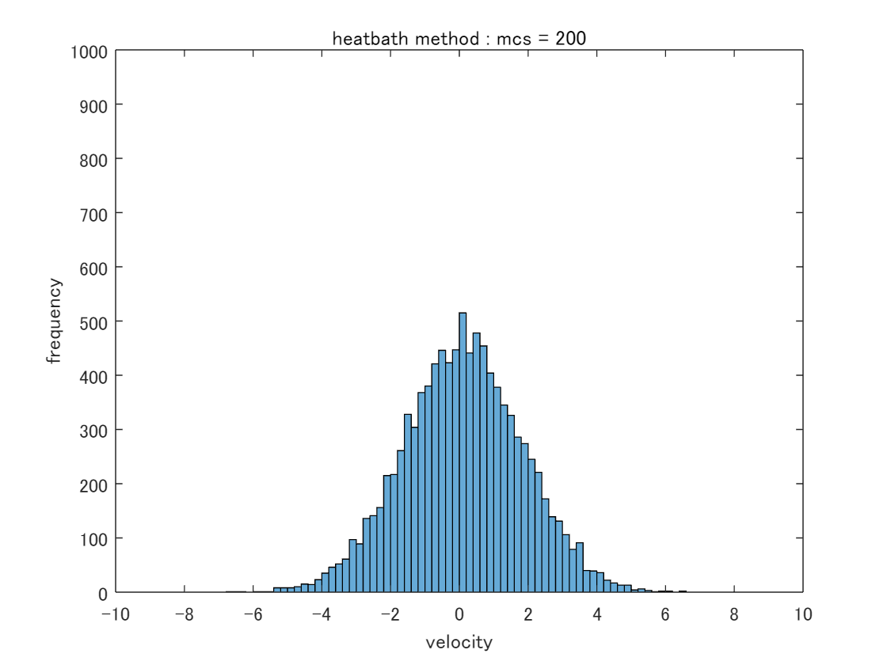</center>

<a name="H_276695E9"></a>
## ガウス分布によるフィッティング（熱浴法）

熱浴法の場合にも、状態の遷移を繰り返すことによって、速度分布は釣り鐘型の分布へと移行し、得られた平衡状態の分布はガウス分布によって良くフィッティングできる。

```matlab
%hm1 = histogram(vm, 20);
% hm1v = hm1.Values;
% hm1x = hm1.BinEdges(1:end-1)+0.5*hm1.BinWidth;

[hh1, edges] = histcounts(vh, 30);
hh1v = hh1;
hh1x = edges(1:end-1)+0.5*(edges(2)-edges(1));

%% 近似: '新規近似 1'。
[xData, yData] = prepareCurveData( hh1x, hh1v );

% 近似タイプとオプションを設定します。
ft = fittype( 'gauss1' );
opts = fitoptions( 'Method', 'NonlinearLeastSquares' );
opts.Display = 'Off';
opts.Lower = [-Inf -Inf 0];
opts.StartPoint = [1549 0.0449999999999995 1.2734707355075];

% モデルをデータに近似します。
[fitresult, gof] = fit( xData, yData, ft, opts )
```

```TextOutput
fitresult = 
     一般モデル Gauss1:
     fitresult(x) =  a1*exp(-((x-b1)/c1)^2)
     係数 (95% の信頼限界):
       a1 =        1039  (1023, 1056)
       b1 =      0.1093  (0.07763, 0.141)
       c1 =       2.438  (2.393, 2.483)
gof = 
           sse: 7.9407e+03
       rsquare: 0.9980
           dfe: 27
    adjrsquare: 0.9979
          rmse: 17.1493
```

```matlab

% データの近似をプロットします。
figure( 'Name', 'fitting' );
h = plot( fitresult, xData, yData, 'o' );
legend( h, 'heatbath', 'fitting', 'Location', 'NorthEast', 'Interpreter', 'none' );
% ラベル Axes
xlabel( 'velocity', 'Interpreter', 'none' );
ylabel( 'frequency', 'Interpreter', 'none' );
grid on
```

<center>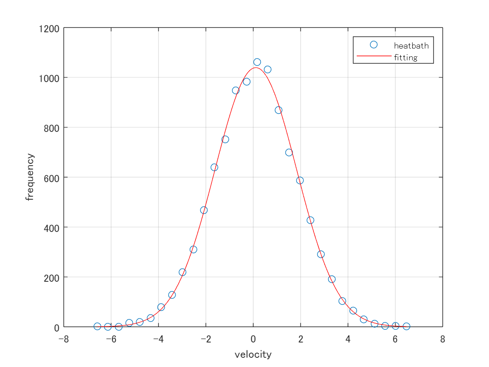</center>

<a name="H_9781EDB3"></a>
## エネルギーについて、平衡状態への緩和（熱浴法）＋メトロポリス法との比較

熱浴法の場合にも平衡状態へ緩和する過程で、系の全エネルギーは一定値へと減少している (解釈は上記)。


今回扱った1次元理想気体の場合には、メトロポリス法の方が熱浴法よりも速く平衡状態に達していることが分かる。


ただしメトロポリス法と熱浴法のいずれでも、最終的には統計的に同等の平衡状態が得られている。

```matlab
plot([0:1:200],eh1(1:201), '-b', LineWidth=2, DisplayName='Heatbath')
hold on 
plot([0:1:200],em1(1:201), '-m', LineWidth=2, DisplayName='Metropolis')
hold off
title('relaxation to equilibrium for energy')
xlabel('mcs')
ylabel('enegy')
legend()
```

<center>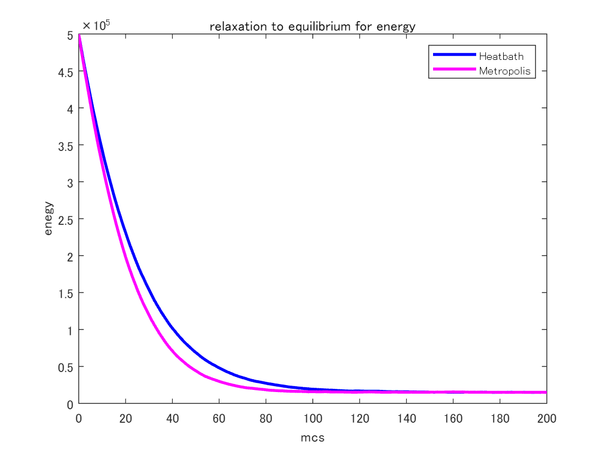</center>

<a name="H_29390B9A"></a>
## 平衡状態におけるエネルギーの揺らぎ（熱浴法）
<a name="H_2858C44A"></a>
### 平衡状態のサンプリング
```matlab
tmq = 10000;
eqh1 = zeros(1, tmq);
for j = 1:1:tmq
    for k = 1:1:N
        pcl = randi(N);
        vht = vh(pcl) + 2*(rand(1)-0.5)*dlt;
        dhe = 0.5*(vht*vht - vh(pcl)*vh(pcl));
        ihchk = 0;
        if dhe > 0
            if exp(-beta*dhe) < rand(1)
                ihchk = 1;
            end
        end
        if ihchk == 0
            vh(pcl) = vht;
        end
    end
    eqh1(j) = sum(0.5*vh.*vh);
end
plot(eqh1)
xlabel('mcs')
ylabel('total energy')
title('flucuation of the total energy in equilibrium state')
```

<center>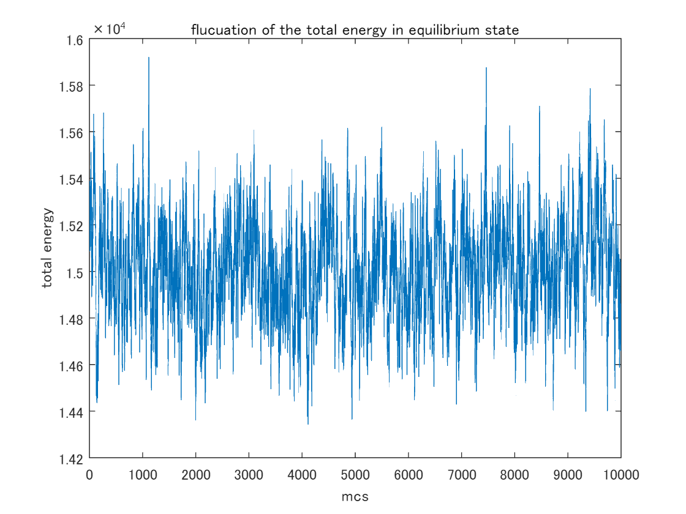</center>

<a name="H_77CF1E85"></a>
### 平衡状態におけるエネルギー分布

熱浴法でも、平衡状態における系のエネルギーの頻度分布はガウス分布で良くフィッティングできる (解釈は上記)。

```matlab
[heqhv, edges] = histcounts(eqh1, 20);
heqhx = edges(1:end-1)+0.5*(edges(2)-edges(1));
%% 近似: '新規近似 1'。
[xData, yData] = prepareCurveData( heqhx, heqhv );

% 近似タイプとオプションを設定します。
ft = fittype( 'gauss1' );
opts = fitoptions( 'Method', 'NonlinearLeastSquares' );
opts.Display = 'Off';
opts.Lower = [-Inf -Inf 0];
opts.StartPoint = [1644 14929 186.199813605734];

% モデルをデータに近似します。
[fitresult, gof] = fit( xData, yData, ft, opts )
```

```TextOutput
fitresult = 
     一般モデル Gauss1:
     fitresult(x) =  a1*exp(-((x-b1)/c1)^2)
     係数 (95% の信頼限界):
       a1 =        1517  (1481, 1552)
       b1 =   1.501e+04  (1.5e+04, 1.501e+04)
       c1 =         310  (301.5, 318.5)
gof = 
           sse: 1.5349e+04
       rsquare: 0.9973
           dfe: 17
    adjrsquare: 0.9970
          rmse: 30.0484
```

```matlab

% データの近似をプロットします。
figure( 'Name', '新規近似 1' );
h = plot( fitresult, xData, yData, 'o' );
legend( h, 'heatbath', 'fitting', 'Location', 'NorthEast', 'Interpreter', 'none' );
% ラベル Axes
xlabel( 'energy', 'Interpreter', 'none' );
ylabel( 'frequency', 'Interpreter', 'none' );
grid on
```

<center>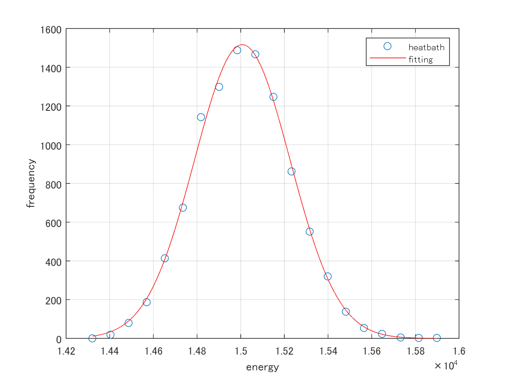</center>

