# Reproduction of equilibrium state by detailed balance 
<a name="beginToc"></a>

## Table of Contents
[Equilibrium state of one\-dimensional ideal gas ](#equilibrium-state-of-one\-dimensional-ideal-gas-)
 
&emsp;[Problem setting](#problem-setting)
 
&emsp;[Objective ](#objective-)
 
&emsp;[Setting the initial conditions ](#setting-the-initial-conditions-)
 
&emsp;[Fitting using Gaussian distribution (Metropolis method) ](#fitting-using-gaussian-distribution-(metropolis-method)-)
 
&emsp;[About temporal changes in energy: Relaxation to an equilibrium state (Metropolis method) ](#about-temporal-changes-in-energy:-relaxation-to-an-equilibrium-state-(metropolis-method)-)
 
&emsp;[Energy fluctuation in an equilibrium state (Metropolis method) ](#energy-fluctuation-in-an-equilibrium-state-(metropolis-method)-)
 
&emsp;&emsp;[Sampling of an equilibrium state ](#sampling-of-an-equilibrium-state-)
 
&emsp;&emsp;[Energy distribution in the equilibrium state ](#energy-distribution-in-the-equilibrium-state-)
 
&emsp;[Fitting using Gaussian distribution (Heat bath method) ](#fitting-using-gaussian-distribution-(heat-bath-method)-)
 
&emsp;[Energy: Comparison of relaxation to equilibrium state (heat bath method vs Metropolis method) ](#energy:-comparison-of-relaxation-to-equilibrium-state-(heat-bath-method-vs-metropolis-method)-)
 
&emsp;[ Fluctuation of energy in equilibrium state (heat bath method) ](#-fluctuation-of-energy-in-equilibrium-state-(heat-bath-method)-)
 
&emsp;&emsp;[ Sampling of equilibrium state ](#-sampling-of-equilibrium-state-)
 
&emsp;&emsp;[Energy distribution in equilibrium state](#energy-distribution-in-equilibrium-state)
 
<a name="endToc"></a>

```matlab
clear all;
clf; 
```

# Equilibrium state of one\-dimensional ideal gas 
## Problem setting

Consider a one\-dimensional ideal gas system consisting of $N$ particles in contact with a heat bath of temperature $T$ . The mass of all particles is equal $m$ . As an initial condition, we will give all particles an initial velocity of $v_0$ . If the speed of the $j(=1,\cdots ,N)$ \-th particle is written as $v_j$ , the total energy of the system $E$ is expressed as ${E=\sum_{j=1}^N \frac{1}{2}mv_j^2 }$ . 


 

## Objective 

Confirm the relaxation to an equilibrium state using the metropolis method and the heat bath method. 


In the numerical simulation below use $N=10000,~~m=1,~~T=3,~~v_0 =10,$ and the maximum change in velocity for both the reference state and the trial state is set to $\delta v=1$ .


Also, set the Boltzmann constant $k_B =1$ .


 

## Setting the initial conditions 
```matlab
N = 10000; % number of particles
v0 = 10; % initial speed
dlt = 1;

% for metropolis
vm = v0 * ones(1, N); 
vm2 = vm.*vm;
em0 = sum(0.5*vm2);

% for heat bath
vh = v0 * ones(1, N); 
vh2 = vh.*vh;
eh0 = sum(0.5*vh2);

% temperature
T = 3;
beta = 1/T;

% maximum montecarlo step
tm = 200;

% time evolution of energy
% for metropolis
em1 = zeros(1,tm+1);
em2 = zeros(1,tm+1);
em1(1) = em0;
em2(1) = em0*em0;

% for heat bath
eh1 = zeros(1,tm+1);
eh2 = zeros(1,tm+1);
eh1(1) = eh0;
eh2(1) = eh0*eh0;

% distribution of the initial state
histogram(vm)
xlabel("velocity")
ylabel("frequency")
title("the initial distribution of velocity at mcs = 0")
ylim([0 1.1*N])
xlim([-5 11]) 
```

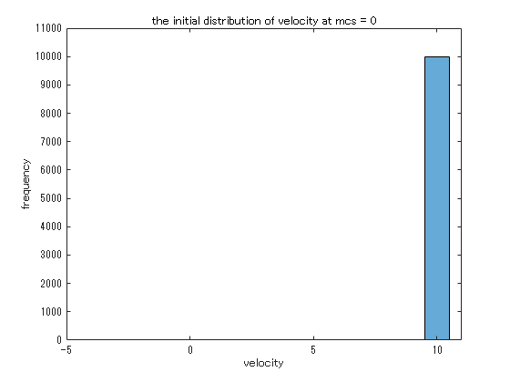

#  **Metropolis method** 
```matlab
for j = 1:1:tm
    for k = 1:1:N
        pcl = randi(N);
        vmt = vm(pcl) + 2*(rand(1)-0.5)*dlt;
        dme = 0.5*(vmt*vmt - vm(pcl)*vm(pcl));
        imchk = 0;
        if dme > 0
            if exp(-beta*dme) < rand(1)
                imchk = 1;
            end
        end
        if imchk == 0
            vm(pcl) = vmt;
        end
    end

    em1(j+1) = sum(0.5*vm.*vm);
    em2(j+1) = em1(j+1)*em1(j+1);

    edges = [-10:0.2:10];
    histogram(vm, edges)
    xlabel("velocity")
    ylabel("frequency")
    title("metropolis method : mcs = "+string(j))
    ylim([0 0.1*N])
    xlim([-10 10])
    drawnow
end 
```

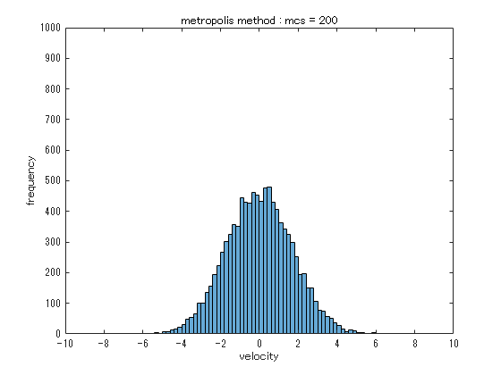

## Fitting using Gaussian distribution (Metropolis method) 

Metropolis method In the state transition based on , the velocity distribution shifts from a delta function\-like distribution reflecting the initial conditions to a bell\-shaped distribution by repeating the state transition. 


Since the velocity distribution in the equilibrium state is expected to be a Maxwell distribution, we will try to fit the obtained equilibrium state distribution with a Gaussian distribution. 

```matlab
[hm1, edges] = histcounts(vm, 20);
hm1v = hm1;
hm1x = edges(1:end-1)+0.5*(edges(2)-edges(1));

%% Fit: 'New Fit 1'.
[xData, yData] = prepareCurveData( hm1x, hm1v );

% Set the fit type and options.
ft = fittype( 'gauss1' );
opts = fitoptions( 'Method', 'NonlinearLeastSquares' );
opts.Display = 'Off';
opts.Lower = [-Inf -Inf 0];
opts.StartPoint = [1549 0.0449999999999995 1.2734707355075];

% Fit the model to the data.
[fitresult, gof] = fit( xData, yData, ft, opts )
```

```matlabTextOutput
fitresult = 
     一般モデル Gauss1:
     fitresult(x) =  a1*exp(-((x-b1)/c1)^2)
     係数 (95% の信頼限界):
       a1 =        1645  (1626, 1664)
       b1 =    -0.01345  (-0.03684, 0.009941)
       c1 =       2.444  (2.41, 2.477)
gof = フィールドをもつ struct:
           sse: 4.085822184867160e+03
       rsquare: 0.999388152679042
           dfe: 17
    adjrsquare: 0.999316170641283
          rmse: 15.502982985953835

```

```matlab

% Plot a fit to the data.
figure( 'Name', 'fitting' );
h = plot( fitresult, xData, yData, 'o' );
legend( h, 'Metropolis', 'fitting', 'Location', 'NorthEast', 'Interpreter', 'none' );
% Label Axes
xlabel( 'velocity', 'Interpreter', 'none' );
ylabel( 'frequency', 'Interpreter', 'none' );
grid on 
```

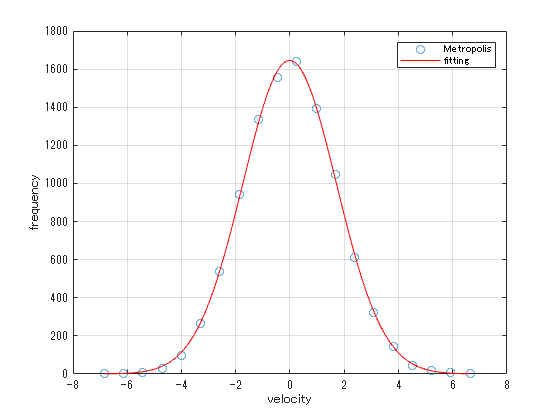

## About temporal changes in energy: Relaxation to an equilibrium state (Metropolis method) 

Metropolis method allows a system to relax to an equilibrium state, and a graph shows the temporal change in the total energy of the system during the relaxation process. 


At this time, the energy change in the system can be interpreted as an exchange of energy in the form of heat with the heat bath (environment) in contact with the system. 

```matlab
plot([0:1:tm],em1, '-m', LineWidth=2, DisplayName='Metropolis')
title('Metroplois method')
xlabel('mcs')
ylabel('enegy')
legend() 
```

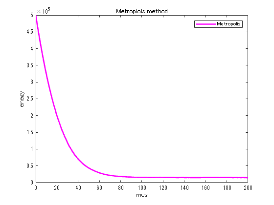

## Energy fluctuation in an equilibrium state (Metropolis method) 
### Sampling of an equilibrium state 

Sampling the state after relaxation to an equilibrium state and attempting to represent the fluctuation of the state in an equilibrium state as a distribution. 

```matlab
tmq = 10000;
eqm1 = zeros(1, tmq);
for j = 1:1:tmq
    for k = 1:1:N
        pcl = randi(N);
        vmt = vm(pcl) + 2*(rand(1)-0.5)*dlt;
        dme = 0.5*(vmt*vmt - vm(pcl)*vm(pcl));
        imchk = 0;
        if dme > 0
            if exp(-beta*dme) < rand(1)
                imchk = 1;
            end
        end
        if imchk == 0
            vm(pcl) = vmt;
        end
    end
    eqm1(j) = sum(0.5*vm.*vm);
end
plot(eqm1)
xlabel('mcs')
ylabel('total energy')
title('flucuation of the total energy in equilibrium state') 
```

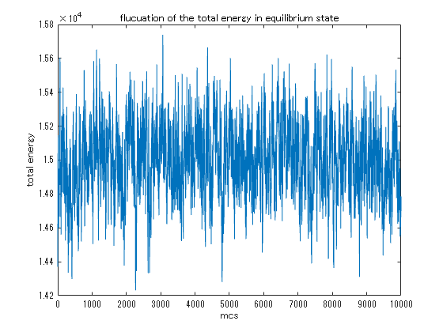

### Energy distribution in the equilibrium state 

If we pay attention to the energy fluctuations after the system reaches the equilibrium state, we confirm that the frequency distribution of energy can also be well fitted by a Gaussian distribution. 


Qualitatively, the higher the energy of the system, the higher the number of states, whereas the higher the energy, the lower the probability of appearance \[ \*\], so the frequency distribution of energy obtained by multiplying them is unimodal.


\[  \*\] Alternatively, the energy allocated to the environment decreases, and the number of possible states of the environment decreases. 


```matlab
[heqmv, edges] = histcounts(eqm1, 20);
heqmx = edges(1:end-1)+0.5*(edges(2)-edges(1));
%% Fit: 'New Fit 1'.
[xData, yData] = prepareCurveData( heqmx, heqmv );

% Set the fit type and options.
ft = fittype( 'gauss1' );
opts = fitoptions( 'Method', 'NonlinearLeastSquares' );
opts.Display = 'Off';
opts.Lower = [-Inf -Inf 0];
opts.StartPoint = [1506 14979.5 155.895955293752];

% Fit the model to the data.
[fitresult, gof] = fit( xData, yData, ft, opts )
```

```matlabTextOutput
fitresult = 
     一般モデル Gauss1:
     fitresult(x) =  a1*exp(-((x-b1)/c1)^2)
     係数 (95% の信頼限界):
       a1 =        1425  (1384, 1466)
       b1 =   1.501e+04  (1.5e+04, 1.501e+04)
       c1 =       307.5  (297.3, 317.7)
gof = フィールドをもつ struct:
           sse: 2.138985354322950e+04
       rsquare: 0.995878280384598
           dfe: 17
    adjrsquare: 0.995393372194551
          rmse: 35.471491074009002

```

```matlab

% Plot a fit to the data.
figure( 'Name', '新規近似 1' );
h = plot( fitresult, xData, yData, 'o' );
legend( h, 'metropolis', 'fitting', 'Location', 'NorthEast', 'Interpreter', 'none' );
% Label Axes
xlabel( 'energy', 'Interpreter', 'none' );
ylabel( 'frequency', 'Interpreter', 'none' );
grid on 
```

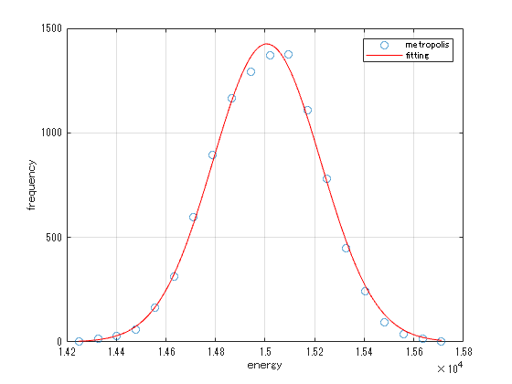

#  **Heat bath method** 
```matlab
for j = 1:1:tm
    for k = 1:1:N
        pcl = randi(N);
        vht = vh(pcl) + 2*(rand(1)-0.5)*dlt;
        dhe = 0.5*(vht*vht - vh(pcl)*vh(pcl));
        ihchk = 0;
        if 1/(1+exp(beta*dhe)) < rand(1)
            ihchk = 1;
        end
        if ihchk == 0
            vh(pcl) = vht;
        end
    end

    eh1(j+1) = sum(0.5*vh.*vh);
    eh2(j+1) = eh1(j+1)*eh1(j+1);    
    edges = [-10:0.2:10];
    histogram(vh, edges)
    xlabel("velocity")
    ylabel("frequency")
    title("heatbath method : mcs = "+string(j))
    ylim([0 0.1*N])
    xlim([-10 10])
    drawnow
end 
```

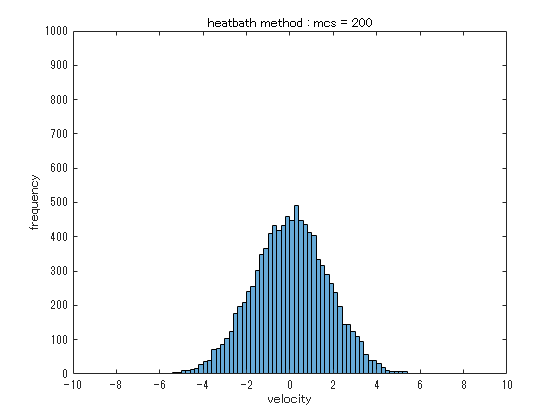

## Fitting using Gaussian distribution (Heat bath method) 

In the heat bath method, by repeating the state transition, the velocity distribution shifts to a bell\-shaped distribution, and the resulting equilibrium state distribution can be well fitted by a Gaussian distribution. 

```matlab
%hm1 = histogram(vm, 20);
% hm1v = hm1.Values;
% hm1x = hm1.BinEdges(1:end-1)+0.5*hm1.BinWidth;

[hh1, edges] = histcounts(vh, 30);
hh1v = hh1;
hh1x = edges(1:end-1)+0.5*(edges(2)-edges(1));

%% Fit: 'New Fit 1'.
[xData, yData] = prepareCurveData( hh1x, hh1v );

% Set the fit type and options.
ft = fittype( 'gauss1' );
opts = fitoptions( 'Method', 'NonlinearLeastSquares' );
opts.Display = 'Off';
opts.Lower = [-Inf -Inf 0];
opts.StartPoint = [1549 0.0449999999999995 1.2734707355075];

% Fit the model to the data.
[fitresult, gof] = fit( xData, yData, ft, opts )
```

```matlabTextOutput
fitresult = 
     一般モデル Gauss1:
     fitresult(x) =  a1*exp(-((x-b1)/c1)^2)
     係数 (95% の信頼限界):
       a1 =        1058  (1042, 1073)
       b1 =     0.05008  (0.02111, 0.07905)
       c1 =       2.458  (2.417, 2.499)
gof = フィールドをもつ struct:
           sse: 6.673170441268367e+03
       rsquare: 0.998396847741037
           dfe: 27
    adjrsquare: 0.998278095721855
          rmse: 15.721146929779559

```

```matlab

% Plot a fit to the data.
figure( 'Name', 'fitting' );
h = plot( fitresult, xData, yData, 'o' );
legend( h, 'heatbath', 'fitting', 'Location', 'NorthEast', 'Interpreter', 'none' );
% Label Axes
xlabel( 'velocity', 'Interpreter', 'none' );
ylabel( 'frequency', 'Interpreter', 'none' );
grid on 
```

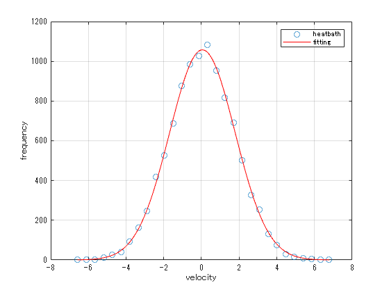

## Energy: Comparison of relaxation to equilibrium state (heat bath method vs Metropolis method) 

In case of heat bath method, the total energy of the system decreases to a constant value in the process of relaxing to equilibrium state. (interpretation above). 


In the case of the one\-dimensional ideal gas treated here, it can be seen that the metropolis method reaches an equilibrium state faster than the heat bath method. 


However, both the metropolis method and the heat bath method ultimately result in statistically equivalent equilibrium states. 

```matlab
plot([0:1:200],eh1(1:201), '-b', LineWidth=2, DisplayName='Heatbath')
hold on 
plot([0:1:200],em1(1:201), '-m', LineWidth=2, DisplayName='Metropolis')
hold off
title('relaxation to equilibrium for energy')
xlabel('mcs')
ylabel('enegy')
legend()
```

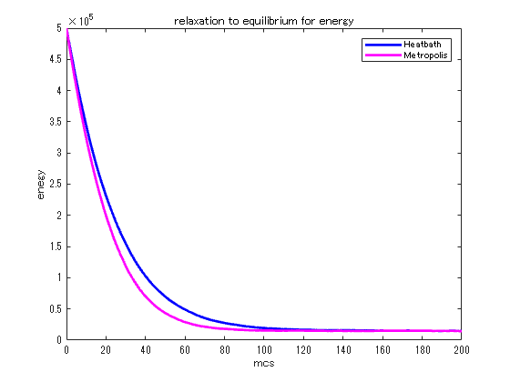

##  Fluctuation of energy in equilibrium state (heat bath method) 
###  Sampling of equilibrium state 
```matlab
tmq = 10000;
eqh1 = zeros(1, tmq);
for j = 1:1:tmq
    for k = 1:1:N
        pcl = randi(N);
        vht = vh(pcl) + 2*(rand(1)-0.5)*dlt;
        dhe = 0.5*(vht*vht - vh(pcl)*vh(pcl));
        ihchk = 0;
        if dhe > 0
            if exp(-beta*dhe) < rand(1)
                ihchk = 1;
            end
        end
        if ihchk == 0
            vh(pcl) = vht;
        end
    end
    eqh1(j) = sum(0.5*vh.*vh);
end
plot(eqh1)
xlabel('mcs')
ylabel('total energy')
title('flucuation of the total energy in equilibrium state')
```

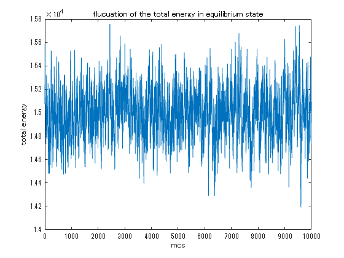

### Energy distribution in equilibrium state

With the heat bath method, the frequency distribution of the energy of the system at equilibrium can be fitted well with a Gaussian distribution (see above for interpretation). 

```matlab
[heqhv, edges] = histcounts(eqh1, 20);
heqhx = edges(1:end-1)+0.5*(edges(2)-edges(1));
%% Fit: 'New Fit 1'.
[xData, yData] = prepareCurveData( heqhx, heqhv );

% Set the fit type and options.
ft = fittype( 'gauss1' );
opts = fitoptions( 'Method', 'NonlinearLeastSquares' );
opts.Display = 'Off';
opts.Lower = [-Inf -Inf 0];
opts.StartPoint = [1644 14929 186.199813605734];

% Fit the model to the data.
[fitresult, gof] = fit( xData, yData, ft, opts )
```

```matlabTextOutput
fitresult = 
     一般モデル Gauss1:
     fitresult(x) =  a1*exp(-((x-b1)/c1)^2)
     係数 (95% の信頼限界):
       a1 =        1524  (1485, 1563)
       b1 =     1.5e+04  (1.499e+04, 1.5e+04)
       c1 =       300.8  (291.9, 309.6)
gof = フィールドをもつ struct:
           sse: 1.802129768876427e+04
       rsquare: 0.996910687994625
           dfe: 17
    adjrsquare: 0.996547239523404
          rmse: 32.558813470905115

```

```matlab

% Plot a fit to the data.
figure( 'Name', '新規近似 1' );
h = plot( fitresult, xData, yData, 'o' );
legend( h, 'heatbath', 'fitting', 'Location', 'NorthEast', 'Interpreter', 'none' );
% Label Axes
xlabel( 'energy', 'Interpreter', 'none' );
ylabel( 'frequency', 'Interpreter', 'none' );
grid on
```

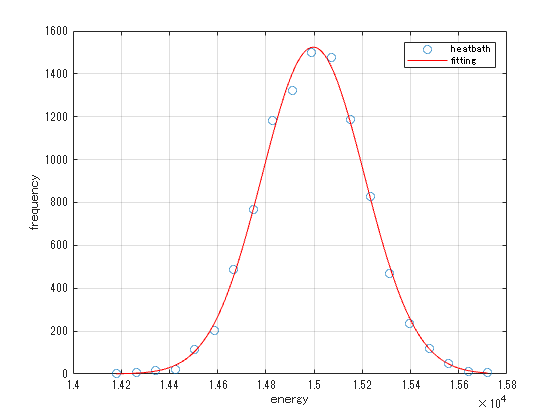
