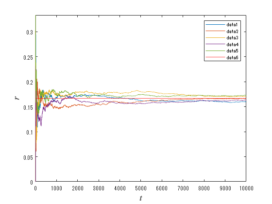
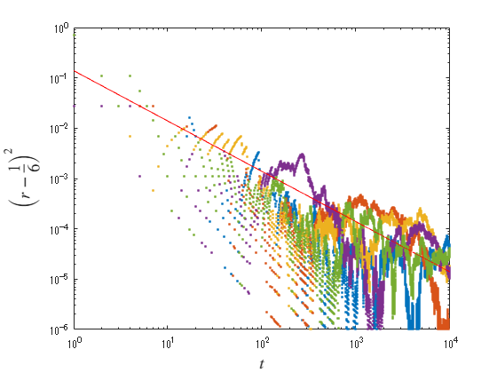
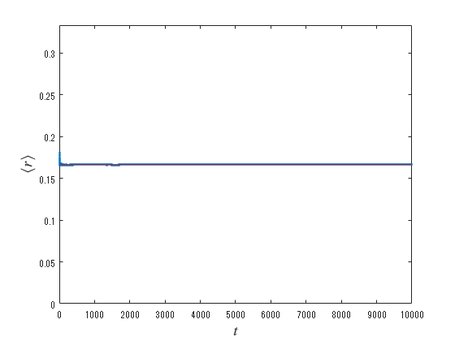
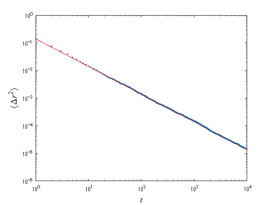

<a name="T_E1A55AA7"></a>
# <span style="color:rgb(213,80,0)">経験的確率と大数の法則</span>
<a name="beginToc"></a>
## 目次
[１．サイコロの「１」の目が出る（経験的）確率](#H_1A20678A)
 
&emsp;[１．１　サイコロの目を一様乱数で生成する](#H_7D0EB4DB)
 
&emsp;[１．２　「１」の目が出た割合](#H_4AA2234C)
 
&emsp;[１．３　各サンプルにおける期待値からの差の２乗](#H_1A999692)
 
[２．サンプル平均の性質：大数の法則](#H_69F50803)
 
<a name="endToc"></a>
<a name="H_1A20678A"></a>
# １．サイコロの「１」の目が出る（経験的）確率
<a name="H_CCACB440"></a>

ここでは、先験的に与えられた確率に経験的確率がどのように近づいていくかを確認する。

<a name="H_4F81EF7F"></a>
<a name="H_7D0EB4DB"></a>
## １．１　サイコロの目を一様乱数で生成する

 <samp>[1, 6]</samp> の一様分布したランダムな整数列（長さ $T$ ）のサンプルを $M$ 個出力する。


先験的確率として、サイコロのそれぞれの目が出る確率は $1/6$ としている（等重率の仮定）。

```matlab
T = 10000;
M = 1000;

d1 = randi([1, 6], [M T]);
```

<a name="H_4AA2234C"></a>
## １．２　「１」の目が出た割合

 $x$ 回までの間に「１」の目が出た割合を $r(x)$ とし、1番目から5番目までのサンプルについての $r(x)$ をグラフに描く。

```matlab
x = 1:T;
r = cumsum(d1==1, 2)./(1:T);

plot(x, r(1:5,:))
hold on 
    yline(1/6, 'r')
hold off
xlabel(' $t$ ', Interpreter='latex', FontSize=14)
ylabel(' $r$ ', Interpreter='latex', FontSize=14)
ylim([0 1/3])
legend()
```

<center></center>


<a name="H_9B19DDF5"></a>
<a name="H_1A999692"></a>
## １．３　各サンプルにおける期待値からの差の２乗

 $x$ 回までの間に「１」の目が出た割合を $r(x)$ とし、1番目から5番目までのサンプルについての $r(x)$ をグラフに描く。

```matlab

loglog(x, (r(1:5,:)-1/6).^2, '.')
hold on
    loglog(x, (5/36)*x.^(-1), 'r')
hold off
xlabel(' $t$ ', Interpreter='latex', FontSize=14)
ylabel(' $\left(r-\frac{1}{6}\right)^{2}$ ', Interpreter='latex', FontSize=14)
ylim([1e-6 1])
```

<center></center>


<a name="H_5ACD591D"></a>
<a name="H_69F50803"></a>
# ２．サンプル平均の性質：大数の法則

 $x$ 回までの間に「１」の目が出た割合を $r(x)$ とし、1番目から5番目までのサンプルについての $r(x)$ をグラフに描く。

```matlab
y0 = mean(r,1);
y1 = var(r,0,1);

plot(x, y0, '.-')
hold on 
    yline(1/6, 'r')
hold off
xlabel(' $t$ ', Interpreter='latex', FontSize=14)
ylabel(' $\left\langle r \right\rangle$ ', Interpreter='latex', FontSize=14)
ylim([0 1/3])
```

<center></center>


```matlab


loglog(x, y1, '.')
hold on
    loglog(x, (5/36)*x.^(-1), 'r-')
hold off
xlabel(' !!!EQ_7!!! ', Interpreter='latex', FontSize=14)
ylabel(' !!!EQ_20!!! ', Interpreter='latex', FontSize=14)
ylim([1e-6 1])
```

<center></center>


