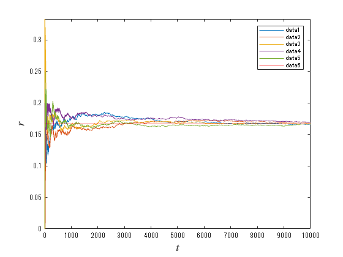
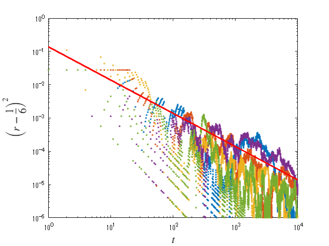
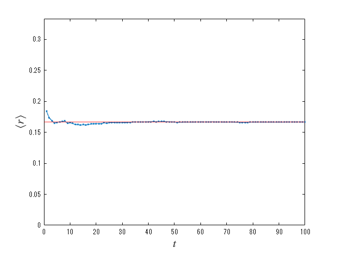
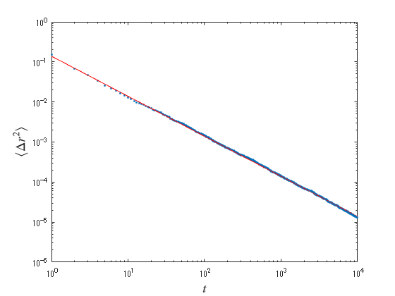

# Empirical probability and the law of large numbers 
<a name="beginToc"></a>

## Table of Contents
[1. (Empirical) Probability of getting a "1" on the dice](#1.-(empirical)-probability-of-getting-a-"1"-on-the-dice)
 
&emsp;[1.1 Generate dice rolls with uniform random numbers](#1.1-generate-dice-rolls-with-uniform-random-numbers)
 
&emsp;[1.2 Probability of rolling a 1 on a dice](#1.2-probability-of-rolling-a-1-on-a-dice)
 
&emsp;[ 1.3 Square of the difference from the expected value in each sample ](#-1.3-square-of-the-difference-from-the-expected-value-in-each-sample-)
 
[2. Properties of sample averages: law of large numbers](#2.-properties-of-sample-averages:-law-of-large-numbers)
 
<a name="endToc"></a>

# 1. (Empirical) Probability of getting a "1" on the dice

In this section, we will see how empirical probabilities approach a priori given probabilities.


 

## 1.1 Generate dice rolls with uniform random numbers

Output M samples of uniformly distributed random integer sequences in \[1, 6\]. (length $T$ ). As an a priori probability, the probability that each of the dice rolls is $1/6$ (assumption of equal weight ratio)


```matlab
T = 10000;
M = 1000;

d1 = randi([1, 6], [M T]); 
```

 

## 1.2 Probability of rolling a 1 on a dice

Let $r(x)$ be the percentage of "1" rolls in the dice up to $x$ times, and draw a graph of $r(x)$ for the first through the fifth samples.

```matlab
x = 1:T;
r = cumsum(d1==1, 2)./(1:T);

plot(x, r(1:5,:))
hold on 
    yline(1/6, 'r')
hold off
xlabel(' $t$ ', Interpreter='latex', FontSize=14)
ylabel(' $r$ ', Interpreter='latex', FontSize=14)
ylim([0 1/3])
legend()
```



##  1.3 Square of the difference from the expected value in each sample 

```matlab
loglog(x, (r(1:5,:)-1/6).^2, '.')
hold on
    loglog(x, (5/36)*x.^(-1), 'r', LineWidth=2)
hold off
xlabel(' !!!EQ_6!!! ', Interpreter='latex', FontSize=14)
ylabel(' !!!EQ_9!!! ', Interpreter='latex', FontSize=14)
xlim([1 T])
ylim([1e-6 1])
```



# 2. Properties of sample averages: law of large numbers

```matlab
y0 = mean(r,1);
y1 = var(r,0,1);

plot(x, y0, '.-')
hold on 
    yline(1/6, 'r')
hold off
xlabel(' !!!EQ_6!!! ', Interpreter='latex', FontSize=14)
ylabel(' !!!EQ_11!!! ', Interpreter='latex', FontSize=14)
xlim([0 100])
ylim([0 1/3])
```



```matlab

loglog(x, y1, '.')
hold on
    loglog(x, (5/36)*x.^(-1), 'r-')
hold off
xlabel(' !!!EQ_6!!! ', Interpreter='latex', FontSize=14)
ylabel(' !!!EQ_13!!! ', Interpreter='latex', FontSize=14)
ylim([1e-6 1])
```



\linebreak 

