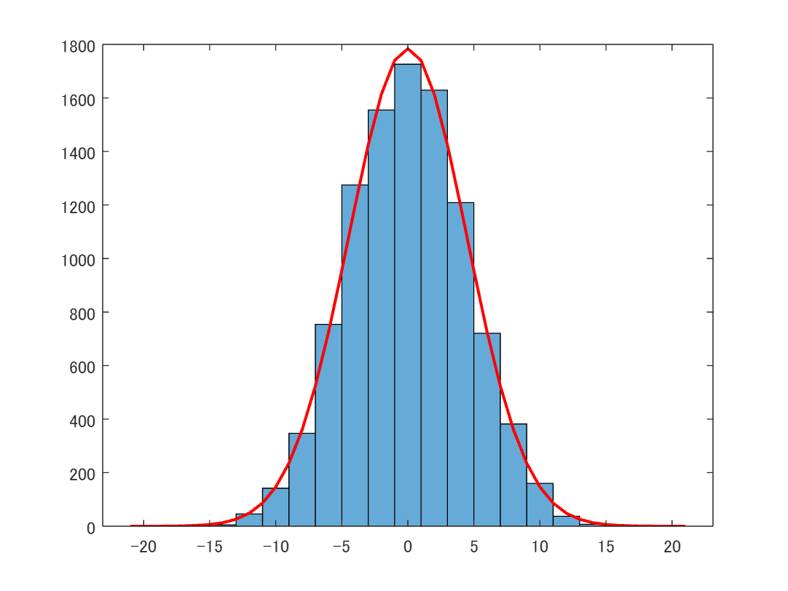
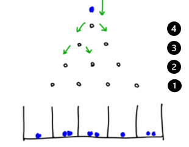
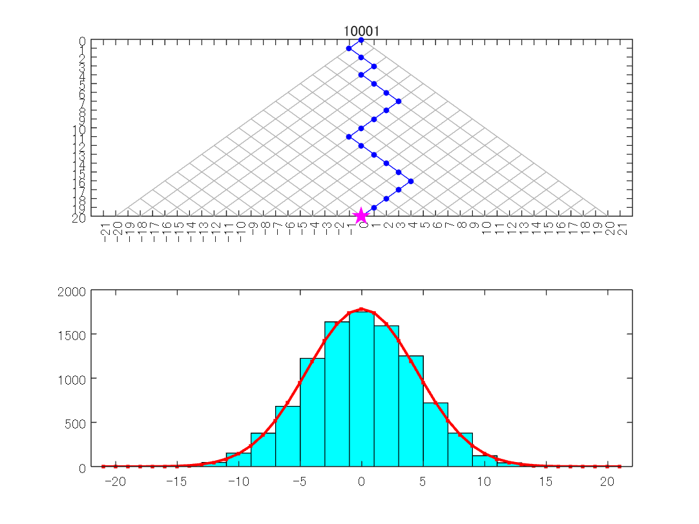

<a name="T_4433F24F"></a>
# <span style="color:rgb(213,80,0)">Galton board: 二項分布から正規分布へ</span>
<a name="beginToc"></a>
## 目次
[正規分布によるフィッティング](#H_315DFD8F)
 
[Galton board（多数のコイン投げの度数分布）：正規分布への時間発展アニメーション ](#H_2C8852C2)
 
[参考文献](#H_97B4A72C)
 
<a name="endToc"></a>
<a name="H_315DFD8F"></a>
# 正規分布によるフィッティング
```matlab
%random walk 
N = 10000; %試行回数
T = 20; %コイン数

r = sign(rand(N, T)-0.5); %各コインの固有状態
w = cumsum(r,2); %各試行における全コインの和

w(:, T);
 

nbins = [-T-1:2:T+1];
histogram(w(:, T), nbins)

hold on
x = -T-1:1:T+1;
y = (2*N)*1/sqrt(2*pi*T)*exp(-(x).^2/(2*T));
plot(x, y, 'r', 'LineWidth',1.5)
hold off
```

<center></center>


<a name="H_2C8852C2"></a>
# Galton board（多数のコイン投げの度数分布）：正規分布への時間発展アニメーション 
-  コイン投げ問題はランダムウォークと等価。 
-  コイン投げの度数分布は二項分布に従う。 




図1: コイン投げモデル：Galton board


図1では、コイン投げに対するボールと箱の等価系を示している。ボールの総数はコインを投げる試行回数（コインを一緒に投げる回数）に等しく、箱の総数はコインの数より1つ多い。玉はレベルごとに1つずつ導入される。そのレベルに対応するコインが表を示していれば左、裏を示していれば右というように、ボールが1レベル下をどちらに進むべきかを示している。向きは図1の緑の矢印で示されている。すべてのコインが表を示した場合のみ、ボールは一番左の箱に落ちる。ボールは箱の中で分散する。

<a name="H_A3858203"></a>
```matlab
%random walk 
N = 10001; %試行回数
T = 20; %コイン数

r = sign(rand(N, T)-0.5); %各コインの固有状態
w = cumsum(r,2); %各試行における全コインの和r

Mtr = 1:1:T;

tiledlayout(2,1)            % Introduced in R2019b
nexttile                    % Introduced in R2019b

X0 = -T:T;
Y0 = -0*X0 + T+1;
plot(X0, Y0)
%grid on
xticks(-T-1:1:T+1)
yticks(0:1:T)
xlim([-T-2 T+2])
ylim([0 T])
ax = gca;
ax.YDir = 'reverse';
hold on
for j = 0:1:T-1
    plot(X0(T+1-j:2*T+1-2*j),  X0(T+1-j:2*T+1-2*j)+2*j, '-', "Color",[0.7 0.7 0.7], 'LineWidth', 0.1)
    plot(X0(2*j+1:T+1+j), -X0(2*j+1:T+1+j)+2*j, '-', "Color",[0.7 0.7 0.7], 'LineWidth', 0.1)
end
%plot(X0, -X0, '-', "Color",[0.3 0.3 0.3], 'LineWidth', 0.1)
%plot(X0,  X0, '-', "Color",[0.3 0.3 0.3], 'LineWidth', 0.1)
%pbaspect([2 1 1])

Xp = w(1,:);
Yp = Mtr;
hh0 = plot([0 Xp],[0 Yp], '.-b', "MarkerSize",10);
hh2 = plot([Xp(T)],[Yp(T)], 'pm', "MarkerSize",10, "MarkerFaceColor",'m');
ht = title("1");
pause(0.5);

%hh2 = plot((w(1,tr)+tr)/2,(-w(1,tr)+tr)/2, 'o');

hold off

nexttile
nbins = [-T-1:2:T+1];
[Nhh3, Ehh3] =  histcounts(w(1, T), nbins);
%hh3 = plot([-T:2:T], Nhh3);
hh3 = bar([-T:2:T], Nhh3, 1, "FaceColor",'c');
hold on
xlim([-T-2 T+2]);
x = -T-1:1:T+1;
y = (2*1)*1/sqrt(2*pi*T)*exp(-(x).^2/(2*T)); %normal distribution
hh4 = plot(x, y, '.-r', 'LineWidth',1.5);
%pbaspect([2 1 1])
hold off

NS = (N-1)/1000;
for j = 1:NS:N
    Xp = w(j,:);
    Yp = Mtr;
    %----------
    hh0.XData = [0 Xp];
    hh0.YData = [0 Yp];
    %----------
    hh2.XData = [Xp(T)];
    hh2.YData = [Yp(T)];
    %----------
    ht.String = j;
    %----------
    [Nhh3, Ehh3] =  histcounts(w(1:j, T), nbins);
    hh3.YData = Nhh3;
    %----------
    hh4.YData = (2*j)*1/sqrt(2*pi*T)*exp(-(x).^2/(2*T));
    %----------
    drawnow
end
```

<center></center>


<a name="H_97B4A72C"></a>
# 参考文献
-  [https://jp.mathworks.com/help/stats/binomial-distribution.html](https://jp.mathworks.com/help/stats/binomial-distribution.html) 
-  [https://blogs.mathworks.com/pick/2021/03/26/animation-playback-controls-in-live-scripts-r2021a/](https://blogs.mathworks.com/pick/2021/03/26/animation-playback-controls-in-live-scripts-r2021a/) 
