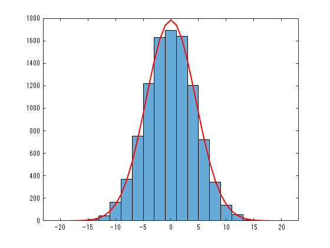
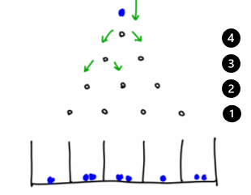
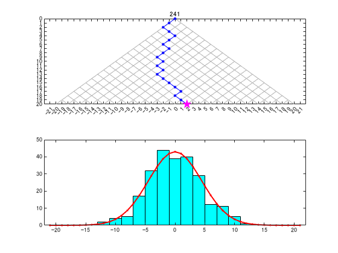

# Galton board: From binomial distribution to normal distribution 
<a name="beginToc"></a>

## Table of Contents
[Fitting with normal distribution ](#fitting-with-normal-distribution-)
 
[Galton board (frequency distribution of many coin tosses): Animation for time evolution to normal distribution ](#galton-board-(frequency-distribution-of-many-coin-tosses):-animation-for-time-evolution-to-normal-distribution-)
 
[References ](#references-)
 
<a name="endToc"></a>

# Fitting with normal distribution 
```matlab
%random walk
N = 10000; %number of attempts
T = 20; %number of coins

r = sign(rand(N, T)-0.5); %Unique state of each coin
w = cumsum(r,2); %Sum of all coins in each trial

w(:, T);
 

nbins = [-T-1:2:T+1];
histogram(w(:, T), nbins)

hold on
x = -T-1:1:T+1;
y = (2*N)*1/sqrt(2*pi*T)*exp(-(x).^2/(2*T));
plot(x, y, 'r', 'LineWidth',1.5)
hold off
```



```matlab
 
```

# Galton board (frequency distribution of many coin tosses): Animation for time evolution to normal distribution 
-  Many coin toss is equivalent to random walk.  
-  Frequency distribution of many coin toss is subject to binomial distribution. 




Figure 1: Coin toss model: Galton board 


In Fig. 1 we show, for the case of $T=4$ coins, its equivalent system of balls and boxes. Total number of balls $N_{{\mathrm{b}\mathrm{a}\mathrm{l}\mathrm{l}\mathrm{s}}} =N$ is equal to number of trials of tossing $T$ coins (number of how many times we toss $T$ coins together) and total number of boxes is $N_{{\mathrm{b}\mathrm{o}\mathrm{x}\mathrm{e}\mathrm{s}}} =T+1$ is one more than number of coins. Balls are introduced at level $T$ , one at a time. Face on each coin indicates which direction should ball go one\-level down: left if coin corresponding to that level shows head, or right \- if coin shows tail. Directions are indicated by green arrows in Fig. 1. If and only if all $T$ coins show head, then a ball will fall in the left\-most box. At the end of experiment we have $N$ balls distributed in $T+1$ boxes. The snippet below reproduces this distribution. 


 


```matlab
%random walk
N = 10001; %number of attempts
T = 20; %number of coins

r = sign(rand(N, T)-0.5); %Unique state of each coin
w = cumsum(r,2); %sum r of all coins in each trial

Mtr = 1:1:T;

tiledlayout(2,1)            % Introduced in R2019b
nexttile                    % Introduced in R2019b

X0 = -T:T;
Y0 = -0*X0 + T+1;
plot(X0, Y0)
%grid on
xticks(-T-1:1:T+1)
yticks(0:1:T)
xlim([-T-2 T+2])
ylim([0 T])
ax = gca;
ax.YDir = 'reverse';
hold on
for j = 0:1:T-1
    plot(X0(T+1-j:2*T+1-2*j),  X0(T+1-j:2*T+1-2*j)+2*j, '-', "Color",[0.7 0.7 0.7], 'LineWidth', 0.1)
    plot(X0(2*j+1:T+1+j), -X0(2*j+1:T+1+j)+2*j, '-', "Color",[0.7 0.7 0.7], 'LineWidth', 0.1)
end
%plot(X0, -X0, '-', "Color",[0.3 0.3 0.3], 'LineWidth', 0.1)
%plot(X0, X0, '-', "Color",[0.3 0.3 0.3], 'LineWidth', 0.1)
%pbaspect([2 1 1])

Xp = w(1,:);
Yp = Mtr;
hh0 = plot([0 Xp],[0 Yp], '.-b', "MarkerSize",10);
hh2 = plot([Xp(T)],[Yp(T)], 'pm', "MarkerSize",10, "MarkerFaceColor",'m');
ht = title("1");
pause(0.5);

%hh2 = plot((w(1,tr)+tr)/2,(-w(1,tr)+tr)/2, 'o');

hold off

nexttile
nbins = [-T-1:2:T+1];
[Nhh3, Ehh3] =  histcounts(w(1, T), nbins);
%hh3 = plot([-T:2:T], Nhh3);
hh3 = bar([-T:2:T], Nhh3, 1, "FaceColor",'c');
hold on
xlim([-T-2 T+2]);
x = -T-1:1:T+1;
y = (2*1)*1/sqrt(2*pi*T)*exp(-(x).^2/(2*T)); %normal distribution
hh4 = plot(x, y, '.-r', 'LineWidth',1.5);
%pbaspect([2 1 1])
hold off
```



```matlab

NS = (N-1)/1000;
for j = 1:NS:N
    Xp = w(j,:);
    Yp = Mtr;
    %----------
    hh0.XData = [0 Xp];
    hh0.YData = [0 Yp];
    %----------
    hh2.XData = [Xp(T)];
    hh2.YData = [Yp(T)];
    %----------
    ht.String = j;
    %----------
    [Nhh3, Ehh3] =  histcounts(w(1:j, T), nbins);
    hh3.YData = Nhh3;
    %----------
    hh4.YData = (2*j)*1/sqrt(2*pi*T)*exp(-(x).^2/(2*T));
    %----------
    drawnow
end
 
```

# References 
-  [https://jp.mathworks.com/help/stats/binomial\-distribution.html](https://jp.mathworks.com/help/stats/binomial-distribution.html) 
-  [https://blogs.mathworks.com/pick/2021/03/26/animation\-playback\-controls\-in \-live\-scripts\-r2021a/](https://blogs.mathworks.com/pick/2021/03/26/animation-playback-controls-in-live-scripts-r2021a/) 
