<a name="T_E1A55AA7"></a>
# <span style="color:rgb(213,80,0)">基本的な確率分布の描画と性質</span>
<a name="beginToc"></a>
## 目次
[1.  一様分布](#H_8712929B)
 
&emsp;[分布オブジェクトの生成](#H_6D56EC72)
 
&emsp;[分布の描画](#H_D518924A)
 
&emsp;[乱数の生成](#H_AFB752AC)
 
[2．指数分布](#H_1A20678A)
 
&emsp;[分布オブジェクトの生成](#H_6458F814)
 
&emsp;[分布の描画](#H_78792AA8)
 
&emsp;[乱数の生成](#H_CCE4F93B)
 
[3．二項分布](#H_6A6D0036)
 
&emsp;[分布オブジェクトの生成](#H_5B3758FE)
 
&emsp;[分布の描画](#H_4AA3F57D)
 
&emsp;[乱数の生成](#H_66800663)
 
[4．正規分布（ガウス分布）](#H_F4C44D8E)
 
&emsp;[分布オブジェクトの生成](#H_FF1A670C)
 
&emsp;[分布の描画](#H_CF54533F)
 
&emsp;[乱数の生成](#H_55C2CB28)
 
[参考文献](#H_A69A9F36)
 
<a name="endToc"></a>
<a name="H_0F939D85"></a>

使用 toolbox


&nbsp;&nbsp;&nbsp;&nbsp; Statistics and Machine Learning Toolbox 


ここでは、makedist を用いて統一した表記を紹介する。


<a name="H_8712929B"></a>
# 1.  一様分布
<a name="H_6D56EC72"></a>
## 分布オブジェクトの生成

例として、下限 $-3$ 、上限 $+5$ の連続一様分布オブジェクトを作成する。

```matlab
pd1 = makedist("Uniform", lower=-4, upper=5);
```
<a name="H_D518924A"></a>
## 分布の描画
<a name="H_DD406E82"></a>

 $-10$ から $+10$ の範囲で確率密度関数と累積分布を描く

```matlab
x = -10:0.01:10;
plot(x, pdf(pd1, x))
hold on
    pd1_m = mean(pd1)
```

```TextOutput
pd1_m = 0.5000
```

```matlab
    pd1_s = std(pd1)
```

```TextOutput
pd1_s = 2.5981
```

```matlab
    xline(pd1_m, 'r--')
    xline(pd1_m + pd1_s, 'g--')
    xline(pd1_m - pd1_s, 'g--')
hold off
title('pdf of uniform distribution', Interpreter='latex', FontSize=15)
xlabel(" !!!EQ_5!!! ", Interpreter="latex", FontSize=13)
ylabel(" !!!EQ_6!!! ", Interpreter="latex", FontSize=13)
```

<center>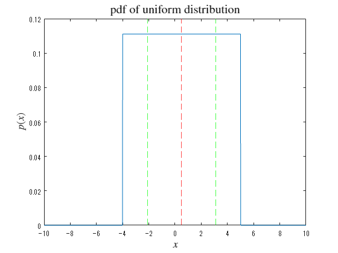</center>


```matlab

plot(x, cdf(pd1, x))
title('cdf of uniform distribution', Interpreter='latex', FontSize=15)
xlabel(" !!!EQ_5!!! ", Interpreter="latex", FontSize=13)
ylabel(" !!!EQ_8!!! ", Interpreter="latex", FontSize=13)
```

<center>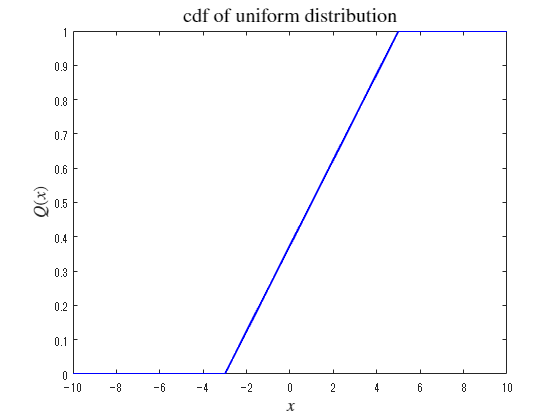</center>


<a name="H_AFB752AC"></a>
## 乱数の生成
<a name="H_DD406E82"></a>

乱数を生成し、ヒストグラムを描画する

```matlab
histogram(random(pd1,[1 1000]))
```

<center>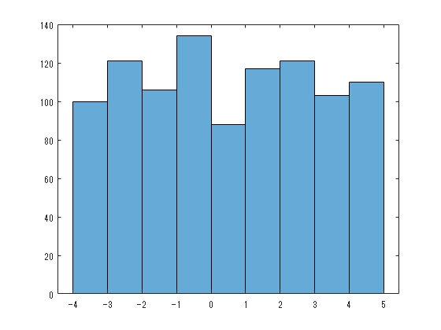</center>

<a name="H_1A20678A"></a>
# 2．指数分布
<a name="H_6458F814"></a>
## 分布オブジェクトの生成

例として、平均 1.7 の指数分布オブジェクトを作成する。

```matlab
pd2 = makedist("Exponential", mu=1.7);
```
<a name="H_78792AA8"></a>
## 分布の描画
<a name="H_DD406E82"></a>

 $0$ から $+10$ の範囲で確率密度関数と累積分布を描く

```matlab
x = 0:0.01:10;
plot(x, pdf(pd2, x))
hold on
    pd2_m = mean(pd2)
```

```TextOutput
pd2_m = 1.7000
```

```matlab
    pd2_s = std(pd2)
```

```TextOutput
pd2_s = 1.7000
```

```matlab
    xline(pd2_m, 'r--')
    xline(pd2_m + pd2_s, 'g--')
    xline(pd2_m - pd2_s, 'g--')
hold off
title('pdf of exponential distribution', Interpreter='latex', FontSize=15)
xlabel(" !!!EQ_5!!! ", Interpreter="latex", FontSize=13)
ylabel(" !!!EQ_6!!! ", Interpreter="latex", FontSize=13)
```

<center>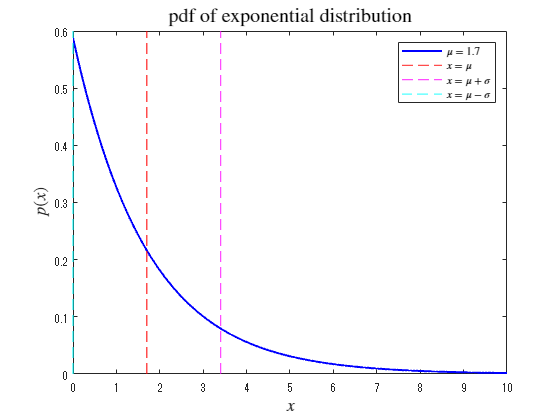</center>


```matlab

plot(x, cdf(pd2, x))
title('cdf of exponential distribution', Interpreter='latex', FontSize=15)
xlabel(" !!!EQ_5!!! ", Interpreter="latex", FontSize=13)
ylabel(" !!!EQ_8!!! ", Interpreter="latex", FontSize=13)
```

<center>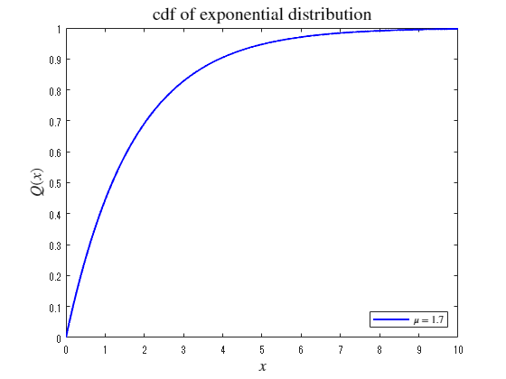</center>


<a name="H_CCE4F93B"></a>
## 乱数の生成
<a name="H_DD406E82"></a>

乱数を生成し、ヒストグラムを描画する

```matlab
rd2 = random(pd2,[1 1000])
```

```TextOutput
rd2 = 1x1000    
    0.2437    0.2620    3.8315    0.3468    0.7781    1.4436    1.0693    1.1215    0.9996    0.7206    0.2261    0.6882    2.5052    3.2356    1.4807    1.3627    0.3102    1.9166    1.1876    4.6345    1.6380    3.6151    1.0388    3.2250    0.7689    0.2457    1.4113    0.5708    1.8623    3.9440    0.1623    0.4053    0.0337    8.1615    2.1137    0.4172    0.1025    0.1833    3.6291    2.3150    0.2221    0.8732    2.7934    0.2664    2.4054    0.6343    1.1252    0.1999    0.1484    0.6290
```

```matlab
histfit(rd2, 30,"exponential")
```

<center>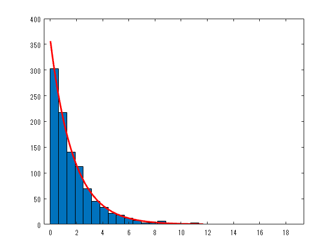</center>


```matlab
fitdist(rd2',"exponential")
```

```TextOutput
ans = 
  ExponentialDistribution
  指数 分布
    mu = 1.76639   [1.66182, 1.88119]
```
<a name="H_6A6D0036"></a>
# 3．二項分布
<a name="H_5B3758FE"></a>
## 分布オブジェクトの生成

例として、 $N=100$ 、 $p=0.35$ の二項分布オブジェクトを作成する。

```matlab
pd3 = makedist("Binomial", "N",100, "p",0.35);
```
<a name="H_4AA3F57D"></a>
## 分布の描画
<a name="H_DD406E82"></a>

 $0$ から $+10$ の範囲で確率密度関数と累積分布を描く

```matlab
x = 0:1:100;
plot(x, pdf(pd3, x), 'o-')
hold on
    pd3_m = mean(pd3)
```

```TextOutput
pd3_m = 35
```

```matlab
    pd3_s = std(pd3)
```

```TextOutput
pd3_s = 4.7697
```

```matlab
    xline(pd3_m, 'r--')
    xline(pd3_m + pd3_s, 'g--')
    xline(pd3_m - pd3_s, 'g--')
hold off
title('pdf of binomial distribution', Interpreter='latex', FontSize=15)
xlabel(" !!!EQ_5!!! ", Interpreter="latex", FontSize=13)
ylabel(" !!!EQ_6!!! ", Interpreter="latex", FontSize=13)
```

<center>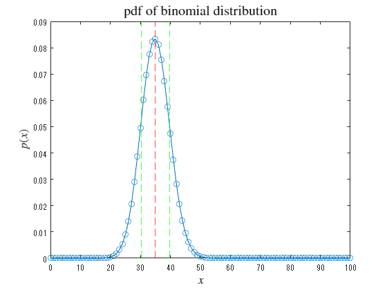</center>


```matlab

plot(x, cdf(pd2, x), 'o-')
title('cdf of binomial distribution', Interpreter='latex', FontSize=15)
xlabel(" !!!EQ_5!!! ", Interpreter="latex", FontSize=13)
ylabel(" !!!EQ_8!!! ", Interpreter="latex", FontSize=13)
```

<center>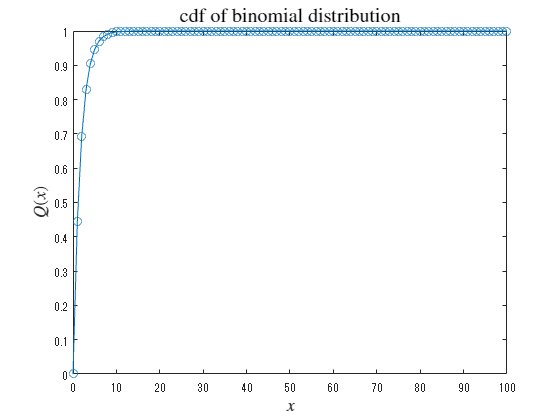</center>

<a name="H_66800663"></a>
## 乱数の生成
<a name="H_DD406E82"></a>

乱数を生成し、ヒストグラムを描画する

```matlab
rd3 = random(pd3,[1 1000])
```

```TextOutput
rd3 = 1x1000    
    36    37    40    27    33    41    34    41    34    32    42    33    33    36    38    33    36    35    37    37    31    41    35    36    47    29    36    31    31    34    41    34    32    42    39    31    39    38    35    39    35    30    28    38    29    39    29    31    30    34
```

```matlab
histfit(rd3, 30,"normal")
```

<center>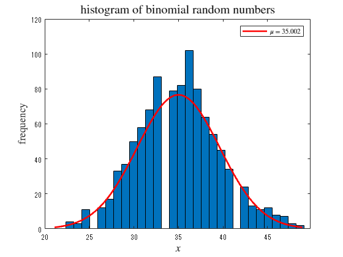</center>


```matlab
fitdist(rd3',"normal")
```

```TextOutput
ans = 
  NormalDistribution
  正規 分布
       mu =  35.086   [34.8003, 35.3717]
    sigma = 4.60389   [4.41058, 4.81505]
```
<a name="H_F4C44D8E"></a>
# 4．正規分布（ガウス分布）
<a name="H_FF1A670C"></a>
## 分布オブジェクトの生成

例として、 $\mu =5$ 、 $\sigma =2.1$ の二項分布オブジェクトを作成する。

```matlab
pd4 = makedist("normal","mu",5,"sigma",2.1);
```
<a name="H_CF54533F"></a>
## 分布の描画
<a name="H_DD406E82"></a>

 $0$ から $+10$ の範囲で確率密度関数と累積分布を描く

```matlab
x = -5:0.01:15;
plot(x, pdf(pd4, x), '-')
hold on
    pd4_m = mean(pd4)
```

```TextOutput
pd4_m = 5
```

```matlab
    pd4_s = std(pd4)
```

```TextOutput
pd4_s = 2.1000
```

```matlab
    xline(pd4_m, 'r--')
    xline(pd4_m + pd4_s, 'g--')
    xline(pd4_m - pd4_s, 'g--')
hold off
title('pdf of normal distribution', Interpreter='latex', FontSize=15)
xlabel(" !!!EQ_5!!! ", Interpreter="latex", FontSize=13)
ylabel(" !!!EQ_6!!! ", Interpreter="latex", FontSize=13)
```

<center>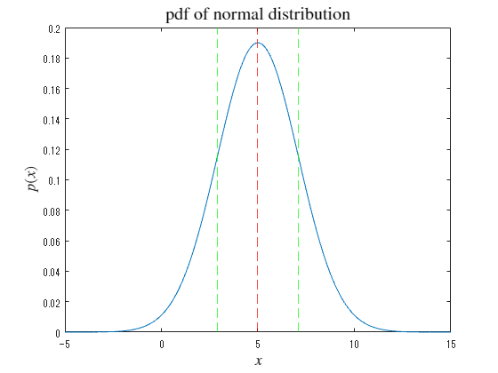</center>


```matlab

plot(x, cdf(pd4, x), '-')
title('cdf of normal distribution', Interpreter='latex', FontSize=15)
xlabel(" !!!EQ_5!!! ", Interpreter="latex", FontSize=13)
ylabel(" !!!EQ_8!!! ", Interpreter="latex", FontSize=13)
```

<center>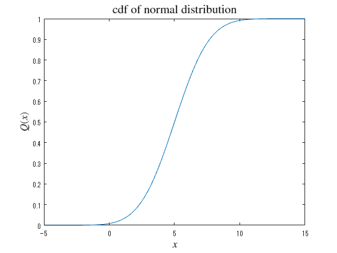</center>

<a name="H_55C2CB28"></a>
## 乱数の生成
<a name="H_DD406E82"></a>

乱数を生成し、ヒストグラムを描画する

```matlab
rd4 = random(pd4,[1 1000])
```

```TextOutput
rd4 = 1x1000    
    9.7441    5.2541    1.2820    5.8811    5.8873    5.5369    8.1014    3.4104    6.1540    7.0385    2.4053    2.4342    3.7522    4.4694    3.5528    5.0926    1.8941    5.7379    7.8158    4.5254    4.0065    5.4638    4.9128    8.3422    3.4555    4.9765    7.0332    1.5198    6.7035    5.0024    5.0738    6.5498    3.7303    4.5947    4.4214    5.0428    5.4128    3.1554    2.3847    7.5476    4.1723    8.5252    1.3190    4.1811    6.5152    5.2886   -1.1761    3.1481    3.8328    4.4720
```

```matlab
histfit(rd4, 30,"normal")
```

<center></center>


```matlab
fitdist(rd4',"normal")
```

```TextOutput
ans = 
  NormalDistribution
  正規 分布
       mu = 4.99992   [4.87308, 5.12676]
    sigma = 2.04407   [1.95824, 2.13782]
```
<a name="H_A69A9F36"></a>
# 参考文献
-  [https://jp.mathworks.com/help/stats/index.html?s_tid=CRUX_lftnav](https://jp.mathworks.com/help/stats/index.html?s_tid=CRUX_lftnav) 
-  [https://jp.mathworks.com/help/stats/histfit.html](https://jp.mathworks.com/help/stats/histfit.html) 
-  [https://jp.mathworks.com/help/stats/fitdist.html](https://jp.mathworks.com/help/stats/fitdist.html) 
