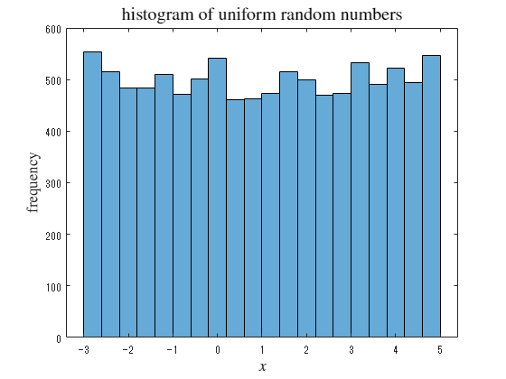
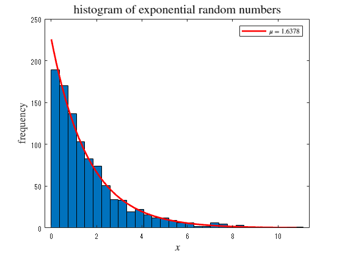
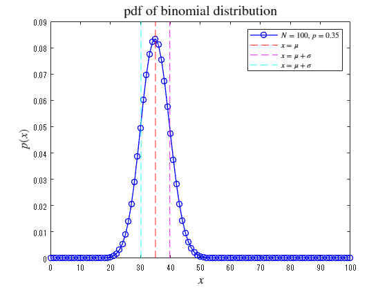
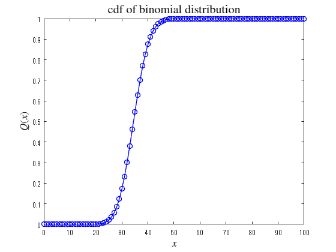
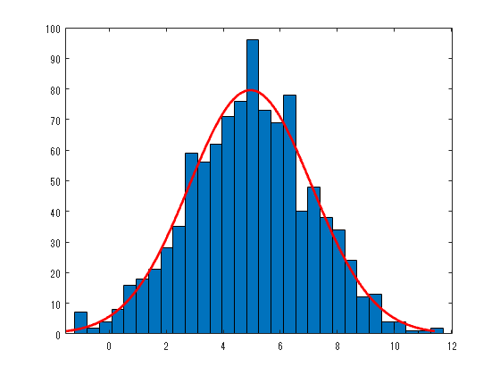

<a name="T_E1A55AA7"></a>
# <span style="color:rgb(213,80,0)">基本的な確率分布の描画と性質</span>
<a name="beginToc"></a>
## 目次
[1.  一様分布](#H_8712929B)
 
&emsp;[分布オブジェクトの生成](#H_6D56EC72)
 
&emsp;[分布の描画](#H_D518924A)
 
&emsp;[乱数の生成](#H_AFB752AC)
 
[2．指数分布](#H_1A20678A)
 
&emsp;[分布オブジェクトの生成](#H_6458F814)
 
&emsp;[分布の描画](#H_78792AA8)
 
&emsp;[乱数の生成](#H_CCE4F93B)
 
[3．二項分布](#H_6A6D0036)
 
&emsp;[分布オブジェクトの生成](#H_5B3758FE)
 
&emsp;[分布の描画](#H_4AA3F57D)
 
&emsp;[乱数の生成](#H_66800663)
 
[4．正規分布（ガウス分布）](#H_F4C44D8E)
 
&emsp;[分布オブジェクトの生成](#H_FF1A670C)
 
&emsp;[分布の描画](#H_CF54533F)
 
&emsp;[乱数の生成](#H_55C2CB28)
 
[参考文献](#H_A69A9F36)
 
<a name="endToc"></a>
<a name="H_0F939D85"></a>

使用 toolbox


&nbsp;&nbsp;&nbsp;&nbsp; Statistics and Machine Learning Toolbox 


ここでは、makedist を用いて統一した表記を紹介する。


<a name="H_8712929B"></a>
# 1.  一様分布
<a name="H_6D56EC72"></a>
## 分布オブジェクトの生成

例として、下限 $-3$ 、上限 $+5$ の連続一様分布オブジェクトを作成する。

```matlab
xl = -3;
xu = 5;
pd1 = makedist("Uniform", lower=xl, upper=xu);
```
<a name="H_D518924A"></a>
## 分布の描画
<a name="H_DD406E82"></a>

 $-10$ から $+10$ の範囲で確率密度関数と累積分布を描く

```matlab
x = -10:0.01:10;
    plot(x, pdf(pd1, x), 'b-', LineWidth=1.5, DisplayName="uniform")
hold on
    pd1_m = mean(pd1)
```

```TextOutput
pd1_m = 1
```

```matlab
    pd1_s = std(pd1)
```

```TextOutput
pd1_s = 2.3094
```

```matlab
    xline(pd1_m, 'r--', LineWidth=1, DisplayName=" !!!EQ_5!!! ")
    xline(pd1_m + pd1_s, 'k--', LineWidth=1, DisplayName=" !!!EQ_6!!! ")
    xline(pd1_m - pd1_s, 'k--', LineWidth=1, DisplayName=" !!!EQ_6!!! ")
hold off
title('pdf of uniform distribution', Interpreter='latex', FontSize=15)
xlabel(" !!!EQ_8!!! ", Interpreter="latex", FontSize=13)
ylabel(" !!!EQ_9!!! ", Interpreter="latex", FontSize=13)
legend(Interpreter="latex", Location="southwest")
```

<center></center>


```matlab

plot(x, cdf(pd1, x), 'b-', LineWidth=1.5)
title('cdf of uniform distribution', Interpreter='latex', FontSize=15)
xlabel(" !!!EQ_8!!! ", Interpreter="latex", FontSize=13)
ylabel(" !!!EQ_11!!! ", Interpreter="latex", FontSize=13)
```

<center></center>


<a name="H_AFB752AC"></a>
## 乱数の生成
<a name="H_DD406E82"></a>

一様分布に従う乱数を10000個生成し、ヒストグラムを描画する

```matlab
histogram(random(pd1,[1 10000]), 20)
title('histogram of uniform random numbers', Interpreter='latex', FontSize=15)
xlabel(" $x$ ", Interpreter="latex", FontSize=13)
ylabel("frequency", Interpreter="latex", FontSize=13)
```

<center></center>

<a name="H_1A20678A"></a>
# 2．指数分布
<a name="H_6458F814"></a>
## 分布オブジェクトの生成

例として、平均 1.7 の指数分布オブジェクトを作成する。

```matlab
mu = 1.7;
pd2 = makedist("Exponential", mu);
```
<a name="H_78792AA8"></a>
## 分布の描画
<a name="H_DD406E82"></a>

 $0$ から $+10$ の範囲で確率密度関数と累積分布を描く

```matlab
x = 0:0.01:10;
plot(x, pdf(pd2, x), 'b-', LineWidth=1.5, DisplayName=" $\mu =$ "+string(mu))
hold on
    pd2_m = mean(pd2)
```

```TextOutput
pd2_m = 1.7000
```

```matlab
    pd2_s = std(pd2)
```

```TextOutput
pd2_s = 1.7000
```

```matlab
    xline(pd2_m, 'r--', LineWidth=1, DisplayName=" !!!EQ_5!!! ")
    xline(pd2_m + pd2_s, 'm--', LineWidth=1, DisplayName=" !!!EQ_6!!! ")
    xline(pd2_m - pd2_s, 'c--', LineWidth=1, DisplayName=" !!!EQ_18!!! ")
hold off
title('pdf of exponential distribution', Interpreter='latex', FontSize=15)
xlabel(" !!!EQ_8!!! ", Interpreter="latex", FontSize=13)
ylabel(" !!!EQ_9!!! ", Interpreter="latex", FontSize=13)
legend(Interpreter="latex")
```

<center></center>


```matlab

plot(x, cdf(pd2, x), 'b-', LineWidth=1.5, DisplayName=" !!!EQ_15!!! "+string(mu))
title('cdf of exponential distribution', Interpreter='latex', FontSize=15)
xlabel(" !!!EQ_8!!! ", Interpreter="latex", FontSize=13)
ylabel(" !!!EQ_11!!! ", Interpreter="latex", FontSize=13)
legend(Interpreter="latex", Location="southeast")
```

<center></center>


<a name="H_CCE4F93B"></a>
## 乱数の生成
<a name="H_DD406E82"></a>

乱数を生成し、ヒストグラムを描画する

```matlab
rd2 = random(pd2,[1 1000]);
f2 = fitdist(rd2',"exponential");
h2 = histfit(rd2, 30,"exponential");
h22 = h2(2);
set(h22, DisplayName=" $\mu =$ "+string(f2.mu))
title('histogram of exponential random numbers', Interpreter='latex', FontSize=15)
xlabel(" $x$ ", Interpreter="latex", FontSize=13)
ylabel("frequency", Interpreter="latex", FontSize=13)
legend(h22, Interpreter="latex")
```

<center></center>


<a name="H_6A6D0036"></a>
# 3．二項分布
<a name="H_5B3758FE"></a>
## 分布オブジェクトの生成

例として、 $N=100$ 、 $p=0.35$ の二項分布オブジェクトを作成する。

```matlab
N3 = 100;
p3 = 0.35;
pd3 = makedist("Binomial", "N", N3, "p", p3);
```
<a name="H_4AA3F57D"></a>
## 分布の描画
<a name="H_DD406E82"></a>

 $0$ から $+10$ の範囲で確率密度関数と累積分布を描く

```matlab
x = 0:1:100;
plot(x, pdf(pd3, x), 'bo-', LineWidth=1, DisplayName=" $N =$ "+string(N3)+", $p =$ "+string(p3))
hold on
    pd3_m = mean(pd3);
    pd3_s = std(pd3);
    xline(pd3_m, 'r--', LineWidth=1, DisplayName=" $x = \mu$ ")
    xline(pd3_m + pd3_s, 'm--', LineWidth=1, DisplayName=" $x = \mu + \sigma$ ")
    xline(pd3_m - pd3_s, 'c--', LineWidth=1, DisplayName=" $x = \mu + \sigma$ ")
hold off
title('pdf of binomial distribution', Interpreter='latex', FontSize=15)
xlabel(" $x$ ", Interpreter="latex", FontSize=13)
ylabel(" $p(x)$ ", Interpreter="latex", FontSize=13)
legend(Interpreter="latex")
```

<center></center>


```matlab

plot(x, cdf(pd3, x), 'bo-', LineWidth=1)
title('cdf of binomial distribution', Interpreter='latex', FontSize=15)
xlabel(" !!!EQ_8!!! ", Interpreter="latex", FontSize=13)
ylabel(" !!!EQ_11!!! ", Interpreter="latex", FontSize=13)
```

<center></center>

<a name="H_66800663"></a>
## 乱数の生成
<a name="H_DD406E82"></a>

乱数を生成し、ヒストグラムを描画する

```matlab
rd3 = random(pd3,[1 1000]);
f3 = fitdist(rd3',"normal");
h3 = histfit(rd3, 30,"normal");
h32 = h3(2);
set(h32, DisplayName=" $\mu =$ "+string(f3.mu))
title('histogram of binomial random numbers', Interpreter='latex', FontSize=15)
xlabel(" $x$ ", Interpreter="latex", FontSize=13)
ylabel("frequency", Interpreter="latex", FontSize=13)
legend(h32, Interpreter="latex")
```

<center></center>


<a name="H_F4C44D8E"></a>
# 4．正規分布（ガウス分布）
<a name="H_FF1A670C"></a>
## 分布オブジェクトの生成

例として、 $\mu =5$ 、 $\sigma =2.1$ の二項分布オブジェクトを作成する。

```matlab
pd4 = makedist("normal","mu",5,"sigma",2.1);
```
<a name="H_CF54533F"></a>
## 分布の描画
<a name="H_DD406E82"></a>

 $0$ から $+10$ の範囲で確率密度関数と累積分布を描く

```matlab
x = -5:0.01:15;
plot(x, pdf(pd4, x), '-')
hold on
    pd4_m = mean(pd4)
```

```TextOutput
pd4_m = 5
```

```matlab
    pd4_s = std(pd4)
```

```TextOutput
pd4_s = 2.1000
```

```matlab
    xline(pd4_m, 'r--')
    xline(pd4_m + pd4_s, 'g--')
    xline(pd4_m - pd4_s, 'g--')
hold off
title('pdf of normal distribution', Interpreter='latex', FontSize=15)
xlabel(" !!!EQ_8!!! ", Interpreter="latex", FontSize=13)
ylabel(" !!!EQ_9!!! ", Interpreter="latex", FontSize=13)
```

<center></center>


```matlab

plot(x, cdf(pd4, x), '-')
title('cdf of normal distribution', Interpreter='latex', FontSize=15)
xlabel(" !!!EQ_8!!! ", Interpreter="latex", FontSize=13)
ylabel(" !!!EQ_11!!! ", Interpreter="latex", FontSize=13)
```

<center></center>

<a name="H_55C2CB28"></a>
## 乱数の生成
<a name="H_DD406E82"></a>

乱数を生成し、ヒストグラムを描画する

```matlab
rd4 = random(pd4,[1 1000])
```

```TextOutput
rd4 = 1x1000    
    9.7441    5.2541    1.2820    5.8811    5.8873    5.5369    8.1014    3.4104    6.1540    7.0385    2.4053    2.4342    3.7522    4.4694    3.5528    5.0926    1.8941    5.7379    7.8158    4.5254    4.0065    5.4638    4.9128    8.3422    3.4555    4.9765    7.0332    1.5198    6.7035    5.0024    5.0738    6.5498    3.7303    4.5947    4.4214    5.0428    5.4128    3.1554    2.3847    7.5476    4.1723    8.5252    1.3190    4.1811    6.5152    5.2886   -1.1761    3.1481    3.8328    4.4720
```

```matlab
histfit(rd4, 30,"normal")
```

<center></center>


```matlab
fitdist(rd4',"normal")
```

```TextOutput
ans = 
  NormalDistribution
  正規 分布
       mu = 4.99992   [4.87308, 5.12676]
    sigma = 2.04407   [1.95824, 2.13782]
```
<a name="H_A69A9F36"></a>
# 参考文献
-  [https://jp.mathworks.com/help/stats/index.html?s_tid=CRUX_lftnav](https://jp.mathworks.com/help/stats/index.html?s_tid=CRUX_lftnav) 
-  [https://jp.mathworks.com/help/stats/histfit.html](https://jp.mathworks.com/help/stats/histfit.html) 
-  [https://jp.mathworks.com/help/stats/fitdist.html](https://jp.mathworks.com/help/stats/fitdist.html) 
