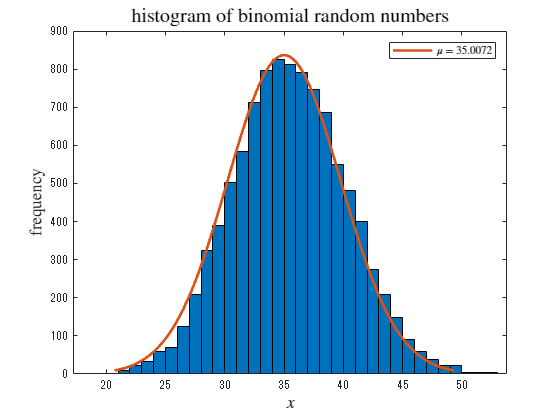

# Plotting basic probability distributions and their properties
<a name="beginToc"></a>

## Table of Contents
[1. Uniform distribution ](#1.-uniform-distribution-)
 
&emsp;[Creating a distribution object ](#creating-a-distribution-object-)
 
&emsp;[Plotting the distribution](#plotting-the-distribution)
 
&emsp;[Generate random numbers ](#generate-random-numbers-)
 
[2. Exponential distribution ](#2.-exponential-distribution-)
 
&emsp;[Creating a distribution object ](#creating-a-distribution-object-)
 
&emsp;[Plotting the distribution](#plotting-the-distribution)
 
&emsp;[Generate random numbers ](#generate-random-numbers-)
 
[3 ．Binomial distribution](#3-．binomial-distribution)
 
&emsp;[Creating a distribution object ](#creating-a-distribution-object-)
 
&emsp;[Plotting the distribution](#plotting-the-distribution)
 
&emsp;[Generate random numbers ](#generate-random-numbers-)
 
[4. Poisson distribution ](#4.-poisson-distribution-)
 
&emsp;[Creating a distribution object ](#creating-a-distribution-object-)
 
&emsp;[Plotting the distribution](#plotting-the-distribution)
 
&emsp;[Generate random numbers ](#generate-random-numbers-)
 
[5. Normal distribution (Gaussian distribution) ](#5.-normal-distribution-(gaussian-distribution)-)
 
&emsp;[Creating a distribution object ](#creating-a-distribution-object-)
 
&emsp;[Plotting the distribution](#plotting-the-distribution)
 
&emsp;[Generating random numbers ](#generating-random-numbers-)
 
[References ](#references-)
 
<a name="endToc"></a>


Used toolbox 


Statistics and Machine Learning Toolbox  


 

# 1. Uniform distribution 
## Creating a distribution object 

As an example, create a continuous uniform distribution object with lower limit $-3$ and upper limit $+5$ . 

```matlab
xl = -3;
xu = 5;
pd1 = makedist("Uniform", lower=xl, upper=xu); 
```

## Plotting the distribution

Plot probability density functions and cumulative distributions in the range from $-10$ to $+10$ 

```matlab
x = -10:0.01:10;
    plot(x, pdf(pd1, x), 'b-', LineWidth=1.5, DisplayName="uniform")
hold on
    pd1_m = mean(pd1) %Calculating the average value
```

```matlabTextOutput
pd1_m = 1
```

```matlab
    pd1_s = std(pd1) %Calculating standard deviation
```

```matlabTextOutput
pd1_s = 2.3094
```

```matlab
    xline(pd1_m, 'r--', LineWidth=1, DisplayName=" !!!EQ_5!!! ")
    xline(pd1_m + pd1_s, 'k--', LineWidth=1, DisplayName=" !!!EQ_6!!! ")
    xline(pd1_m - pd1_s, 'k--', LineWidth=1, DisplayName=" !!!EQ_6!!! ")
hold off
title('pdf of uniform distribution', Interpreter='latex', FontSize=15)
xlabel(" !!!EQ_8!!! ", Interpreter="latex", FontSize=13)
ylabel(" !!!EQ_9!!! ", Interpreter="latex", FontSize=13)
legend(Interpreter="latex", Location="southwest")
```


```matlab

plot(x, cdf(pd1, x), 'b-', LineWidth=1.5)
title('cdf of uniform distribution', Interpreter='latex', FontSize=15)
xlabel(" !!!EQ_8!!! ", Interpreter="latex", FontSize=13)
ylabel(" !!!EQ_11!!! ", Interpreter="latex", FontSize=13)
```


```matlab
 
```

## Generate random numbers 

Generate 10,000 random numbers that follow a uniform distribution and draw a histogram 

```matlab
rd1 = random(pd1,[1 10000]);
histogram(rd1, 20)
title('histogram of uniform random numbers', Interpreter='latex', FontSize=15)
xlabel(" $x$ ", Interpreter="latex", FontSize=13)
ylabel("frequency", Interpreter="latex", FontSize=13)
```


# 2. Exponential distribution 
## Creating a distribution object 

As an example, create an exponential distribution object with a mean of 1.7. 

```matlab
mu = 1.7;
pd2 = makedist("Exponential", mu); 
```

## Plotting the distribution

Plot the probability density function and cumulative distribution in the range from $0$ to $+10$ 

```matlab
x = 0:0.01:10;
plot(x, pdf(pd2, x), 'b-', LineWidth=1.5, DisplayName=" $\mu =$ "+string(mu))
hold on
    pd2_m = mean(pd2) %Calculating the average value
```

```matlabTextOutput
pd2_m = 1.7000
```

```matlab
    pd2_s = std(pd2) %Calculating standard deviation
```

```matlabTextOutput
pd2_s = 1.7000
```

```matlab
    xline(pd2_m, 'r--', LineWidth=1, DisplayName=" !!!EQ_5!!! ")
    xline(pd2_m + pd2_s, 'm--', LineWidth=1, DisplayName=" !!!EQ_6!!! ")
    xline(pd2_m - pd2_s, 'c--', LineWidth=1, DisplayName=" !!!EQ_18!!! ")
hold off
title('pdf of exponential distribution', Interpreter='latex', FontSize=15)
xlabel(" !!!EQ_8!!! ", Interpreter="latex", FontSize=13)
ylabel(" !!!EQ_9!!! ", Interpreter="latex", FontSize=13)
legend(Interpreter="latex")
```


```matlab

plot(x, cdf(pd2, x), 'b-', LineWidth=1.5, DisplayName=" !!!EQ_15!!! "+string(mu))
title('cdf of exponential distribution', Interpreter='latex', FontSize=15)
xlabel(" !!!EQ_8!!! ", Interpreter="latex", FontSize=13)
ylabel(" !!!EQ_11!!! ", Interpreter="latex", FontSize=13)
legend(Interpreter="latex", Location="southeast")
```


```matlab
 
```

## Generate random numbers 

Generate random numbers and draw a histogram 


Furthermore, perform fitting with exponential distribution 

```matlab
rd2 = random(pd2,[1 10000]);
f2 = fitdist(rd2',"exponential");
h2 = histfit(rd2, 30,"exponential");
h22 = h2(2);
set(h22, DisplayName=" $\mu =$ "+string(f2.mu))
title('histogram of exponential random numbers', Interpreter='latex', FontSize=15)
xlabel(" $x$ ", Interpreter="latex", FontSize=13)
ylabel("frequency", Interpreter="latex", FontSize=13)
legend(h22, Interpreter="latex")
```


```matlab
 
```

# 3 ．Binomial distribution
## Creating a distribution object 

As an example, create a binomial distribution object $N=100$ and $p=0.35$ . 

```matlab
N3 = 100;
p3 = 0.35;
pd3 = makedist("Binomial", "N", N3, "p", p3); 
```

## Plotting the distribution

Plot the probability density function and cumulative distribution in the range from $0$ to $+10$ 

```matlab
x = 0:1:100;
plot(x, pdf(pd3, x), 'bo-', LineWidth=1, DisplayName=" $N =$ "+string(N3)+", $p =$ "+string(p3))
hold on
    pd3_m = mean(pd3);
    pd3_s = std(pd3);
    xline(pd3_m, 'r--', LineWidth=1, DisplayName=" $x = \mu$ ")
    xline(pd3_m + pd3_s, 'm--', LineWidth=1, DisplayName=" $x = \mu + \sigma$ ")
    xline(pd3_m - pd3_s, 'c--', LineWidth=1, DisplayName=" $x = \mu + \sigma$ ")
hold off
title('pdf of binomial distribution', Interpreter='latex', FontSize=15)
xlabel(" $x$ ", Interpreter="latex", FontSize=13)
ylabel(" $p(x)$ ", Interpreter="latex", FontSize=13)
legend(Interpreter="latex")
```


```matlab

plot(x, cdf(pd3, x), 'bo-', LineWidth=1)
title('cdf of binomial distribution', Interpreter='latex', FontSize=15)
xlabel(" !!!EQ_8!!! ", Interpreter="latex", FontSize=13)
ylabel(" !!!EQ_11!!! ", Interpreter="latex", FontSize=13) 
```


## Generate random numbers 

Generate random numbers and draw the histogram 

```matlab
rd3 = random(pd3,[1 10000]);
f3 = fitdist(rd3',"normal");
h3 = histfit(rd3, 35,"normal");
h32 = h3(2);
set(h32, DisplayName=" $\mu =$ "+string(f3.mu))
title('histogram of binomial random numbers', Interpreter='latex', FontSize=15)
xlabel(" $x$ ", Interpreter="latex", FontSize=13)
ylabel("frequency", Interpreter="latex", FontSize=13)
legend(h32, Interpreter="latex")
```



```matlab
 
```

# 4. Poisson distribution 
## Creating a distribution object 

For example, create a Poisson distribution object of $\lambda =10$ . 

```matlab
lambda = 10;
pd5 = makedist("Poisson", "lambda", lambda); 
```

## Plotting the distribution

Plot the probability density function and cumulative distribution in the range from $0$ to $+10$ 

```matlab
x = 0:1:40;
plot(x, pdf(pd5, x), 'bo-', LineWidth=1, DisplayName=" $\lambda =$ "+string(lambda))

hold on
    pd5_m = mean(pd5);
    pd5_s = std(pd5);
    xline(pd5_m, 'r--', LineWidth=1, DisplayName=" $x = \mu$ ")
    xline(pd5_m + pd5_s, 'm--', LineWidth=1, DisplayName=" $x = \mu + \sigma$ ")
    xline(pd5_m - pd5_s, 'c--', LineWidth=1, DisplayName=" $x = \mu + \sigma$ ")
hold off
title('pdf of Poisson distribution', Interpreter='latex', FontSize=15)
xlabel(" $x$ ", Interpreter="latex", FontSize=13)
ylabel(" $p(x)$ ", Interpreter="latex", FontSize=13)
legend(Interpreter="latex")
```


```matlab

plot(x, cdf(pd5, x), 'bo-', LineWidth=1)
title('cdf of Poisson distribution', Interpreter='latex', FontSize=15)
xlabel(" !!!EQ_8!!! ", Interpreter="latex", FontSize=13)
ylabel(" !!!EQ_11!!! ", Interpreter="latex", FontSize=13)
```


## Generate random numbers 

Generate random numbers and draw the histogram 

```matlab
rd5 = random(pd5,[1 10000]);
f5 = fitdist(rd5',"normal");
h5 = histfit(rd5, 23,"normal");
h52 = h5(2);
set(h52, DisplayName=" $\mu =$ "+string(f5.mu))
title('histogram of Poisson random numbers', Interpreter='latex', FontSize=15)
xlabel(" $x$ ", Interpreter="latex", FontSize=13)
ylabel("frequency", Interpreter="latex", FontSize=13)
legend(h52, Interpreter="latex")
```


```matlab
 
```

# 5. Normal distribution (Gaussian distribution) 
## Creating a distribution object 

As an example, create binomial distribution objects of $\mu =5$ and $\sigma =2.1$ . 

```matlab
mu4 = 5;
sigma4 = 2.1;
pd4 = makedist("normal","mu", mu4, "sigma", sigma4); 
```

## Plotting the distribution

Plot the probability density function and cumulative distribution in the range from $0$ to $+10$ 

```matlab
x = -5:0.01:15;
plot(x, pdf(pd4, x), 'b-', LineWidth=1.5, DisplayName=" $\mu =$ "+string(mu4)+", $\sigma =$ "+string(sigma4))
hold on
    pd4_m = mean(pd4)
```

```matlabTextOutput
pd4_m = 5
```

```matlab
    pd4_s = std(pd4)
```

```matlabTextOutput
pd4_s = 2.1000
```

```matlab
    xline(pd4_m, 'r--', LineWidth=1, DisplayName=" !!!EQ_5!!! ")
    xline(pd4_m + pd4_s, 'm--', LineWidth=1, DisplayName=" !!!EQ_6!!! ")
    xline(pd4_m - pd4_s, 'c--', LineWidth=1, DisplayName=" !!!EQ_6!!! ")
hold off
title('pdf of normal distribution', Interpreter='latex', FontSize=15)
xlabel(" !!!EQ_8!!! ", Interpreter="latex", FontSize=13)
ylabel(" !!!EQ_9!!! ", Interpreter="latex", FontSize=13)
legend(Interpreter="latex")
```


```matlab

plot(x, cdf(pd4, x), 'b-', LineWidth=1.5)
title('cdf of normal distribution', Interpreter='latex', FontSize=15)
xlabel(" !!!EQ_8!!! ", Interpreter="latex", FontSize=13)
ylabel(" !!!EQ_11!!! ", Interpreter="latex", FontSize=13) 
```


## Generating random numbers 

Generating random numbers and drawing a histogram 

```matlab
rd4 = random(pd4,[1 10000])
```

```matlabTextOutput
rd4 = 1x10000    
    5.4021    5.2658   10.1988    1.6652    6.3109    6.5662    5.8664    5.7893    5.4136    5.4891    4.5508    6.3831    7.9438    8.9690    2.8779    7.9333    3.7045    3.2342    4.5544    3.2196    4.0499    5.5953    5.4371    3.4730    8.9946    1.9844    6.9120    6.2115    5.6240    4.7850    5.0463    4.9435    7.2474    4.4948    6.2506    6.6036    5.9722    5.8084    6.5562    6.4411    4.9217    6.7524    6.0632    6.2696    3.4920    2.1568    7.7336    4.5714    3.2498    5.6342

```

```matlab
f4 = fitdist(rd4',"normal");
h4 = histfit(rd4, 30,"normal");
h42 = h4(2);
set(h42, DisplayName=" !!!EQ_15!!! "+string(f4.mu)+",  !!!EQ_59!!! "+string(f4.std))
title('histogram of normal random numbers', Interpreter='latex', FontSize=15)
xlabel(" !!!EQ_8!!! ", Interpreter="latex", FontSize=13)
ylabel("frequency", Interpreter="latex", FontSize=13)
legend(h42, Interpreter="latex") 
```


# References 
-  [https://jp.mathworks. com/help/stats/index.html?s\_tid=CRUX\_lftnav](https://jp.mathworks.com/help/stats/index.html?s_tid=CRUX_lftnav) 
-  [https://jp.mathworks.com/help/stats/histfit.html](https://jp.mathworks.com/help/stats/histfit.html) 
-  [https://jp.mathworks.com/help/stats/fitdist.html](https://jp.mathworks.com/help/stats/fitdist.html) 

 

