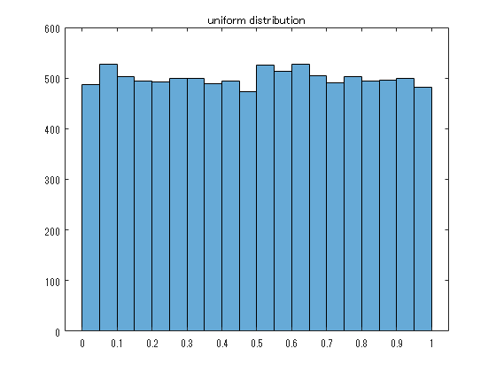
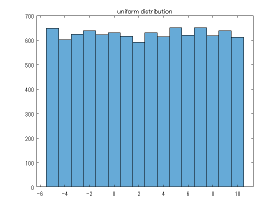

<a name="T_E1A55AA7"></a>
# <span style="color:rgb(213,80,0)">一様乱数の生成と頻度分布の描画</span>
<a name="beginToc"></a>
## 目次
[１．乱数を生成する](#H_1A20678A)
 
&emsp;[１．１　一様乱数の生成](#H_7D0EB4DB)
 
&emsp;[１．２　整数の一様乱数](#H_CD9B0322)
 
[２．度数分布の描画](#H_8712929B)
 
&emsp;[２．１　乱数列をデータとして、変数に格納する](#H_6D56EC72)
 
&emsp;[２．２　度数分布の描画](#H_4E50F7CC)
 
[例題](#H_1C55320D)
 
[参考文献](#H_74926F91)
 
<a name="endToc"></a>
```matlab
%使用toolboxの確認
license('inuse')
```

```TextOutput
matlab
```
<a name="H_1A20678A"></a>
# １．乱数を生成する
<a name="H_4F81EF7F"></a>
<a name="H_7D0EB4DB"></a>
## １．１　一様乱数の生成

Q1. 0 から 1までの一様乱数を5個出力せよ。

```matlab
rand([1 5])
```

```TextOutput
ans = 1x5    
    0.8147    0.9058    0.1270    0.9134    0.6324
```

または

```matlab
unifrnd(0, 1, [1 5])
```

```TextOutput
ans = 1x5    
    0.0975    0.2785    0.5469    0.9575    0.9649
```
<a name="H_CD9B0322"></a>
## １．２　整数の一様乱数

Q2. <samp>[-3,4]</samp> の一様分布したランダムな整数を5個出力せよ。

```matlab
randi([-3,4], [1 5])
```

```TextOutput
ans = 1x5    
    -2     4     4     0     3
```
<a name="H_8712929B"></a>
# ２．度数分布の描画
<a name="H_22FD0609"></a>
<a name="H_6D56EC72"></a>
## ２．１　乱数列をデータとして、変数に格納する

Q3. 0 から 1までの一様乱数を10000個出力し、変数 data1 に格納せよ。

```matlab
data1 = rand([1 10000])
```

```TextOutput
data1 = 1x10000    
    0.1419    0.4218    0.9157    0.7922    0.9595    0.6557    0.0357    0.8491    0.9340    0.6787    0.7577    0.7431    0.3922    0.6555    0.1712    0.7060    0.0318    0.2769    0.0462    0.0971    0.8235    0.6948    0.3171    0.9502    0.0344    0.4387    0.3816    0.7655    0.7952    0.1869    0.4898    0.4456    0.6463    0.7094    0.7547    0.2760    0.6797    0.6551    0.1626    0.1190    0.4984    0.9597    0.3404    0.5853    0.2238    0.7513    0.2551    0.5060    0.6991    0.8909
```
<a name="H_DD406E82"></a>

Q4. <samp>[-5, 10]</samp> の一様分布したランダムな整数を10000個出力し、変数 data2 に格納せよ。

```matlab
data2 = randi([-5,10], [1 10000])
```

```TextOutput
data2 = 1x10000    
    -2     2    -3     0    -1     8     6     0     4    -1    -1    -1     5     3    -4    -5    -1     2    -1     5    10     7     5     7     6     4     7     1     4    -2    -1    -5     0    -3     1    -3     8     6    -4     8    -2    -4     5    10     8     4     0    -1     1     0
```
<a name="H_4E50F7CC"></a>
## ２．２　度数分布の描画

Q5. data1 の度数分布を描画せよ。

```matlab
h1 = histogram(data1)
```

```TextOutput
h1 = 
  Histogram のプロパティ:
             Data: [0.1419 0.4218 0.9157 0.7922 0.9595 0.6557 0.0357 0.8491 0.9340 0.6787 0.7577 0.7431 0.3922 0.6555 0.1712 0.7060 0.0318 0.2769 0.0462 0.0971 0.8235 0.6948 0.3171 0.9502 0.0344 0.4387 0.3816 0.7655 0.7952 0.1869 … ] (1x10000 double)
           Values: [488 528 503 495 493 500 500 489 494 474 525 513 528 505 491 503 494 496 499 482]
          NumBins: 20
         BinEdges: [0 0.0500 0.1000 0.1500 0.2000 0.2500 0.3000 0.3500 0.4000 0.4500 0.5000 0.5500 0.6000 0.6500 0.7000 0.7500 0.8000 0.8500 0.9000 0.9500 1]
         BinWidth: 0.0500
        BinLimits: [0 1]
    Normalization: 'count'
        FaceColor: 'auto'
        EdgeColor: [0 0 0]
  すべてのプロパティ を表示
```

```matlab
title('uniform distribution')
```

<center></center>


Q6. data2 の度数分布を描画せよ。

```matlab
h2 = histogram(data2);
title('uniform distribution')
```

<center></center>

<a name="H_1C55320D"></a>
# 例題

Q7. $-1$ から $+1$ までの一様乱数を1000個出力し、それらの度数分布を描画せよ。


Q8. <samp>[-2, 15]</samp> の一様分布したランダムな整数を1000個出力し、それらの度数分布を描画せよ。


<a name="H_74926F91"></a>
# 参考文献
-  [https://jp.mathworks.com/help/matlab/ref/rand.html](https://jp.mathworks.com/help/matlab/ref/rand.html) 
-  [https://jp.mathworks.com/help/matlab/ref/randi.html](https://jp.mathworks.com/help/matlab/ref/randi.html) 
-  [https://jp.mathworks.com/help/matlab/ref/matlab.graphics.chart.primitive.histogram.html](https://jp.mathworks.com/help/matlab/ref/matlab.graphics.chart.primitive.histogram.html) 
