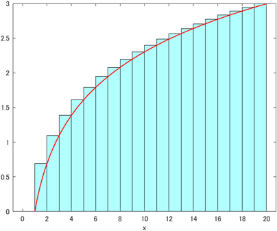

# 統計力学

## 全体の説明

- このリポジトリには、統計力学の基礎を理解するための対話型のMATLAB®ライブスクリプトが含まれている。
- 統計力学を始めて学ぶ学生を対象に、数値シミュレーションを通して、基本的な概念や理論の背景を理解することを目的とする。
  - 特に、初学者が統計物理学の世界にスムーズに入門できるよう、直感的な説明と演習問題を提供する。
- このサイトの内容は、数値計算・数値シミュレーションを用いた、座学で学ぶ統計力学講義に対する補助的な位置づけとなっている。
- 各節は、概要とライブスクリプトから構成され、各章には、理解度確認のため、章末問題がついている。

### 目次
[マインドマップ](https://github.com/yoshy2003/StatMech_A/blob/main/Images/mindmap.png)

1. 準備（乱数・確率・分布・統計）
2. カノニカル分布
3. ミクロな状態遷移とゆらぎ
4. ランダムウォークと拡散

（2023年12月1日現在。内容は随時、追加・更新されます。）

### 前提となる知識

- 熱力学
- 古典力学・量子力学
  - 特に、エネルギーに関連する内容

### 対象学年

- 大学３年・４年

### 学習目標

- マクロな状態とミクロな状態との関係に関する基本的な概念を理解する。
- 乱数に基づく数値シミュレーションを通して、統計力学の基礎を学ぶ。
- ライブスクリプトを通じて理論の理解を深め、実際の物理現象をモデル化しシミュレーションできるようになる。

### 学習の流れ

1. 概要を読み、目的を確認する
2. ライブスクリプトの内容に従って、コードを実行する
3. ライブスクリプトにある例題に取り組む
4. 章末の演習問題に取り組む（理解度確認）

---

## 1. 準備（乱数・分布／確率・統計）

### 1.1 乱数生成と分布の描画

#### ===== 概要 =====

- 乱数（random number）は、ランダム選択された数値を指す。
- 計算機上で完全なランダム性を実現することは困難であるため、線形合同法やメルセンヌ・ツイスター法といった擬似乱数として知られるアルゴリズムに基づいた数値が使用される。
  - [MATLABでは、メルセンヌ・ツイスター法がデフォルトとなっている。](https://jp.mathworks.com/matlabcentral/answers/223373-)
- 生成された乱数列の頻度分布を可視化するために、ヒストグラムを描画する関数を利用することができる。

#### ===== ライブスクリプト =====

| 項目 | リンク |
| -------------- | -------------- |
| (1) 一様乱数の生成と頻度分布の描画  |   |

---

### 1.2 確率分布

#### ===== 概要 =====

- 統計力学において基本的な以下の確率分布を紹介する。
  - 指数分布・二項分布・正規分布
- 乱数は等確率に生成される（一様乱数の場合）だけでなく、特定の確率分布に従うように生成される場合もある。
  - 例えば、1次元ランダムウォークの結果として得られる位置を再現したい場合には、二項分布または正規分布に従った乱数を生成することになる。
  - このように、特定の確率分布に従う乱数を生成することで、物理現象の数値的再現が可能となる。
- MATLABには一様乱数や正規乱数を生成する関数が標準で提供されており、これらを利用して乱数列を生成することができる。
- 確率分布に対する基本的な統計量（平均・分散・偏差）を求める。
- 確率分布は離散的にも連続的にも表すことができる。
  - 例えば、コインの状態は離散的（表か裏）、粒子の位置は連続的に分布する。
  - 連続変数で表される場合は、確率密度 $p(x)$を用いて、区間 $x$から $x+dx$までの確率が $p(x)dx$で与えられる。
  - 確率の総和が1であることに注意して、離散と連続との変換を行うことができる。
- 確率分布に従った乱数生成
  - 頻度分布の描画し、関数でフィッティングすることにより確認する。

#### ===== ライブスクリプト =====

| 項目 | リンク |
| -------------- | -------------- |
| (1) 基本的な確率分布 | 準備中 |
| (2) 確率分布に従う乱数の生成 |  |
| (4) 和と積分について | 準備中 |

---

### 1.3 スターリングの公式

#### ===== 概要 =====

- 統計力学では、階乗 $N!$に対して指数関数による近似を行う際に、 
Stirlingの公式 $\ln N! \approx N\ln N - N$ が用いられる。
- ここでは、 Stirlingの公式を視覚的に理解する
- また、$N$が大きくなるにつれて、近似の精度がどのように変化するかを把握する

#### ===== ライブスクリプト =====

| 項目 | リンク |
| -------------- | -------------- |
|(1) スターリングの公式：証明と近似精度 | |

---

### 1.4 乱数を用いた数値計算

#### ===== 概要 =====

- 乱数を利用した数値計算は一般に、モンテカルロ法と呼ばれている。
- ここでは一例として、乱数を利用して、特定の領域に対する面積を求める方法を紹介する。
  - 例えば、正方形の領域内に特定の領域が存在するとして、正方形の面積を $S$、特定の領域の面積を $S_1$とする。
  - なお、$S$は既知として、 $S_1$を求めることにしよう。
  - この計算は以下の次のステップで進めることができる。
    1. 全領域にランダムに $N$個の点を打つ。なおこの際、乱数を用いて点をランダムに打つ。
    2. 特定領域に入った点の数 $N_1$を数える。
    3. 打たれた点が全領域に均一に分布していると仮定すれば、 $N$が大きくなるにつれて、面積比と点の数の割合が等しくなると期待される。 つまり、全領域に対する特定の領域の面積比は、全点に対する特定領域内の点の割合に近似されることになる。
    4. 従って、 $S_1$は、 $S_1 \approx S \times \frac{N_1}{N}$で求められる。
  - モンテカルロ法による面積計算は、特に複雑な形状の領域や解析的に積分が困難な場合に有効である。
    - 乱数を使用することで、従来の数値積分手法では難しい問題に対しても、近似的な解を効率的に求めることが可能となる。

#### ===== ライブスクリプト =====

| 項目 | リンク |
| -------------- | -------------- |
|(1) モンテカルロ法による面積計算 | |
| (3) コイン投げモデル |  |
| (3) Galton Board シミュレーション |  |

---

### 章末演習問題（1．準備）

| 項目 | リンク |
| -------------- | -------------- |
|(1) ＊＊＊ | 準備中 |

---

## 2. カノニカル分布

### 2.1 コイン分配モデル

#### ＊＊＊　概要　＊＊＊

カノニカル分布を理解するために、コインの分配モデルを用いた系の定常状態に着目しよう。
まず、 $M$人が $N$個のコインをやりとりする状況を想定する。
ここでのコイン交換ルールは、 $M$人の中からランダムに2人を選び、コインを持つ者から持たない者へコインを一つ渡すというものである。
このプロセスを繰り返すことによって、特定の人が持つコインの枚数の分布がどのように形成されるかを考える。

なお物理的には、このコイン分配モデルはエネルギー量子の交換と解釈することができる。
つまり、系全体を $M$個の部分系に分け、各部分系がコイン（エネルギー量子）を所持していると考えるわけである。
いま、全体系のエネルギーを $A$、エネルギーの最小単位を $\varepsilon$とし、全体系に含まれる単位エネルギーの総数を $N$とする $(N = A / \varepsilon)$。

このコイン分配モデルで、ある部分系（特定の人）が所持するコイン（エネルギー量子）の枚数分布を問題としよう。
物理的には、 $N$個のエネルギー量子をランダムに交換した際に、一つの部分系に分配される単位エネルギーの数  $(E/\varepsilon = \eta)$ の確率分布 $p(\eta)$を求める問題に相当する。
そしてこの問題は、「系」と「環境」との間でエネルギー交換が行われる際に、「系」のエネルギーが $E$となる確率 $p(E)$を求める問いとして再定義することができる。

実際にこのコイン分配のルールを適用すると、コイン（エネルギー量子）の枚数のばらつきが増え、少ない枚数を持つ人の数が多くなる傾向が観察されます。
これは、コイン交換（エネルギー量子の交換）がランダムに行われるため、所持するコインの枚数が少ない状態が出現しやすくなることを意味します。
これはミクロな状態が同じ確率で出現するという等重率の原理に対応しており、最終的なコイン分布（エネルギー分布）は指数分布となります。

#### ＊＊＊　ライブスクリプト　＊＊＊

| 項目 | リンク |
| -------------- | -------------- |
| (1) コイン分配モデルとカノニカル分布  | |

---

### 2.2 コイン交換モデル

#### ＊＊＊　概要　＊＊＊

このセクションでは、ボルツマンの関係式の物理的意味と熱力学との関連を、コイン交換モデルを用いて説明する。
コイン交換モデルでは、2つの系AとBが存在し、それぞれの系にあるコインを交換するプロセスを考慮する。
物理的には、この設定は2つの系AとBが熱的に接触し、エネルギーをやり取りしている状況に相当する。
このエネルギー交換は、ランダムなコイン交換でモデル化されている。
初期状態では、系Aのコインは全て表でエネルギーが $+N$、系Bのコインは全て裏でエネルギーが $-N$となっている。
この状態から、それぞれの系からランダムにコインを選び、得点を交換していき、コイン交換を繰り返すと、各系のエネルギーは急速に0に近づき、その後は0の周りでランダムに揺らぐことが分かる。
なお、熱力学的には、この交換モデルは、系全体のエネルギーが変化しない孤立系としてモデル化されている。
さらに、非平衡状態から平衡状態への緩和現象についても考える。
特にコイン枚数が大きい場合、マクロな状態変化はなめらかに見なせ、ランダムなミクロ状態変化にもかかわらず、マクロな状態変化を連続的に記述できることが示唆される。

#### ＊＊＊　ライブスクリプト　＊＊＊

| 項目 | リンク |
| -------------- | -------------- |
| (1) コイン交換モデルと平衡状態  | |
| (2) コイン交換モデルによる緩和過程  | |

---

### 章末演習問題（2．カノニカル分布）

| 項目 | リンク |
| -------------- | -------------- |
|(1) ＊＊＊ | 準備中 |

---

## 3. ミクロな状態遷移とゆらぎ

### 3.1 詳細釣合いと平衡状態

#### ＊＊＊　概要　＊＊＊

ミクロな状態の遷移に基づいて平衡状態の実現を考察するため、ここでは、1次元理想気体のモデルを例とする。
実際、以下のような問題を設定しよう。
いま、系内には $N$個の粒子が存在し、初期状態では全粒子が同一の速度 $v_0$を持っているとする、
この系が温度 $T$の熱浴に接している状況を考え、系がどのように平衡状態に緩和するかを調べる。
特に、平衡状態における粒子の速度分布に着目しよう。
統計力学に基づけば、平衡状態での速度分布はマクスウェル分布に従うことになる。
初期条件では、速度分布は $v = v_0$でデルタ関数となっているが、このデルタ関数的な分布が、どのようにマクスウェル分布へと緩和していくかを観察する。

#### ＊＊＊　ライブスクリプト　＊＊＊

| 項目 | リンク |
| -------------- | -------------- |
| (1) 詳細つりあいと平衡状態  |   |
| (1) ２準位系  |   |
| (2) イジングモデル  |   |

### 3.2 相転移ダイナミクス

#### ＊＊＊　準備中　＊＊＊

---

### 章末演習問題（3．ミクロな状態遷移とゆらぎ）

| 項目 | リンク |
| -------------- | -------------- |
|(1) ＊＊＊ | 準備中 |

---

## 4. ランダムウォークと拡散

### 4.1 ランダムウォーク

#### ＊＊＊　概要　＊＊＊

ランダムウォークは、非平衡状態の物理系を理解するための基本的なモデルとして広く用いられており、ブラウン運動などの物理現象を数理的に表現する際に重要な役割を果たす。
また、ランダムウォークの統計的性質は、マクロな状態の予測可能性とミクロなランダム性の関係を示す一例としても有用である。
実際、ランダムウォークの統計的性質として、初期点から $N$ステップ後の位置までの変位ベクトル $R(N)$に着目すると、 $R(N)^2$のサンプル平均（平均二乗変位）が $N$に比例することが知られている（ランダムウォークの拡散性）。

#### ＊＊＊　ライブスクリプト　＊＊＊

| 項目 | リンク |
| -------------- | -------------- |
| (1) ランダムウォーク  |   |

---
### 4.2 拡散

#### ＊＊＊　概要　＊＊＊

ランダムウォークは、非平衡状態の物理系を理解するための基本的なモデルとして広く用いられており、ブラウン運動などの物理現象を数理的に表現する際に重要な役割を果たす。
また、ランダムウォークの統計的性質は、マクロな状態の予測可能性とミクロなランダム性の関係を示す一例としても有用である。
実際、ランダムウォークの統計的性質として、初期点から $N$ステップ後の位置までの変位ベクトル $R(N)$に着目すると、 $R(N)^2$のサンプル平均（平均二乗変位）が $N$に比例することが知られている（ランダムウォークの拡散性）。

#### ＊＊＊　ライブスクリプト　＊＊＊

| 項目 | リンク |
| -------------- | -------------- |
| (1) 拡散  |   |

---

### 章末演習問題（4．ランダムウォークと拡散）

| 項目 | リンク |
| -------------- | -------------- |
|(1) ＊＊＊ | 準備中 |

---

## 参考図書

- 久保亮五　「統計力学」（共立出版）
- 大沢文夫　「大沢流　手づくり統計力学」（名古屋大学出版会）
- 田崎晴明　「統計力学　Ⅰ・Ⅱ」（培風館）
- 今田正俊　「統計物理学」（丸善出版）
- 松下貢　「物理学講義　統計力学入門」（裳華房）

---

## MATLABに関して

### 推奨のオンラインコース

- [MATLAB入門](https://matlabacademy.mathworks.com/jp/details/matlab-onramp/gettingstarted)
- [MATLAB基礎](https://matlabacademy.mathworks.com/jp/details/matlab-fundamentals/mlbe)

### 使用する製品
- MATLAB

## ライセンス

Copyright (C) 2023- Yoshihiro Yamazaki

ソフトウェアコードはMITライセンス(LICENCE)に従い、ドキュメンテーションや画像はCC-BY 4.0(LICENCE_CC_BY)に従う。

